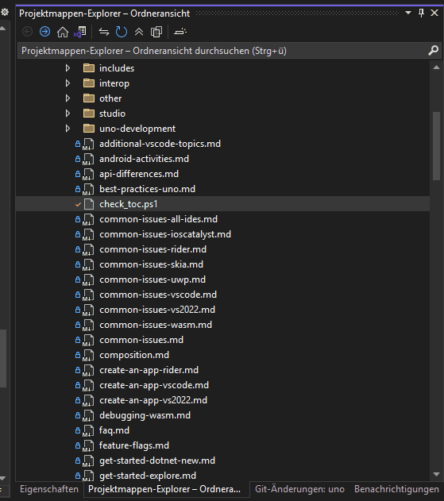

# How-To: Using the Toc Checker script

This guide is for contributors working with the Uno documentation who want to verify the structure and consistency of the DocFX table of contents (TOC). The `check_toc.ps1` script identifies broken or missing links and helps ensure all Markdown articles are properly referenced in `toc.yml`.

> [!TIP]
> The complete source code that goes along with this guide is available in the Uno repository – see the script at [`check_toc`](../check_toc.ps1).

## Prerequisites

- Any Uno Platform supported IDE

### PowerShell Environment

- Windows PowerShell 5.1 or PowerShell Core 7+
- Local clone of the Uno documentation repository
- Write access to the `doc/articles` directory to generate temporary output

---

> [!TIP]
> For a general overview of the script and its purpose, see the [TOC Checker Overview](xref:Uno.Contributing.check-toc.Overview).

## Step 1 – Open PowerShell

Open a terminal and navigate to the root of your Uno clone.

## Step 2 – Navigate to the `articles` Directory

The script must be executed from within the folder containing the `toc.yml` file.

```powershell
cd doc/articles
```

> [!IMPORTANT]
> Relative paths are resolved from this directory. Executing from elsewhere will yield incorrect results.

## Step 3 – Run the Script

```powershell
& .\check_toc.ps1
```

For verbose output:

```powershell
& .\check_toc.ps1 -Verbose
```

## Step 4 – Review the Output

- Console output will show broken links and unlinked files.
- A new file `toc_additions.yml.tmp` will be created in the current directory.

Open this file to view `- name:` and `href:` entries that should be added to `toc.yml` in the **appropriate** category.

## Troubleshooting

- If nothing is reported, verify that the script was executed in the correct directory.
- If `toc_additions.yml.tmp` is missing, check for file permission issues.

   > [!NOTE]
   > Visual Studio 2022 does not show the generated file by default.
   > To open it, see these Steps:
   >
   > 

## Related Pages

- [TOC Checker Script Overview](xref:Uno.Contributing.check-toc.Overview)
- [Utility Functions](xref:Uno.Contributing.check-toc.Utilities)
- [Contributing Guidelines](xref:Uno.Contributing.DocFx)

---

[!INCLUDE [getting-help](../includes/getting-help.md)]
