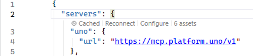

# Issues related to AI Agents

## dnx is not a valid command

The getting started for Claude, Codex and Copilot CLI use the `dnx` command, which is only available on .NET 10.

If you want to use the App MCP with .NET 9 projects, you'll need to change `dnx` to `uno-devserver` and install it using `dotnet tool install -g uno.devserver`.

## The App MCP does not appear in Visual Studio

1. Open the `.vs/mcp.json` file in Visual Studio. It is located in your solution's root directory.
2. Verify that the Uno MCP server entry is present:

```json
"uno": {
  "url": "https://mcp.platform.uno/v1"
}
```

3. If the entry is missing, add it to the `.vs/mcp.json` file and restart Visual Studio.
4. If the entry exists but the server shows as disconnected, click on "Reconnect" in the file editor:



The Uno App MCP should now appear in the list of MCPs in Visual Studio.

## The App MCP turns red in Visual Studio 2022/2026

In Visual Studio, the App MCP might turn red in some occasions. To fix this issue, click on the three dots on the right and select `Reload`.

## The uno-app MCP failed to start

The Uno Platform App MCP may fail to start in Claude/Codex/Copilot CLI when it is started in a folder that does not contain an Uno Platform project.

To fix this issue, change directories to a folder that contains the `.sln` or `.slnx` file of your project.
