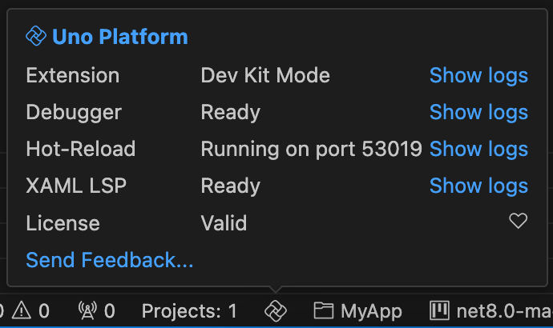

# Issues related to VS Code

## Known limitations for VS Code support

- C# Debugging is not supported when running in a remote Linux Container, Code Spaces, or GitPod.
- Calls to `InitializeComponent()` may show intellisense errors until the Windows head has been built once.

## Troubleshooting Uno Platform VS Code issues

For assistance configuring or running Android or iOS emulators, see the [Android & iOS emulator troubleshooting guide](xref:Uno.UI.CommonIssues.MobileDebugging).

If you're not sure whether your environment is correctly configured for Uno Platform development, running the [`uno-check` command-line tool](external/uno.check/doc/using-uno-check.md) should be your first step.

### macOS-specific issues

#### VS Code in Downloads folder (read-only mode)

If VS Code has been left in the Downloads folder on macOS, it can end up in read-only mode, which prevents proper extension functionality and updates.

**Solution**: Move VS Code from the Downloads folder to the Applications folder:

1. Quit VS Code if it's running
1. Open Finder and navigate to the Downloads folder
1. Locate Visual Studio Code
1. Drag Visual Studio Code to the Applications folder (or use `Cmd+C` to copy, then `Cmd+V` to paste in Applications)
1. Remove the old copy from Downloads
1. Launch VS Code from the Applications folder

This resolves read-only permission issues and allows VS Code to update properly, ensuring the Uno Platform extension functions correctly.

#### VS Code version requirements

The Uno Platform extension requires specific minimum VS Code versions depending on your configuration:

- **Uno Platform extension**: Requires VS Code 1.75.0 or later
- **C# extension** (OmniSharp mode): Requires VS Code 1.93.0 or later  
- **C# Dev Kit extension**: Requires VS Code 1.95.0 or later

**To check your VS Code version**:
1. Open VS Code
1. Press `F1` and type `Code: Check for Updates...` and select it
1. Or go to **Help** > **About** to see your current version

**To update VS Code**:
1. Use the update command above, or
1. Download the latest version from [https://code.visualstudio.com/](https://code.visualstudio.com/)
1. Restart VS Code after updating

If the Uno Platform extension doesn't activate after creating a new Uno app, ensure your VS Code version meets these requirements.

The Uno Platform extension provides multiple output windows to troubleshoot its activities:

- **Uno Platform**, which indicates general messages about the extension
- **Uno Platform - Debugger**, which provides activity messages about the debugger feature
- **Uno Platform - Hot Reload**, which provides activity messages about the Hot Reload feature
- **Uno Platform - XAML**, which provides activity messages about the XAML Code Completion feature

They are also accessible using the status bar Uno logo: hover your mouse pointer over the logo, and the extension status will be shown along with links to the related outputs.

If the extension is not behaving properly, try using the `Developer: Reload Window` (or `Ctrl+R`) command in the palette.

## Reporting issues

You can report issues directly from VS Code by either:

- using the Uno logo status bar (see screenshot above); or
- pressing `F1` and selecting `Uno Platform: Report Issue...`

The form is already pre-filled with some useful information to help diagnose issues.
Follow the comments to complete the report.
