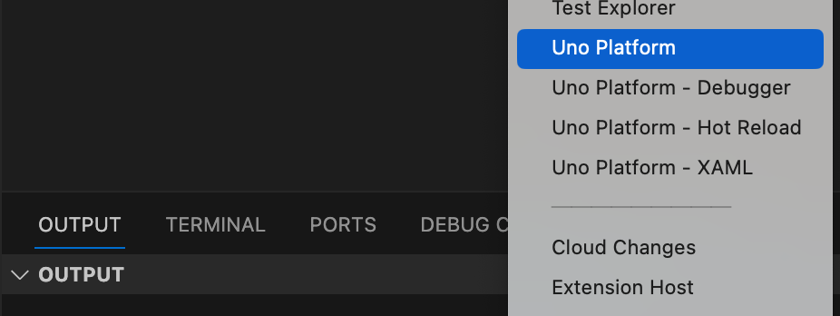
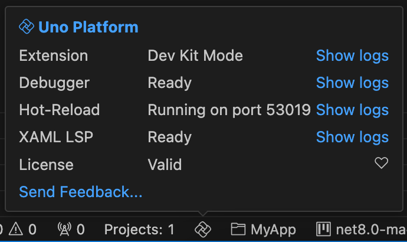

# Issues related to VS Code

## Known limitations for VS Code support

- C# Debugging is not supported when running in a remote Linux Container, Codespaces.
- Calls to `InitializeComponent()` may show intellisense errors until the Windows head has been built once.

## Troubleshooting Uno Platform VS Code issues

For assistance configuring or running Android or iOS emulators, see the [Android & iOS emulator troubleshooting guide](xref:Uno.UI.CommonIssues.MobileDebugging).

If you're not sure whether your environment is correctly configured for Uno Platform development, running the [`uno-check` command-line tool](external/uno.check/doc/using-uno-check.md) should be your first step.

The Uno Platform extension provides multiple output windows to troubleshoot its activities:

- **Uno Platform**, which indicates general messages about the extension
- **Uno Platform - Debugger**, which provides activity messages about the debugger feature
- **Uno Platform - Hot Reload**, which provides activity messages about the Hot Reload feature
- **Uno Platform - XAML**, which provides activity messages about the XAML Code Completion feature



They are also accessible using the status bar Uno logo: hover your mouse pointer over the logo, and the extension status will be shown along with links to the related outputs.



If the extension is not behaving properly, try using the `Developer: Reload Window` (or `Ctrl+R`) command in the palette.

## `.lscache` files appearing in the solution

After upgrading to **C# Dev Kit 3.20** or later, opening an Uno solution in VS Code may produce a large batch of untracked `<ProjectName>.csproj.lscache` files next to each project. Uno solutions typically have multiple platform heads and test projects, so the visual impact is larger than for a typical .NET solution.

This is **not an Uno issue** and **not an error**. `.lscache` files are language-service caches written by the C# Dev Kit project system. They cache project metadata (references, target frameworks, output paths, restored package info) so the workspace can load quickly on the next session, and they regenerate automatically if deleted.

They are safe to commit to source control if you prefer to keep them tracked. If you'd rather exclude them, add the following line to your repository's `.gitignore`:

```text
*.lscache
```

This behavior is owned by the C# Dev Kit project system and tracked upstream at [microsoft/vscode-dotnettools#3080](https://github.com/microsoft/vscode-dotnettools/issues/3080).

## Reporting issues

You can report issues directly from VS Code by either:

- using the Uno logo status bar (see screenshot above); or
- pressing `F1` and selecting `Uno Platform: Report Issue...`

The form is already pre-filled with some useful information to help diagnose issues.
Follow the comments to complete the report.
