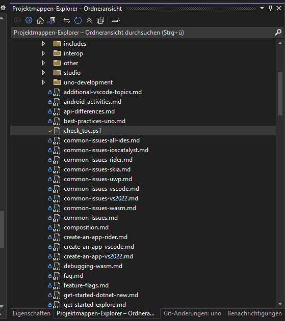

<!-- markdownlint-disable MD001 -->

# The Uno documentation website and DocFX

Uno Platform's docs website uses [DocFX](https://dotnet.github.io/docfx/) to convert Markdown (.md) files in the [articles folder](../../../articles) into [HTML files](xref:Uno.Documentation.Intro).

## Linking to the Table of Contents

Normally when you add a new markdown file, you also add it to [articles/toc.yml](../../toc.yml). This allows it to show up in the left sidebar TOC on the docs website.

## DocFX-flavored Markdown

DocFX supports extended Markdown syntaxes that are treated specially when converting to html.

### Formatted blockquotes

You can use [specially-styled blockquotes](https://dotnet.github.io/docfx/spec/docfx_flavored_markdown.html#note-warningtipimportant), to call special attention to particular information.

The following note types are supported, including an example for each one:

```markdown
> [!NOTE]
> Useful information that users should know, even when skimming content.
```

> [!NOTE]
> Useful information that users should know, even when skimming content.

```markdown
> [!TIP]
> Helpful advice for doing things better or more easily.
```

> [!TIP]
> Helpful advice for doing things better or more easily.

```markdown
> [!IMPORTANT]
> Key information users need to know to achieve their goal.
```

> [!IMPORTANT]
> Key information users need to know to achieve their goal.

```markdown
> [!CAUTION]
> Advises about risks or negative outcomes of certain actions.
```

> [!CAUTION]
> Advises about risks or negative outcomes of certain actions.

```markdown
> [!WARNING]
> Urgent info that needs immediate user attention to avoid problems.
```

> [!WARNING]
> Urgent info that needs immediate user attention to avoid problems.

### Tabs

DocFX can generate tabs. Make sure to follow the [syntax specification](https://dotnet.github.io/docfx/docs/markdown.html#tabs) precisely.

#### Example

Markdown:

```md
# [WinUI](#tab/tabid-1)

`WinUI.Namespace`

# [Uno Platform](#tab/tabid-2)

`Uno.Namespace`

---
```

Html output:
<!-- markdownlint-disable MD051 -->
# [WinUI](#tab/tabid-1)

`WinUI.Namespace`

# [Uno Platform](#tab/tabid-2)

`Uno.Namespace`

---

> [!NOTE]
> Use `---` in the Markdown sample is Important, to not include more Content in the tabbed area than actually wanted, but will not be rendered in the served documentation.
> [!TIP]
> It is possible to use `***` alternatively for the same task.

- [How To: Anchoring Links](./anchor-links.md)

## TOC checker script

The script [`check_toc`](../check_toc.ps1) checks for dead links in the TOC, as well as Markdown files in the `articles` folder that are not part of the TOC.

> [!NOTE]
> At the moment it's not part of the CI, but contributors can run it locally and fix any bad or missing links.

To use it, follow this Steps:

1. Open a Power-Shell Terminal at the Root Directory of your locally cloned Uno Repository.
1. Navigate to the `articles` Directory of your local Uno.UI Repository:

   ```ps
   cd doc/articles
   ```

   > [!IMPORTANT]
   > This execution Directory is important to get the correct links for the TOC!

1. Run the script with `& .\check_toc.ps1`, which will create a file named `toc_additions.yml` in the same directory as it has been executed from.

   > [!TIP]
   > If you run into Issues while this, you can also use the `-Verbose` Flag, see you can see how far it's coming before the unexpected behavior.

1. Open the file and add the missing links to [toc.yml](..\toc.yml) in the **appropriate** category.

   > [!NOTE]
   > Visual Studio 2022 does not show the generated file by default.
   > To open it, enable `show all Files` in the solution browser:

   

## Building docs website locally with DocFX

Sometimes, you may want to run DocFX locally to ensure that your changes render correctly in HTML. To do this, first generate the *implemented views* documentation.

### Run DocFX locally

To run DocFX locally and check the resulting html:

1. Open the `Uno.UI-Tools.slnf` solution filter in the `src` folder with Visual Studio.
2. Edit the properties of the `Uno.UwpSyncGenerator` project. Under the 'Debug' tab, set Application arguments to "doc".
3. Set `Uno.UwpSyncGenerator` as startup project and run it. It may fail to generate the full implemented views content; if so, it should still nonetheless generate stubs so that DocFX can run successfully.
4. Open a Terminal at the Root Directory of your locally cloned Uno Repository.
5. Install Docfx globally: `dotnet tool install -g docfx`
6. Run the following command: `docfx build doc/docfx.json` and attach any nested foldername you want by adding `-o your-nested-output-path`, default: `_site`
7. When DocFX builds successfully, it will create the html output at `uno-clone-repo\doc\[your-nested-output-path\]_site`, which you can serve by one of the following options:
   a. Execute the command `docfx serve doc/docfx.json` in your terminal.
   b. Use a [local server](#use-a-local-server).

### Use a local server

You can use `dotnet-serve` as a simple command-line HTTP server for example.

1. Install `dotnet-serve` using the following command: `dotnet tool install --global dotnet-serve`. For more info about its usage and options,[please refer to the documentation](https://github.com/natemcmaster/dotnet-serve).
2. Using the command prompt, navigate to `C:\src\Uno.UI\docs-local-dist\_site` (replacing `C:\src\Uno.UI` with your local path to the Uno.UI repository) and run the following command `dotnet serve -o -S`. This will start a simple server with HTTPS and open the browser directly.

## Run the documentation generation performance test

If needed, you can also run a script that will give you a performance summary for the documentation generation.

To run the script on Windows:

1. Make sure `crosstargeting_override.props` is not defining UnoTargetFrameworkOverride
2. Open a Developer Command Prompt for Visual Studio (2019 or 2022)
3. Go to the uno\build folder (not the uno\src\build folder)
4. Run the `run-doc-generation.cmd` script; make sure to follow the instructions

## Import Uno Extensions and Tools docs

[!INCLUDE [advises-to-import-external-docs](./external/uno.extensions/doc/README.md)]
