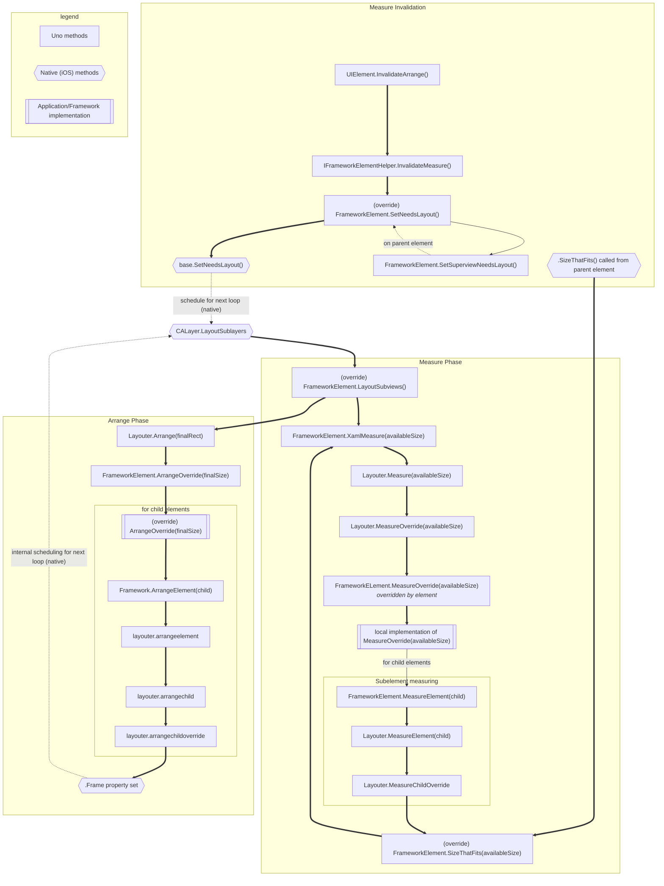

---
uid: Uno.Contributing.Layouting.iOS
---

# Layouting in iOS

The layouting cycle (measure and arrange) in Uno on iOS is a mingling of native layouting logic and logic in managed code. These interactions are summarized in the diagram below. This information is primarily intended to help when debugging Uno, but may also be useful when attempting to incorporate non-Uno views into the visual tree.

