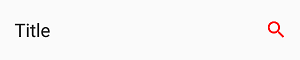
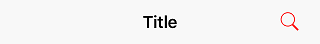
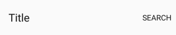
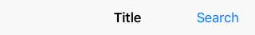
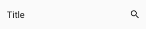
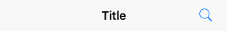
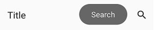
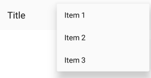
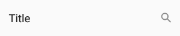
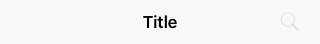

# AppBarButton

The `AppBarButton` in **Uno** is designed to be used the same way you would use the `AppBarButton` on **WinUI**. In most cases, you should refer to the [official `AppBarButton` documentation](https://learn.microsoft.com/uwp/api/windows.ui.xaml.controls.appbarbutton).

When `AppBarButton` is used within a native `CommandBar`, its control template is completely ignored and can't be customized.

## Events

| Event   | Windows | iOS | Android | Comments |
|---------|:-------:|:---:|:-------:|----------|
| Clicked | x       | x   | x       |          |

## Properties

| Property        | Windows | iOS | Android | Comments                                   |
|-----------------|:-------:|:---:|:-------:|--------------------------------------------|
| Command         | x       | x   | x       |                                            |
| Content         | x       | x*  | x*      | Supports `string` and `FrameworkElement`.  |
| Foreground      | x       | x   | x*      | **Android**: See details below.            |
| Icon            | x       | x*  | x*      | Only supports `BitmapIcon`.                |
| IsEnabled       | x       | x   | x*      | **Android**: Not supported with `Content`. |
| Label           | x       | x*  | x*      | See details below.                         |
| Opacity         | x       | x   | x       |                                            |
| Visibility      | x       | x   | x       |                                            |

*If it's not listed, assume it's not supported.*

### Foreground

Gets or sets a brush that describes the foreground color.

#### Remarks

- This changes the color of the `Content` (text) or `Icon`.
- Only supports `SolidColorBrush`.
- On **Android**, this only affects the color of `Icon`, not `Content` (text).
- On **iOS**, the default value is blue.

### Content

Gets or sets the content of a `ContentControl`.

#### Remarks

- When given a `string`, its text will be displayed instead of the icon.
- When given a `FrameworkElement`:
  - it will be displayed instead of the icon
  - the native pressed state and tooltip (Android only) won't work
- Make sure to set `Icon` to null, as it takes priority over `Content`.

### Icon

Gets or sets the graphic content of the app bar button.

#### Remarks

- Only supports `BitmapIcon` (with PNG).

#### Recommended icon sizes (by scale)

| Platform | 100%  | 150%  | 200%  | 300%  | 400%    |
|----------|:-----:|:-----:|:-----:|:-----:|:-------:|
| iOS      | 25x25 | -     | 50x50 | 75x75 | -       |
| Android  | 24x24 | 36x36 | 48x48 | 72x72 | 96x96   |
| Windows  | 32x32 | 48x48 | 64x64 | 96x96 | 128x128 |

### Label

Gets or sets the text description displayed on the app bar button.

#### Remarks

Unlike on **WinUI**, the `Label` will not be displayed below the `Icon`.

It is only displayed on **Android** when the `AppBarButton` is displayed from the overflow (when part of `SecondaryCommands`)

It is highly recommended to set and localize `Label` on all `AppBarButton`s, if only for accessibility.

### IsEnabled

Gets or sets a value indicating whether the user can interact with the control.

#### Remarks

- When set to **false**, buttons are disabled and grayed out (semi-transparent).
- You can't customize the disabled visual state of buttons.
- On **Android**, the disabled visual state only works with `Icon` and not with `Content` (text).
