# CommandBar

The `CommandBar` in **Uno** is designed to be used the same way you would use the `CommandBar` on **UWP**. In most cases, you should refer to the [official `CommandBar` documentation](https://learn.microsoft.com/uwp/api/windows.ui.xaml.controls.commandbar).

This document exists to highlight some of the differences you might encounter when working with the native mode of `CommandBar` on either **iOS** or **Android**.

## Modes

The `CommandBar` supports 2 different modes:

| Mode    | Style                    |
|---------|--------------------------|
| Windows | `XamlDefaultCommandBar`  |
| Native  | `NativeDefaultCommandBar`|

### Windows

This mode replicates **UWP**'s `CommandBar`. It is templatable and supports a template that's almost identical to **UWP**'s default `CommandBar`.


#### Usage Example

```csharp
<Style TargetType="CommandBar" BasedOn="{StaticResource XamlDefaultCommandBar}" />
```

#### Remarks

- This mode hasn't been extensively tested.
- We usually avoid using this mode, and prefer to use the Native one instead.

### Native

This mode is the preferred one and is enabled by default. It uses platform-specific controls to ensure a more native user experience.


| Platform | Native control      | Benefits                                              |
|----------|---------------------|-------------------------------------------------------|
| Android  | `Toolbar`          | Native pressed states (ripple), native overflow menu. |
| iOS      | `UINavigationBar` | Transitions when navigating  between pages.   |

The rest of this document will exclusively cover this mode.

#### Usage Example

```csharp
<Style TargetType="CommandBar" BasedOn="{StaticResource NativeDefaultCommandBar}" />
```

#### Remarks

In this mode, the `CommandBar` can't be fully customized like other templatable controls would. Additionally, you can't customize the visual states of either the `CommandBar` or its `AppBarButton`s.

### Padding

You must use `VisibleBoundsPadding.PaddingMask="Top"` on `CommandBar` to properly support the notch or punch-holes on iOS and Android.

#### Back button

An important difference with this mode is the presence of a back button. Whenever the `CommandBar` is part of a `Page` whose `Frame` has a non-empty back stack, the back button will be displayed.

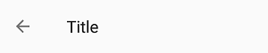

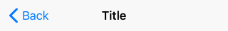

On **Android**, tapping the back button triggers `SystemNavigationService.BackRequested`. It's the responsibility of the application's navigation controller to eventually call `Frame.GoBack()`.

On **iOS**, tapping the back button automatically triggers a back navigation on the native `UINavigationController` (which is part of the native `Frame` implementation). The `Frame` will raise the `Navigated` event, and its state will automatically be updated to reflect the navigation. The navigation can't be intercepted or canceled. To intercept back navigation, you must replace the native back button with your own custom button using `NavigationCommand` (see below).

## Properties

| Property                              | Windows | iOS | Android | Comments                                                                                                               |
|---------------------------------------|:-------:|:---:|:-------:|------------------------------------------------------                                                                  |
| Background                            | x       | x   | x       |                                                                                                                        |
| Content                               | x       | x   | x       |                                                                                                                        |
| Foreground                            | x       | x   | x       |                                                                                                                        |
| Height                                | x       | -   | -       | **iOS** and **Android**: Fixed and can't be changed.                                                                   |
| HorizontalAlignment                   | x       | -   | x       | **iOS**: Always use `HorizontalAlignment.Stretch`.                                                                     |
| Opacity                               | x       | x   | x       |                                                                                                                        |
| Padding                               | x       | x   | x       | **iOS** and **Android**: Please refer to the `Padding` section.                                                        |
| PrimaryCommands                       | x       | x   | x       |                                                                                                                        |
| SecondaryCommands                     | x       | -   | x       | **iOS**: Not supported.                                                                                                |
| VerticalAlignment                     | x       | -   | x       | **iOS**: Always use `VerticalAlignment.Top`.                                                                           |
| Visibility                            | x       | x   | x       |                                                                                                                        |
| Width                                 | x       | -   | x       | **iOS**: Always use `double.NaN`.                                                                                      |
| HorizontalContentAlignment            | x       | -   | x       | **Android**: Stretch and Left are supported. **Windows**: Set `IsDynamicOverflowEnabled="False"` for proper behavior.  |
| VerticalContentAlignment              | x       | -   | -       | Only supported on Windows. **Android**: Alignment needs to be done through the content itself.                         |

*If it's not listed, assume it's not supported.*

### Background

Gets or sets a brush that describes the background of a control.


#### Remarks

- Only supports `SolidColorBrush`.
- Changing the opacity through `SolidColorBrush.Opacity` is supported.

### Content

Gets or sets the content of a `ContentControl`.

#### Remarks

The `Content` is processed differently whether it's of type `string` or `FrameworkElement`.

When `Content` is a `string`, it's displayed using the platform's default font family, font size, font style and text alignment. Only the foreground color can be changed, using `Foreground`.


| Platform | FontFamily    | FontSize | HorizontalAlignment |
|----------|---------------|----------|---------------------|
| iOS      | `San Francisco` | 17       | Center              |
| Android  | `Roboto`        | 20       | Left                |

When `Content` is a `FrameworkElement`, it's displayed within the available area:


| Platform | Available height |
|----------|:----------------:|
| iOS      | 30px             |
| Android  | 48px             |

Please note that:

- `HorizontalContentAlignment` and `VerticalContentAlignment` are ignored.
- On **iOS**, the Content is automatically centered horizontally unless `HorizontalAlignment.Stretch` is used.

### Foreground

Gets or sets a brush that describes the foreground color.

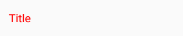


#### Remarks

- This is typically used to change the Content`'s text color.
- Only supports `SolidColorBrush`.
- Setting this property will not affect any of the `CommandBar's` `AppBarButton` tint Color. If you need to change the `AppBarButton` tint, this is possible by setting the `ShowAsMonochrome` property to true as well as setting the Foreground`SolidColorBrush`on the`BitmapIcon`.
- On`Android`, you can also enable a feature that will allow that the`SolidColorBrush`set on your `CommandBar` `Foreground` to update your`AppBarButton`s Tint. To enable this, set on your `App.xml.cs` the `FeatureConfiguration.AppBarButton.EnableBitmapIconTint` to **true**.

### PrimaryCommands

Gets the collection of primary command elements for the `CommandBar`.

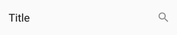

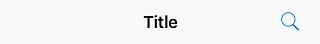

#### Remarks

- Only supports `AppBarButton`. `AppBarToggleButton` and `AppBarSeparator` are not supported.
- Refer to  the `AppBarButton` section for details.

### SecondaryCommands

Gets the collection of secondary command elements for the `CommandBar`.

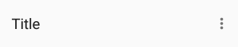

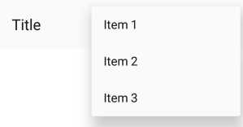

#### Remarks

- Only supported on **Android**.

### Height

Gets or sets the suggested height of a `FrameworkElement`.

#### Remarks

The height is fixed and cannot be changed.

| Platform | Form factor | Portrait | Landscape |
|----------|-------------|:--------:|:---------:|
| iOS      | Phone       | 44pt     | 44pt      |
| iOS      | Tablet      | 44pt     | 44pt      |
| Android  | Phone       | 48dp     | 56dp      |
| Android  | Tablet      | 64dp     | 64dp      |

[Source (Android)](https://material.io/guidelines/layout/structure.html#structure-app-bar)

## Extensions

Extensions are attached properties that extend the **UWP** APIs to provide platform-specific features.

They can be found in the `Uno.UI.Toolkit` namespace.

Extensions to extend the functionality of `CommandBar` can be found in the `CommandBarExtensions` class.

| Attached Property    | Windows | iOS | Android | Comments |
|----------------------|:-------:|:---:|:-------:|----------|
| BackButtonForeground | -       | x   | x       |          |
| BackButtonIcon       | -       | x   | x       |          |
| BackButtonTitle      | -       | x   | x       |          |
| NavigationCommand    | -       | x   | x       |          |
| Subtitle             | -       | -   | x       |          |

### BackButtonForeground

Gets or sets the back button foreground for the `CommandBar`.

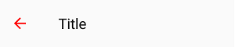


#### Remarks

- Only supports `SolidColorBrush`.

### BackButtonIcon

Gets or sets the back button icon for the `CommandBar`.

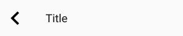

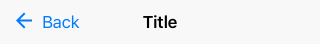

#### Remarks

- Only supports `BitmapIcon`.

### BackButtonTitle

Gets or sets the back button title for the `CommandBar`.


#### Remarks

Only supported on **iOS**.

On **iOS**, the back button displays the title of the previous page (which we usually set as `string` on `Content`). When the title of the previous page is too long (over 140px wide on iPhone 5) or isn't set (for example, if we set `FrameworkElement` instead of `string` on `Content`), "Back" will be displayed instead.

To explicitly provide a value to be used by the back button of the next page, use `BackButtonTitle`.

To remove the back button title from all pages (and only leave the back arrow), set `BackButtonTitle` to `""` in the default `CommandBar` style.

**WARNING:** The name of this property can be misleading, and doesn't actually let you change the title of the back button displayed on the given `CommandBar`. Read above for recommended usage.

### Elevation

Gets or sets the elevation of the `UIElement`.

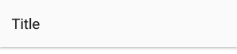

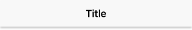

#### Remarks

- This is usually only used on **Android**.
- According to [Google's Material Design Guidelines](https://material.io/guidelines/material-design/elevation-shadows.html), the recommended elevation for `CommandBar` is **8**.

### NavigationCommand

Gets or sets the navigation command for the `CommandBar`.

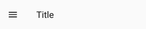


#### Remarks

Unlike the `PrimaryCommands` or `SecondaryCommands`, which appear to the right of the `CommandBar`, the `NavigationCommand` appears to the left of the `CommandBar`.

This is typically used for burger menus.

On **iOS**, the back gesture can be enabled or disabled using this property.

- When a `CommandBar` (visible or collapsed) is in the visual tree, the back gesture is **enabled**.
- When a `CommandBar` has a `NavigationCommand`, the back gesture is **disabled**.

On **Android**, only icons are supported (`AppBarButton.Icon`). This is due to a platform limitation, which can be explained by the fact that `CommandBar.Content` is left-aligned.

### Subtitle (**Android**)

Gets or sets the subtitle for the `CommandBar`.

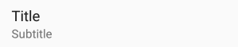

#### Remarks

- The subtitle is displayed below the native title (`Content` of type `string`).
- The color of the subtitle currently can't be changed.

## Placement

On **iOS**, the same `UINavigationBar` instance is shared throughout all pages. When navigating between two pages, you can see that the `UINavigationBar` doesn't move, and only its content and the pages have a transition. To get the same effect while still letting you use `CommandBar` as you would on **UWP** (as part of the `Page`), we have to do some magic. Namely, the `CommandBar` you define inside your `Page` is never actually rendered there, and only serves as a placeholder from which to read the information we need to pass to the shared `UINavigationBar` instance.

To ensure everything works properly, you must follow a few rules:

- The `CommandBar` must stretch horizontally and be aligned with the top of your `Page`.
- The `CommandBar` can't move (i.e., don't put it inside a `ScrollViewer`)
- The `CommandBar` must be accessible as soon as the page is being navigated to (i.e., don't put it inside a `DataTemplate` or an `AsyncValuePresenter`).
- There can only be one `CommandBar` per page.

## Extensibility

The `CommandBar` it automatically managed by the `Frame` control, however you can still use the "native" mode of the `CommandBar` with your own navigation mechanism.

On **iOS** a `CommandBarHelper` is available for this purpose, you only have to invoke each of the provided method in your own `UIViewController` implementation.

# AppBarButton

The `AppBarButton` in **Uno** is designed to be used the same way you would use the `AppBarButton` on **UWP**. In most cases, you should refer to the [official `CommandBar` documentation](https://learn.microsoft.com/uwp/api/windows.ui.xaml.controls.appbarbutton).

When `AppBarButton` is used within a native `CommandBar`, its control template is completely ignored and can't be customized.

## Events

| Event   | Windows | iOS | Android | Comments |
|---------|:-------:|:---:|:-------:|----------|
| Clicked | x       | x   | x       |          |

## Properties

| Property        | Windows | iOS | Android | Comments                                   |
|-----------------|:-------:|:---:|:-------:|--------------------------------------------|
| Command         | x       | x   | x       |                                            |
| Content         | x       | x*  | x*      | Supports `string` and `FrameworkElement`.  |
| Foreground      | x       | x   | x*      | **Android**: See details below.            |
| Icon            | x       | x*  | x*      | Only supports `BitmapIcon`.                |
| IsEnabled       | x       | x   | x*      | **Android**: Not supported with `Content`. |
| Label           | x       | x*  | x*      | See details below.                         |
| Opacity         | x       | x   | x       |                                            |
| Visibility      | x       | x   | x       |                                            |

*If it's not listed, assume it's not supported.*

### Foreground

Gets or sets a brush that describes the foreground color.

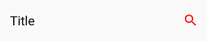

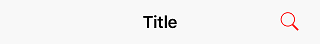

#### Remarks

- This changes the color of the `Content` (text) or `Icon`.
- Only supports `SolidColorBrush`.
- On **Android**, this only affects the color of `Icon`, not `Content` (text).
- On **iOS**, the default value is blue.

### Content

Gets or sets the content of a `ContentControl`.

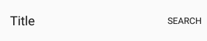

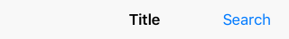

#### Remarks

- When given a `string`, its text will be displayed instead of the icon.
- When given a `FrameworkElement`:
  - it will be displayed instead of the icon
  - the native pressed state and tooltip (Android only) won't work
- Make sure to set `Icon` to null, as it takes priority over `Content`.

### Icon

Gets or sets the graphic content of the app bar button.

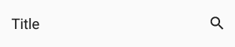


#### Remarks

- Only supports `BitmapIcon` (with PNG).

#### Recommended icon sizes (by scale)

| Platform | 100%  | 150%  | 200%  | 300%  | 400%    |
|----------|:-----:|:-----:|:-----:|:-----:|:-------:|
| iOS      | 25x25 | -     | 50x50 | 75x75 | -       |
| Android  | 24x24 | 36x36 | 48x48 | 72x72 | 96x96   |
| Windows  | 32x32 | 48x48 | 64x64 | 96x96 | 128x128 |

### Label

Gets or sets the text description displayed on the app bar button.

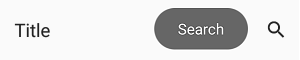


#### Remarks

Unlike on **UWP**, the `Label` will not be displayed below the `Icon`.

It is only displayed on **Android** when the `AppBarButton` is displayed from the overflow (when part of `SecondaryCommands`)

It is highly recommended to set and localize `Label` on all `AppBarButton`s, if only for accessibility.

### IsEnabled

Gets or sets a value indicating whether the user can interact with the control.


#### Remarks

- When set to **false**, buttons are disabled and grayed out (semi-transparent).
- You can't customize the disabled visual state of buttons.
- On **Android**, the disabled visual state only works with `Icon` and not with `Content` (text).

# Known issues

## iOS

- Can't have multiple CommandBars in the same page (e.g., Master/Details, bottom CommandBar).
- Can't change the title of the back button if the previous page doesn't have a CommandBar.
- You must define the title of the back button of the current page's CommandBar in the CommandBar of the previous page.
- Can't have a smooth transition between pages with different CommandBar backgrounds.
- Can't have a smooth transition between pages with and without a CommandBar.
- Can't change the position and size of the CommandBar (always top-aligned, horizontally-stretched, height of 44).
- Can't remove the 1px underline/shadow without making the CommandBar's background transparent.
- Can't change the height of the CommandBar.
- Can't use the back gesture on pages without a CommandBar.
- Can't disable the back gesture without using workarounds (fake back buttons).
- Can't change the Visibility of a CommandBar.
- Can't change the Opacity of a CommandBar.
- Can't superpose views over a CommandBar.
- Can't animate/translate the CommandBar (i.e., when hiding/showing it based on scroll offset).
- Can't put your CommandBar inside a ScrollViewer and make it scroll.
- Can't put your CommandBar inside templates (i.e., AVP).
- Can't cancel a back navigation using BackRequestedEventArgs.Handled.

# FAQ: CommandBar

- > Why is my content underneath the `CommandBar` for iOS and the `CommandBar` underneath the StatusBar/Notch for Android ?

  You must use `VisibleBoundsPadding.PaddingMask="Top"` on `CommandBar` to properly support the notch or punch-holes on iOS and Android.

  ```xml
  xmlns:toolkit="using:Uno.UI.Toolkit"
  ...
  <Style Target="CommandBar">
      <Setter Property="toolkit:VisibleBoundsPadding.PaddingMask"
              Value="Top" />
  </Style>
  ```

- > How can I remove the back button title from all pages on iOS?

  ```xml
  xmlns:toolkit="using:Uno.UI.Toolkit"
  ...
  <Style Target="CommandBar">
      <Setter Property="toolkit:CommandBarExtensions.BackButtonTitle"
              Value="" />
  </Style>
  ```

- > How can I change the back button icon/arrow/chevron in my app?

  ```xml
  xmlns:toolkit="using:Uno.UI.Toolkit"
  ...
  <Style Target="CommandBar">
      <Setter Property="toolkit:CommandBarExtensions.BackButtonIcon">
          <Setter.Value>
              <BitmapIcon UriSource="ms-appx://Assets/back.png" />
          </Setter.Value>
      </Setter>
  </Style>
  ```

- > How can I change the color of the back button?

  ```xml
  xmlns:toolkit="using:Uno.UI.Toolkit"
  ...
  <CommandBar toolkit:CommandBarExtensions.BackButtonForeground="Red" />
  ```

- > Why does my back button display "Back" on iOS?

  The back button will display "Back" if:

  - The previous page doesn't have a `CommandBar`.
  - The previous page's `CommandBar` doesn't have a `Content` of type `string`.
  - The previous page's `CommandBar` doesn't have a `CommandBarExtensions.BackButtonTitle`.
  - The previous page's `CommandBar` has a title that's too long (more than 140pt).

- > Why can't I overlap content over the CommandBar on iOS?

  The `CommandBar` is not actually part of the `Page` on **iOS**, and you can't overlap content over it like you would on **UWP** or **Android**. Please refer to the **Placement** section for details.

- > Why doesn't my CommandBar show a back button?

  For a `CommandBar` to show a back button, it must first be resolved by `Frame` as soon as it navigates to a `Page`. To ensure that `CommandBar` is available as soon as the navigation starts, make sure it's directly part of a page, and not part of a `DataTemplate` or `ControlTemplate`.

- > Why don't my AppBarButton visual states work?

  You can't customize the `ControlTemplate` of `AppBarButton` when using `CommandBar` in native mode.

- > How can I change the foreground of the CommandBarExtensions.Subtitle on Android?

  You can't currently customize the foreground of the `CommandBarExtensions.Subtitle` on **Android**.

- > Why doesn't CommandBarExtensions.Subtitle work on iOS?

  `CommandBarExtensions.Subtitle` is not currently implemented on iOS.

  You can replicate the same effect by setting a custom `Content` on `CommandBar`:

  ```xml
  <CommandBar>
      <CommandBar.Content>
          <StackPanel HorizontalAlignment="Center">
              <TextBlock Text="Title"
                         HorizontalAlignment="Center"
                         FontSize="15" />
              <TextBlock Text="Subtitle"
                         HorizontalAlignment="Center"
                         FontSize="12"
                         Opacity="0.5" />
          </StackPanel>
      </CommandBar.Content>
  </CommandBar>
  ```

- > How can I add a badge to an AppBarButton?

  You can implement your own badge by setting a custom content on `AppBarButton`:

  ```xml
  <AppBarButton>
      <AppBarButton.Content>
          <Grid Height="48"
                Width="48">
              <Image Source="ms-appx:///Assets/Icons/cart.png"
                     VerticalAlignment="Center"
                     HorizontalAlignment="Center" />
              <Border x:Name="Badge"
                      VerticalAlignment="Top"
                      HorizontalAlignment="Right"
                      Background="Red"
                      Margin="8,4"
                      Padding="4,0"
                      MinWidth="16"
                      Height="16"
                      CornerRadius="8">
                  <TextBlock x:Name="Count"
                             HorizontalAlignment="Center"
                             VerticalAlignment="Center"
                             Foreground="White"
                             FontSize="8"
                             Text="0" />
              </Border>
          </Grid>
      </AppBarButton.Content>
  </AppBarButton>
  ```

- > How can I set custom content to an AppBarButton?

  You can set a custom content to an `AppBarButton` like this:

  ```xml
  <AppBarButton>
      <AppBarButton.Content>
          <TextBlock Text="Custom content goes here" />
      </AppBarButton.Content>
  </AppBarButton>
  ```

- > Why does my CommandBar always appear at the top of the page on iOS?

  You can't place your `CommandBar` anywhere other than at the top of the `Page` on **iOS**. See the **Placement** section for details.

- > How can I change the height of my CommandBar?

  You can't currently change the height of the `CommandBar`.

- > How can I remove the 1px line displayed below the CommandBar on iOS?

  To hide the native 1px *shadow* that's displayed below the `CommandBar` on **iOS**, make its background transparent:

  ```xml
  <CommandBar Background="Transparent" />
  ```

- > How can I add an elevation shadow to the CommandBar on Android?

  ```xml
  xmlns:toolkit="using:Uno.UI.Toolkit"
  ...
  <CommandBar toolkit:UIElementExtensions.Elevation="4" />
  ```

- > How can I use a Path for the AppBarButton Icon?

  `AppBarButton` doesn't currently support `PathIcon`. Only `BitmapIcon` with PNGs is supported. Please refer to the **Icon** section.

- > Why doesn't CommandBarExtensions.BackButtonTitle change the title of my back button?

  `CommandBarExtensions.BackButtonTitle` must be set on the page to which the back button navigates to. Please refer to the **BackButtonTitle** section.

- > Why doesn't my CommandBarExtensions.NavigationCommand display anything on Android?

  `CommandBarExtensions.NavigationCommand` only supports `AppBarButton` with `Icon` (not `Content`). Please refer to the **NavigationCommand** section.

- > How can I localize CommandBarExtensions.BackButtonTitle?

  _For attached properties, you need a special syntax in the Name column of a `.resw` file._ Ref: [Microsoft documentation](https://learn.microsoft.com/windows/uwp/app-resources/localize-strings-ui-manifest#refer-to-a-string-resource-identifier-from-xaml).

  More specifically :

  ```xml

  <CommandBar x:Uid="MyCommandBar"
              toolkit:CommandBarExtensions.BackButtonTitle="My Page Title">
          ...
  </CommandBar>
  ```

  And in the `.resw` file, the name would be: `MyCommandBar.[using:Uno.UI.Toolkit]CommandBarExtensions.BackButtonTitle`

- > How can I put a ComboBox in my CommandBar?

  ```xml
  <CommandBar>
      <CommandBar.Content>
          <ComboBox />
      </CommandBar.Content>
  </CommandBar>
  ```

- > How can I customize the pressed/disabled visual states of my AppBarButton?

  You can't currently customize the visual states of `AppBarButton` when using `CommandBar` in native mode.

- > Why doesn't the disabled state work on my AppBarButton on Android?

  `AppBarButton` doesn't currently support the disabled state when used with `Content` (of `string`) on **Android**. You can use an `Icon` instead.

- > How can I disable the back swipe/gesture on iOS?

  To disable the back swipe/gesture on **iOS**, you must remove the `CommandBar` or replace the back button with a custom one:

  ```xml
  <CommandBar>
      <toolkit:CommandBarExtensions.NavigationCommand>
          <AppBarButton Command="{Binding GoBack}">
              <AppBarButton.Icon>
                  <BitmapIcon UriSource="ms-appx:///Assets/Icons/back.png" />
              </AppBarButton.Icon>
          </AppBarButton>
      </toolkit:CommandBarExtensions.NavigationCommand>
  </CommandBar>
  ```

- > How can I display two CommandBars side by side on iOS (i.e., master-detail)

  `Page` only supports a single `CommandBar` at a time. To display two `CommandBar`s side by side (i.e., master-detail), you should place two `Frame`s side by side and put a `CommandBar` in the `Page` of each `Frame`.

- > How can I add a burger menu to the left of my CommandBar?

  ```xml
  <CommandBar>
      <toolkit:CommandBarExtensions.NavigationCommand>
          <AppBarButton Command="{Binding ToggleMenu}">
              <AppBarButton.Icon>
                  <BitmapIcon UriSource="ms-appx:///Assets/Icons/menu.png" />
              </AppBarButton.Icon>
          </AppBarButton>
      </toolkit:CommandBarExtensions.NavigationCommand>
  </CommandBar>
  ```

- > Why doesn't Flyout work on my AppBarButton?

  `AppBarButton` doesn't currently support `Flyout` when using `CommandBar` in native mode. You can use `MenuFlyout` instead.

- > Why can't I change the Foreground of my AppBarButton on Android?

  `AppBarButton` doesn't currently support `Foreground` when displaying text (using `Content` of `string`).

  However, you can change the color of all textual `AppBarButton`s globally using **Android** styles:

  **Colors.xml**

  ```xml
  <color name="red">#FFFF0000</color>
  ```

  **Styles.xml**

  ```xml
  <item name="android:actionMenuTextColor">@color/red</item>
  <item name="actionMenuTextColor">@color/red</item>
  ```

  If you need the button to display a different color to reflect being in a disabled state, you can add a selector in its own file, under res/color, like so:

  **PrimaryTextColorSelector.xml**

  ```xml
  <?xml version="1.0" encoding="utf-8"?>
  <selector xmlns:android="http://schemas.android.com/apk/res/android" >
      <item android:state_enabled="false" android:color="#88888888"/>
      <item android:color="#FF00FFFF"/>
  </selector>
  ```

  **Styles.xml**

  ```xml
  <item name="android:actionMenuTextColor">@color/PrimaryTextColorSelector</item>
  <item name="actionMenuTextColor">@color/PrimaryTextColorSelector</item>
  ```

- > How can I customize the font of the CommandBar title/content?

  You can't currently customize the font of the native `CommandBar` title (set with a `string` on `Content`). Only the color can be changed, using the `Foreground` property.

  To customize the font of the `CommandBar`'s title, you must set a custom `FrameworkElement` as the `Content` of your `CommandBar`:

  ```xml
  <CommandBar>
      <CommandBar.Content>
          <TextBlock Text="Title"
                     FontStyle="Italic"
                     FontWeight="Bold"
                     FontSize="30" />
      </CommandBar.Content>
  </CommandBar>
  ```

- > Why doesn't my CommandBar scroll when placed inside a ScrollViewer on iOS?

  `CommandBar` can't be placed inside a `ScrollViewer`. It must be anchored to the top of your `Page` at all time. Please refer to the **Placement** section for details.

- > How can I change the color of the ripple effect when pressing on AppBarButtons on Android?

  You can change the color of the ripple effect globally using Android styles:

  **Colors.xml**

  ```xml
  <!-- https://android.googlesource.com/platform/frameworks/support/+/415f740/v7/appcompat/res/values/colors_material.xml -->
  <color name="ripple_material_light">#20444444</color>
  <color name="ripple_material_dark">#20ffffff</color>
  ```

  **Styles.xml**
  
   ```xml
  <item name="colorControlHighlight">@color/ripple_material_dark</item>
   ```

- > Why doesn't my AppBarToggleButton work?

  `AppBarToggleButton` is not currently supported.

  To implement a similar effect, you can bind your `AppBarButton`'s icon to a state using a converter:

  ```xml
  <CommandBar>
      <AppBarButton Command="{Binding ToggleIsFavorite}">
          <AppBarButton.Icon>
              <BitmapIcon UriSource="{Binding IsFavorite, Converter={StaticResource IsFavoriteToStarIcon}}" />
          </AppBarButton.Icon>
      </AppBarButton>
  </CommandBar>
  ```

- > How can I show an image under my CommandBar?

  You can show an image under a `CommandBar` by making its background transparent and superposing it over an `Image`:

  ```xml
  <Grid>
      <Image Source="http://www.example.com/image.png">
      <CommandBar Background="Transparent"
                  VerticalAlignment="Top" />
  </Grid>
  ```

  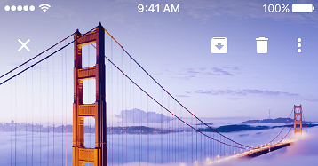

- > What size should my AppBarButton icons be?

  Please refer to the **Icon** section for details.

- > Why does my back button icon change when swiping back on iOS?

  This can happen when navigating between two pages with `CommandBar`s using different `CommandBarExtensions.BackButtonIcon`s.

  To avoid this issue, please make sure that all `CommandBar`s use the same `CommandBarExtensions.BackButtonIcon` by using a style:

  ```xml
  <Style Target="CommandBar">
      <Setter Property="toolkit:CommandBarExtensions.BackButtonIcon">
          <Setter.Value>
              <BitmapIcon UriSource="ms-appx:///Assets/Icons/back.png" />
          </Setter.Value>
      </Setter>
  </Style>
  ```

  If the issue still occurs, make sure that both pages have a `CommandBar`. If you don't want your page to display a `CommandBar`, you can simply collapse it:

  ```xml
  <CommandBar Visibility="Collapsed" />
  ```
