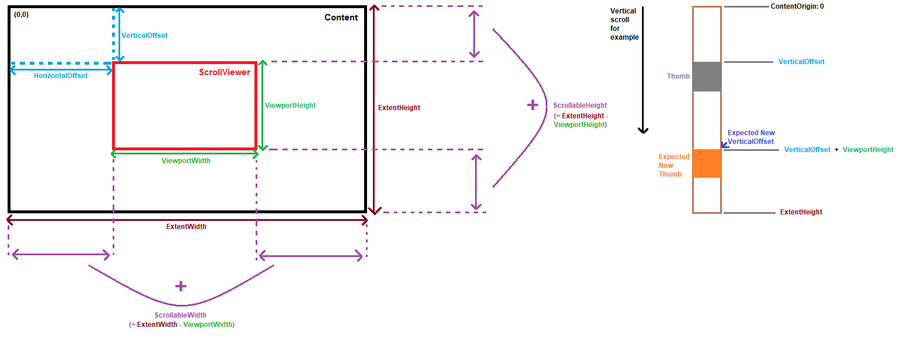

# ScrollViewer in Uno.UI

The `ScrollViewer` represents a scrollable area that can contain other visible elements. For more info about its usage, [please refer the microsoft documentation](https://learn.microsoft.com/windows/winui/api/microsoft.ui.xaml.controls.scrollviewer?view=winui-3.0)

## ScrollViewer visual diagram

The `ScrollViewer` is a more intricate control and it's not always easy to have a good overview/understanding of some of its properties.
So here is a more visual diagram to better understand how some of the main ScrollViewer properties are supposed to behave.

