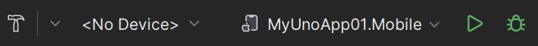

# Create an app with Rider

> [!NOTE]
> Make sure to setup your environment by [following our instructions](xref:Uno.GetStarted.Rider).
>
> [!IMPORTANT]
> As of Rider 2023.1, .NET 8 for mobile targets is not supported. To build and run mobile apps, use .NET 7 in your `TargetFrameworks`. See [this JetBrains article](https://rider-support.jetbrains.com/hc/en-us/articles/13244959138834) for more details.

## Create the App

Creating an Uno Platform project is done [using dotnet new](xref:Uno.GetStarted.dotnet-new) and Uno Platform Online Wizard by following these steps:

1. Open a browser and navigate to the online [App Wizard](https://aka.platform.uno/app-wizard)
1. Configure your new project by providing a project name, then click **Start**

    

1. Choose a template to build your application

    

    > [!TIP]
    > For a detailed overview of the Uno Platform project template wizard and all its options, see the [Template Wizard guide](xref:Uno.GettingStarted.UsingWizard).

1. Click the **Create** button on the top right corner, then click the **Copy** button

    

1. In your terminal, navigate to the folder that will contains your new app.
1. Create a new project by pasting the command that was previously generated in the App Wizard.
1. Open the solution in Rider, you should now have a folder structure that looks like this:

    

> [!TIP]
> If you are not able to run the online App Wizard, you can explore the [`dotnet new` template](xref:Uno.GetStarted.dotnet-new) directly in the CLI.

## Debug the App

### [**Android**](#tab/android)

Set Android as your startup project. Run.

> [!NOTE]
> Whether you're using a physical device or the emulator, the app will install but will not automatically open. You will have to manually open it.

### [**WebAssembly**](#tab/wasm)

Select Wasm as your startup project then run.

A new browser window will automatically run your application.

> [!NOTE]
> There is no debugging for WebAssembly within Rider for Uno Platform, but you can debug using the [built-in Chrome tools](external/uno.wasm.bootstrap/doc/debugger-support.md#how-to-use-the-browser-debugger).

### [**Catalyst**](#tab/catalyst)

You will be able to build the Catalyst project, by selecting one of the project with the apple logo.

Alternatively, you can use a tool like VNC to run the simulator on a mac.  

### [**WinUI/WinAppSDK**](#tab/winui)

You will be able to build the Windows project.

  

### [**Skia Gtk**](#tab/gtk)

Select the Skia.Gtk project, then Run.

### [**Skia WPF**](#tab/wpf)

Select the Skia.WPF project, then Run.

> [!NOTE]
> The WPF project can only be run under Windows.

***

## Next Steps

Now that you're Created and Debug the App.

Learn more about:

- [Uno Platform features and architecture](xref:Uno.GetStarted.Explore)
- [Hot Reload feature](xref:Uno.Features.HotReload)
- [Uno Platform App solution structure](xref:Uno.Development.AppStructure)
- [Troubleshooting](xref:Uno.UI.CommonIssues)
- [How-tos and Tutorials](xref:Uno.Tutorials.Intro) See real-world examples with working code.
- <a href="implemented-views.md">Use the API Reference to Browse the set of available controls and their properties.</a>
