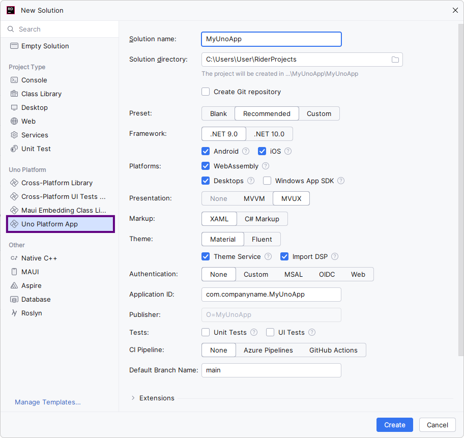
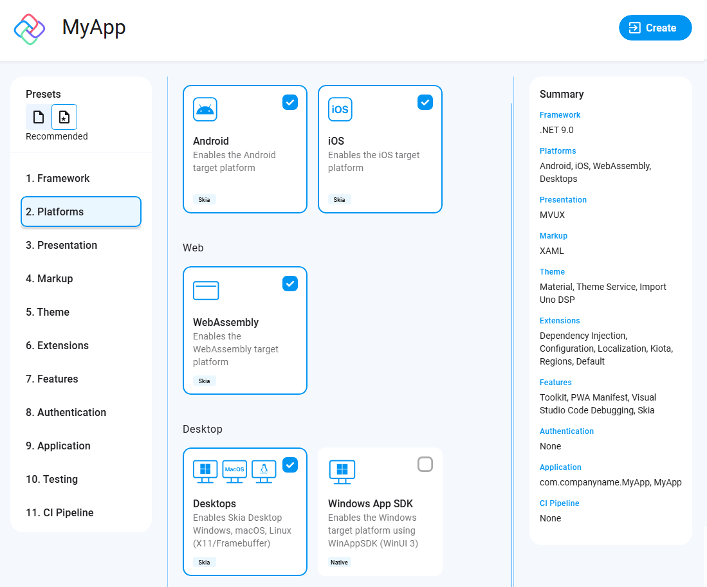
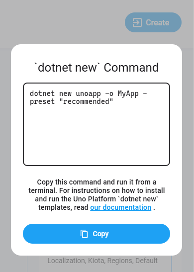

# Create an app with Rider

> [!NOTE]
> Make sure to setup your environment first by [following our instructions](xref:Uno.GetStarted.Rider).

## Create the App

> [!IMPORTANT]
>
> - **Rider (2024.2 and above)**: For Rider (2024.2 and above), we have released versions of the Uno Platform Plugin that support creating Uno Platform projects using the "New Solution" dialog.
>   Make sure to follow the directions for **Rider 2024.2** provided below.
>
> - **Rider (2024.1 and earlier)**: Current versions of Rider (2024.1 and earlier) do not support creating Uno Platform projects using the "New Solution" dialog, even if the Uno Platform project template appears.
>   Make sure to follow the directions for **Rider 2024.1** provided below.

### [**Rider Version 2024.2+**](#tab/rider2024-2)

Creating an Uno Platform project is done by following these steps:

1. On the **Welcome to JetBrains Rider** screen, click **New Solution**.

    

1. From the project types list on the left, locate and click **Uno Platform App**. It will be under the **Uno Platform** section.
1. Configure your new project by providing a solution name and a directory location.
1. Choose a template to build your application.

    

    > [!TIP]
    > For a detailed overview of the Uno Platform project wizard and all its options, see the [Wizard guide](xref:Uno.GettingStarted.UsingWizard).
    > [!NOTE]
    > Starting with Uno.Sdk 6.0, [Skia rendering](xref:Uno.Development.HowItWorks) is now the default rendering engine in Uno Platform templates for iOS/Android/WebAssembly. If you prefer native rendering instead, you can switch this setting in the `Features` tab under `Renderer`.

1. Click the create button and wait for the solution to load.

1. You should now have a folder structure that looks like this:

    

### [**Previous Rider Version 2024.1**](#tab/rider2024-1)

Creating an Uno Platform project is done [using dotnet new](xref:Uno.GetStarted.dotnet-new) and the Uno Platform Live Wizard by following these steps:

1. Open a browser and navigate to the <a target="_blank" href="https://aka.platform.uno/app-wizard">Live Wizard</a>.
1. Configure your new project by providing a project name, then click **Start**.

    

1. Choose a template to build your application.

    

    > [!TIP]
    > For a detailed overview of the Uno Platform project wizard and all its options, see the [Wizard guide](xref:Uno.GettingStarted.UsingWizard).

1. Click the **Create** button on the top right corner, then click the **Copy** button.

    

1. In your terminal, navigate to the folder that will contain your new app.

1. Create a new project by pasting the command that was previously generated in the Live Wizard.

1. Open the solution in Rider, and you should now have a folder structure that looks like this:

    

> [!TIP]
> If you are not able to run the online Live Wizard, you can explore the [`dotnet new` template](xref:Uno.GetStarted.dotnet-new) directly in the CLI.

---

> [!IMPORTANT]
> A notification should appear prompting you to sign in or register with Uno Platform.
>
> Signing in with your Uno Platform account in Rider unlocks powerful tools like Hot Reload, helping you speed up development.
>
> With a single registration, you also gain early access to new features and the opportunity to connect with the Uno Platform community, where you can share feedback and network.
>
> Detailed information on registration and sign-in is available <a href="https://aka.platform.uno/account-access" target="_blank">here</a>.
>
> 

### Considerations for macOS and Linux

When using macOS or Linux for developing your application and you have selected the WinAppSDK target, you may get the **UNOB0014** error, which mentions that building on macOS or Linux is not supported. While Uno Platform is able to filter out unsupported targets from the command line and other IDEs, Rider currently [does not support this automatic filtering](https://youtrack.jetbrains.com/issue/RIDER-114790/Unsupported-target-framework-filtering).

To correct this, you'll need to modify your `csproj` file in order to make the project compatible.

You can change this line:

```xml
<TargetFrameworks>net9.0-android;net9.0-ios;net9.0-windows10.0.26100;net9.0-browserwasm;net9.0-desktop</TargetFrameworks>
```

To be:

```xml
<TargetFrameworks>net9.0-android;net9.0-browserwasm;net9.0-desktop</TargetFrameworks>
<TargetFrameworks Condition=" $([MSBuild]::IsOSPlatform('windows')) ">$(TargetFrameworks);net9.0-windows10.0.26100</TargetFrameworks>
<TargetFrameworks Condition=" !$([MSBuild]::IsOSPlatform('linux')) ">$(TargetFrameworks);net9.0-ios</TargetFrameworks>
```

Make sure to adjust the list of target frameworks based on the platforms you have in your original list.

## Debug the App

### [**Desktop**](#tab/desktop)

Select the **MyUnoApp (Desktop)** debug profile, then click the green arrow or the debug button.


### [**Android**](#tab/android)

Set the Android debug profile in the debugger toolbar, then click the green arrow or the debug button.


If you don't already have an emulator, you can create and manage one **directly in Rider**.

1. **Install the Android plugin** (if it isn’t already):
   - `File` → `Settings` → `Plugins` → **Marketplace** → search **Rider Android Support** → **Install** → restart Rider.  
 

2. **Confirm Android SDK is set**:
   - `File` → `Settings` → search **Android SDK Location** → make sure the SDK path is valid and components are installed.
 

3. **Open Device Manager**:
   - `View` → `Tool Windows` → **Device Manager**.
   - Click **+** → **Create Virtual Device…**, pick a device (e.g., Pixel), choose a recent system image (API 34/35), and finish.

4. **Run your Uno app**:
   - In the Rider debug toolbar, choose the **Android Emulator** profile and press ▶︎ **Run** or  **Debug**.

> [!NOTE]
> Whether you're using a physical device or the emulator, the app will install but may not automatically open. You may have to manually open it.

### [**WebAssembly**](#tab/wasm)

> [!IMPORTANT]
> To run WebAssembly with Rider, you will need to install one of the following browsers:
>
> - **Google Chrome**
> - **Microsoft Edge (Chromium-based)**

Select the **MyUnoApp (WebAssembly)** debug profile, then click the green arrow or the debug button.


A new browser window will automatically run your application.

> [!IMPORTANT]
> If you get an **"Error: Default system browser option is not supported for Blazor apps. Please select a Chromium-based browser."** error message, you will also need to change the project configuration in Rider for WebAssembly, to ensure it uses either Chrome or Microsoft Edge. To do this, click on the TFMs dropdown to access the Edit Configuration option. Then navigate to WebAssembly, and change the browser setting from 'Default' to 'Chrome' or 'Edge'.


> [!IMPORTANT]
> There is currently a known issue with **Rider version 2024.2** on **macOS** that causes an **'Access to localhost was denied' error when launching applications on WebAssembly**. Until this issue is resolved, you will need to reload the browser page to successfully load the application.
> Please refer to this open related [Rider issue](https://youtrack.jetbrains.com/issue/RIDER-115776/MacOS-WASM-Access-to-localhost-was-denied-on-Initial-Run) to track progress on this issue we are prioritizing with the JetBrains team.
>
> [!NOTE]
> There is no debugging for WebAssembly within Rider for Uno Platform, but you can debug using the [built-in Chrome tools](external/uno.wasm.bootstrap/doc/debugger-support.md#how-to-use-the-browser-debugger).

### [**iOS**](#tab/ios)

Select the **MyUnoApp** debug profile with the mobile Apple logo, then click the green arrow or the debug button.


> [!NOTE]
> Debugging iOS apps is only supported on macOS

### [**WinUI/WinAppSDK**](#tab/winui)

Select the **MyUnoApp (WinAppSDK Unpackaged)** debug profile, then click the green arrow or the debug button.


> [!NOTE]
> Debugging Windows App SDK profile is only supported on Windows.

---

## Next Steps

Now that you're Created and Debug the App.

Learn more about:

- [Uno Platform features and architecture](xref:Uno.GetStarted.Explore)
- [Hot Reload feature](xref:Uno.Features.HotReload)
- [Uno Platform App solution structure](xref:Uno.Development.AppStructure)
- [Troubleshooting](xref:Uno.UI.CommonIssues)
- [How-tos and Tutorials](xref:Uno.Tutorials.Intro) See real-world examples with working code.
- <a href="implemented-views.md">Use the API Reference to Browse the set of available controls and their properties.</a>
