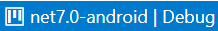
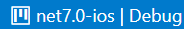
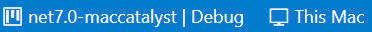

# Creating an app with VS Code

> [!NOTE]
> Make sure to setup your environment by [following our instructions](xref:Uno.GetStarted.vscode).

## Create the App

Creating an Uno Platform project is done [using dotnet new](xref:Uno.GetStarted.dotnet-new) and Uno Platform Live Wizard by following these steps:

1. Open a browser and navigate to the online <a target="_blank" href="https://aka.platform.uno/app-wizard">Live Wizard</a>
1. Configure your new project by providing a project name, then click **Start**

    

1. Choose a template to build your application

    

    > [!TIP]
    > For a detailed overview of the Uno Platform project wizard and all its options, see the [Wizard guide](xref:Uno.GettingStarted.UsingWizard).

1. Click the **Create** button on the top right corner, then click the **Copy** button

    

1. In your terminal, navigate to the folder that will contain your new app.
1. Create a new project by pasting and executing the command that was previously generated in the Live Wizard.

> [!IMPORTANT]
> Apple targets cannot be built under Linux. If you are using Linux, you'll need to remove iOS and Catalyst from the platforms list.

Next, open the project using Visual Studio Code:

* In the terminal type the following:

    ```bash
    code ./MyApp
    ```

* Visual Studio Code might ask to restore the NuGet packages. Allow it to restore them if asked.
* Once the project has been loaded, in the status bar at the bottom left of VS Code, `MyApp.sln` is selected by default. Select `MyApp.Wasm.csproj`, `MyApp.Skia.Gtk.csproj` or `MyApp.Mobile.csproj` instead.

## Debug the App

Uno Platform provides integrated support for debugging your app on Windows, mac and Linux.

### [**WebAssembly**](#tab/Wasm)

1. In the debugger section of the [activity bar](https://code.visualstudio.com/docs/getstarted/userinterface) select `Debug (Chrome, WebAssembly)`
1. In the status bar, ensure the `MyApp.Wasm.csproj` project is selected - by default `MyApp.sln` is selected.
1. Press `F5` to start the debugging session

### [**Skia GTK**](#tab/skiagtk)

1. In the debugger section of the [activity bar](https://code.visualstudio.com/docs/getstarted/userinterface) select `Skia.GTK (Debug)`
1. In the status bar, ensure the `MyApp.Skia.Gtk.csproj` project is selected - by default `MyApp.sln` is selected.
1. Press `F5` to start the debugging session

Note that C# Hot Reload is not available when running with the debugger. In order to use C# Hot Reload, run the app using the following:

* On Windows, type the following:

    ```bash
    $env:DOTNET_MODIFIABLE_ASSEMBLIES="debug"
    dotnet run
    ```

* On Linux or macOS:

    ```bash
    export DOTNET_MODIFIABLE_ASSEMBLIES=debug
    dotnet run
    ```

### [**Android**](#tab/androiddebug)

* In the status bar, select the `MyApp.Mobile` project - by default `MyApp.sln` is selected.

  
* To the right of `MyApp.Mobile`, click on the target framework to select `net8.0-android | Debug`

  
* Then, to the right of the target framework, select the device to debug with. You will need to connect an android device, or create an Android simulator.

  
* Finally, in the debugger side menu, select the `Uno Platform Mobile` profile
* Either press `F5` or press the green arrow to start the debugging session.

### [**iOS**](#tab/iosdebug)

> [!NOTE]
> Debugging for iOS is only possible when running locally (or remotely through [Remote SSH](https://marketplace.visualstudio.com/items?itemName=ms-vscode-remote.remote-ssh)) on a macOS machine.

* In the status bar, select the `MyApp.Mobile` project - by default `MyApp.sln` is selected.

  
* To the right of `MyApp.Mobile`, click on the target framework to select `net8.0-ios | Debug`

  
* Then, to the right of the target framework, select the device to debug with. You will need to connect an iOS device, or use an existing iOS simulator.

  
* Finally, in the debugger side menu, select the `Uno Platform Mobile` profile
* Either press `F5` or press the green arrow

> [!TIP]
> When deploying to an iOS device, you may encounter the following error: `errSecInternalComponent`. In such case, you'll need to unlock your keychain from a terminal inside VS Code by running the following command: `security unlock-keychain`

### [**Mac Catalyst**](#tab/catalystdebug)

> [!NOTE]
> Debugging for Mac Catalyst is only possible when running locally (or remotely through [Remote SSH](https://marketplace.visualstudio.com/items?itemName=ms-vscode-remote.remote-ssh)) on a macOS machine.

* In the status bar, select the `MyApp.Mobile` project - by default `MyApp.sln` is selected.

  
* To the right of `MyApp.Mobile`, click on the target framework to select `net8.0-maccatalyst | Debug`

  
* Finally, in the debugger side menu, select the `Uno t Mobile` profile
* Either press `F5` or press the green arrow to start the debugging session.

***

You're all set!

You can also find [additional VS Code topics](xref:Uno.vscode.additional), such as using snippets, updating existing apps to use VS Code

## Next Steps

Now that you're Created and Debug the App.

Learn more about:

* [Uno Platform features and architecture](xref:Uno.GetStarted.Explore)
* [Hot Reload feature](xref:Uno.Features.HotReload)
* [Uno Platform App solution structure](xref:Uno.Development.AppStructure)
* [Troubleshooting](xref:Uno.UI.CommonIssues)
* [How-tos and Tutorials](xref:Uno.Tutorials.Intro) See real-world examples with working code.
* <a href="implemented-views.md">Use the API Reference to Browse the set of available controls and their properties.</a>
