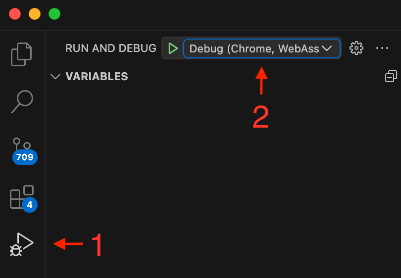
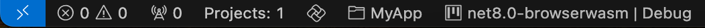
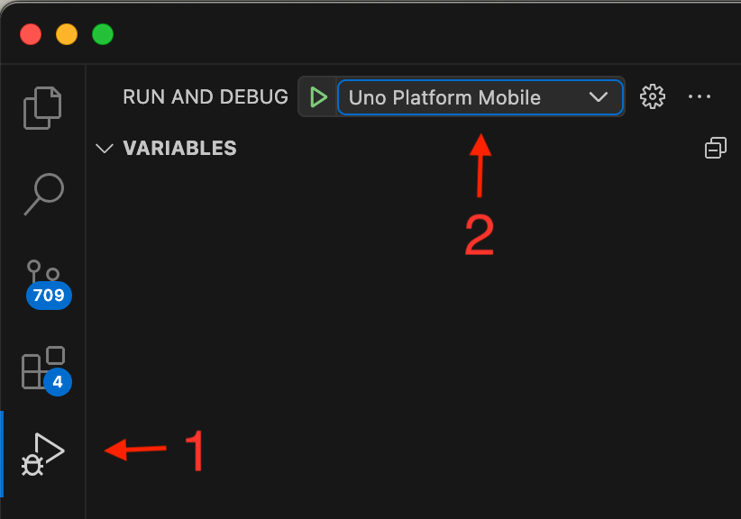
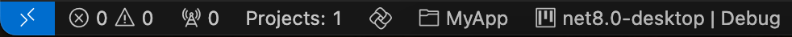
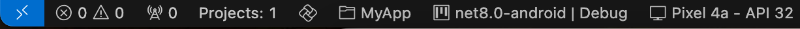
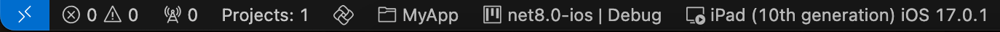
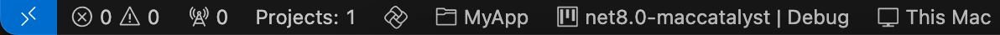

# Creating an app with VS Code

> [!NOTE]
> Make sure to setup your environment by [following our instructions](xref:Uno.GetStarted.vscode).

## Create the App

Creating an Uno Platform project is done [using dotnet new](xref:Uno.GetStarted.dotnet-new) and the Uno Platform Live Wizard by following these steps:

1. Open a browser and navigate to the online <a target="_blank" href="https://aka.platform.uno/app-wizard">Live Wizard</a>
1. Configure your new project by providing a project name, then click **Start**

    

1. Choose a template to build your application

    

    > [!TIP]
    > For a detailed overview of the Uno Platform project wizard and all its options, see the [Wizard guide](xref:Uno.GettingStarted.UsingWizard).

1. Click the **Create** button on the top right corner, then click the **Copy** button

    

1. In your terminal, navigate to the folder that will contain your new app.
1. Create a new project by pasting and executing the command that was previously generated in the Live Wizard.

> [!IMPORTANT]
> Apple targets are automatically disabled under Linux.

Next, open the project using Visual Studio Code:

* In the terminal type the following:

    ```bash
    code ./MyApp
    ```

* Visual Studio Code might ask to restore the NuGet packages. Allow it to restore them if asked.
* Once the solution has been loaded, in the status bar at the bottom left of VS Code, `MyApp.sln` is selected by default. Select `MyApp.csproj` to load the project instead.

## Debug the App

Uno Platform provides integrated support for debugging your app on Windows, macOS, and Linux.

### [**WebAssembly**](#tab/Wasm)

In VS Code :

1. In the [activity bar](https://code.visualstudio.com/docs/getstarted/userinterface) select the debugger
1. Set the debugger launch to `Debug (Chrome, WebAssembly)`



In the status bar :

1. Just after the Uno logo, ensure the `MyApp` project is selected - by default `MyApp.sln` is selected
1. Next, click on the target framework to select `net8.0-browserwasm | Debug`



Finally, press `F5` to start the debugging session.

### [**Desktop / Skia**](#tab/skia)

In VS Code :

1. In the [activity bar](https://code.visualstudio.com/docs/getstarted/userinterface) select the debugger
1. Set the debugger launch to `Uno Platform Mobile` or `Uno Platform Desktop (Debug)`



In the status bar :

1. Just after the Uno logo, ensure the `MyApp` project is selected - by default `MyApp.sln` is selected
1. Next click on the target framework to select `net8.0-desktop | Debug`



Finally, press `F5` to start the debugging session.

#### Debugging using WSL 2 on Windows

VS Code supports debugging Uno Platform Desktop apps though the WSL Extension:

1. Install the [WSL extension](https://marketplace.visualstudio.com/items?itemName=ms-vscode-remote.remote-wsl)
1. In the control palette, select **WSL: Connect to WSL**
1. Once connected to WSL, ensure that the [Uno Platform extension](https://marketplace.visualstudio.com/items?itemName=unoplatform.vscode) is installed
1. Once the extension is installed, follow the same steps as the section above

#### Debugging on Linux Remotely

When connecting to a remote Linux machine using the [SSH Extension](https://marketplace.visualstudio.com/items?itemName=ms-vscode-remote.remote-ssh), in order for the user interface to show, it is required to specify the `DISPLAY` environment variable:

1. In the `.vscode/launch.json`, find the `Uno Platform Desktop (Debug)` section
1. In the `env` section, add the following:

    ```json
    "env": {
        "DISPLAY": ":0"
    },
    ```

This will allow for the application to build on the remote machine, then show on the main display.

#### Considerations for Hot Reload

Note that C# Hot Reload is not available when running with the debugger. In order to use C# Hot Reload, run the app using the following:

* On Windows, type the following:

    ```bash
    $env:DOTNET_MODIFIABLE_ASSEMBLIES="debug"
    dotnet run -f net8.0-desktop
    ```

* On Linux or macOS:

    ```bash
    export DOTNET_MODIFIABLE_ASSEMBLIES=debug
    dotnet run -f net8.0-desktop
    ```


### [**Android**](#tab/androiddebug)

In VS Code :

1. In the [activity bar](https://code.visualstudio.com/docs/getstarted/userinterface) select the debugger
1. Set the debugger launch to `Uno Platform Mobile`


In the status bar :

1. Just after the Uno logo ensure the `MyApp` project is selected - by default `MyApp.sln` is selected
1. Next click on the target framework to select `net8.0-android | Debug`
1. Then select the device to debug with. You will need to connect an Android device or [create an Android emulator](https://developer.android.com/studio/run/managing-avds).



Finally, press `F5` to start the debugging session.

### [**iOS**](#tab/iosdebug)

> [!NOTE]
> Debugging for iOS is only possible when running locally (or remotely through [Remote SSH](https://marketplace.visualstudio.com/items?itemName=ms-vscode-remote.remote-ssh)) on a macOS machine.

In VS Code :

1. In the [activity bar](https://code.visualstudio.com/docs/getstarted/userinterface) select the debugger
1. Set the debugger launch to `Uno Platform Mobile`


In the status bar :

1. Just after the Uno logo ensure the `MyApp` project is selected - by default `MyApp.sln` is selected
1. Next click on the target framework to select `net8.0-ios | Debug`
1. Then select the device to debug with. You will need to connect an iOS device or [use an installed iOS simulator](https://developer.apple.com/documentation/xcode/installing-additional-simulator-runtimes).



Finally, press `F5` to start the debugging session.

> [!TIP]
> When deploying to an iOS device, you may encounter the following error: `errSecInternalComponent`. In such case, you'll need to unlock your keychain from a terminal inside VS Code by running the following command: `security unlock-keychain`

### [**Mac Catalyst**](#tab/catalystdebug)

> [!NOTE]
> Debugging for Mac Catalyst is only possible when running locally (or remotely through [Remote SSH](https://marketplace.visualstudio.com/items?itemName=ms-vscode-remote.remote-ssh)) on a macOS machine.

In VS Code :

1. In the [activity bar](https://code.visualstudio.com/docs/getstarted/userinterface) select the debugger
1. Set the debugger launch to `Uno Platform Mobile`


In the status bar :

1. Just after the Uno logo ensure the `MyApp` project is selected - by default `MyApp.sln` is selected
1. Next click on the target framework to select `net8.0-maccatalyst | Debug`
1. The `This Mac` device will be pre-selected. On Apple Silicon (arm64) Macs you will have the option to use `This Mac using Rosetta` to debug `x64` applications



Finally, press `F5` to start the debugging session.

### [**Windows**](#tab/windowsdebug)

> [!NOTE]
> Debugging for Windows is only possible when running locally (or remotely through [Remote SSH](https://marketplace.visualstudio.com/items?itemName=ms-vscode-remote.remote-ssh)) on a Windows computer.

In VS Code :

1. In the [activity bar](https://code.visualstudio.com/docs/getstarted/userinterface) select the debugger
1. Set the debugger launch to `Uno Platform Mobile`


In the status bar :

1. Just after the Uno logo ensure the `MyApp` project is selected - by default `MyApp.sln` is selected
1. Next click on the target framework to select `net8.0-windows10.0.xxxxx | Debug`
1. The `This Computer` device will be pre-selected. On ARM64-based computers, you will have the option to use `This Computer using emulation` to debug `x64` applications


Finally press `F5` to start the debugging session.

***

You're all set!

You can also find [additional VS Code topics](xref:Uno.vscode.additional), such as using snippets, updating existing apps to use VS Code

## Next Steps

Now that you're Created and Debug the App.

Learn more about:

* [Uno Platform features and architecture](xref:Uno.GetStarted.Explore)
* [Hot Reload feature](xref:Uno.Features.HotReload)
* [Uno Platform App solution structure](xref:Uno.Development.AppStructure)
* [Troubleshooting](xref:Uno.UI.CommonIssues)
* [How-tos and Tutorials](xref:Uno.Tutorials.Intro) See real-world examples with working code.
* [List of views implemented in Uno](implemented-views.md) for the set of available controls and their properties.
