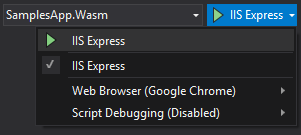
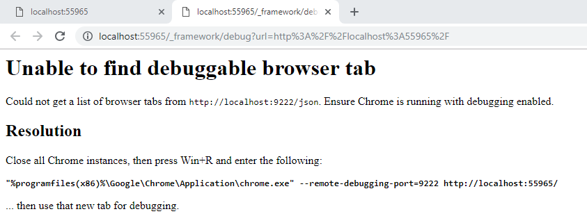
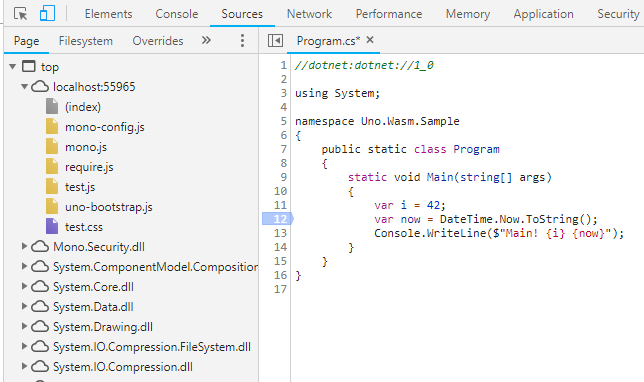
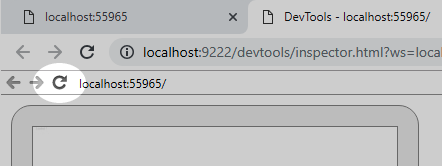

# Using the WebAssembly C# Debugger

There are two ways to debug a WebAssembly application:

- Using Visual Studio 2022 integrated debugger (preferred)
- Using the browser's debugger

## Using Visual Studio

Here’s what you need to do to debug an Uno Platform application in Visual Studio (2022 17.1 or later):

- Install the latest [Uno Platform Visual Studio templates](./get-started-vs-2022.md#install-the-solution-templates)
- Have Chrome or Edge (Chromium based)
- In the NuGet Package Manager, update `Uno.Wasm.Bootstrap` and `Uno.Wasm.Bootstrap.DevServer` 8.0.0 or later
- Ensure that `<MonoRuntimeDebuggerEnabled>true</MonoRuntimeDebuggerEnabled>` is set in your csproj. It is automatically set [when using the Uno.SDK](xref:Uno.Features.Uno.Sdk).
- Ensure that in the `Properties/launchSettings.json` file, the following like below each `launchBrowser` line:

    ```json
    "inspectUri": "{wsProtocol}://{url.hostname}:{url.port}/_framework/debug/ws-proxy?browser={browserInspectUri}",
    ```

Then you can start debugging with the VS debugger toolbar:

- Select **MyApp (WebAssembly IIS Express)** or your application name as the debugging target
- Select **Chrome** or **Microsoft Edge** as the Web Browser
- Press <kbd>F5</kbd> or _Debug_ > _Start Debugging_

You should now be able to set breakpoints or do step-by-step debugging of your code.

### Tips for debugging in visual studio

- Some debugger features may not have yet been implemented by the .NET and Visual Studio team. You can take a look at the [dotnet/runtime](https://github.com/dotnet/runtime) repository for more details.
- If the breaking does not hit, make sure that the `inspectUri` lines have been added to the `Properties/launchSettings.json` file.
- Methods with only invocations to generated code (e.g. control constructors with only "InitializeComponent" in it) may not allow placing breakpoints. Add some explicit code in the scope to place breakpoints.

## Using the browser debugger

To debug your application:

- Make the `net9.0-browserwasm` active debugging target framework (right-click **set as startup** in Solution Explorer)
- Ensure that `<MonoRuntimeDebuggerEnabled>true</MonoRuntimeDebuggerEnabled>` is set in your csproj. It is automatically set [when using the Uno.SDK](xref:Uno.Features.Uno.Sdk).
- In the debugging toolbar:

  - Select **MyApp (WebAssembly IIS Express)** as the debugging target
  - Select **Chrome** or **Microsoft Edge** as the Web Browser
  - Make sure script debugging is disabled<br/>
   

- Start the debugging session using <kbd>Ctrl</kbd><kbd>F5</kbd> or _Debug_ > _Start Without Debugging_ from the menu, (<kbd>F5</kbd> will work, but the debugging experience won't be in Visual Studio)
- Once your application has started, press <kbd>Alt</kbd><kbd>Shift</kbd><kbd>D</kbd> (in Chrome, on your application's tab)
- A new tab will open with the debugger or instructions to activate it

- You will now get the Chrome DevTools to open listing all the .NET loaded assemblies on the Sources tab:<br/>

- You may need to refresh the original tab if you want to debug the entry point (Main) of your application.<br/>


> ### Tips for debugging in Chrome
>
> - You need to launch a new instance of Chrome with right parameters. If Chrome is your main browser
> and you don't want to restart it, install another version of Chrome (_Chrome Side-by-Side_).
> You may simply install _Chrome Beta_ or _Chrome Canary_ and use them instead.
> - Sometimes, you may have a problem removing a breakpoint from code (it's crashing the debugger).
> You can remove them in the _Breakpoints list_ instead.
> - Once _IIS Express_ is launched, no need to press <kbd>Ctrl</kbd><kbd>F5</kbd> again: you simply need to rebuild your
> _WASM_ head and refresh it in the browser.
> - **To refresh an app**, you should use the debugger tab and press the _refresh_ button in the content.
> - **If you have multiple monitors**, you can detach the _debugger tab_ and put it on another window.
> - For breakpoints to work properly, you should not open the debugger tools (<kbd>F12</kbd>) in the app's tab.
> - If you are **debugging a library which is publishing SourceLinks**, you must disable it or you'll
> always see the SourceLink code in the debugger. SourceLink should be activated only on Release build.
> - When debugging in Chrome, <kbd>Ctrl</kbd>+<kbd>O</kbd> brings up a file-search field. That way it's a lot easier to find .cs files versus searching through the whole folder hierarchy.
