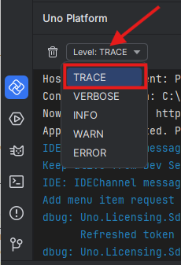

# Dev Server

The Dev Server is the local development companion that enables productive inner-loop features in Uno Platform, such as Hot Reload, design-time updates, and IDE integration. It runs as a lightweight HTTP process and maintains a bidirectional channel with the IDE and the running application.

## Overview

- Provides a transport between the IDE and the running application to exchange development-time messages
- Powers Hot Reload and Hot Design experiences by delivering code and XAML updates
- Starts automatically and stays out of the way; you usually do not have to configure it

## Prerequisites

- Requires .NET SDK, [same version as uno](xref:Uno.Development.NetVersionSupport)
- Works in Debug builds, where connection information is embedded so the app can reach the Dev Server

## When and how the Dev Server starts

> [!NOTE]
> The Dev Server starts only when Uno Platform packages are referenced by your project(s).
>
> [!NOTE]
> The Dev Server won't start until NuGet package restore has completed successfully (a failed or pending restore prevents startup).

1. Open the solution: the IDE reserves a free TCP port and writes it to each project's .csproj.user file under the UnoRemoteControlPort property.
2. Build/run in Debug: the app is built with the Dev Server connection information.
3. Launch the app (Debug): the app connects back to the Dev Server.
4. Develop: the IDE and app exchange development-time messages (e.g., Hot Reload updates).

## Command-line (advanced usage for specific scenarios)

You can manage the Dev Server from the command line using the dotnet tool `Uno.DevServer` (command: uno-devserver):

- `uno-devserver start`: Start the Dev Server for the current solution directory
- `uno-devserver stop`: Stop the Dev Server attached to the current directory
- `uno-devserver list`: List running Dev Server instances
- `uno-devserver cleanup`: Terminate stale Dev Server processes
- `uno-devserver login`: Open the Uno Platform settings application
- `--mcp`: Run an MCP proxy mode for integration with MCP-based tooling
- `--port | -p <int>`: Optional port value for MCP proxy mode

## Hot Reload

The Dev Server enables Hot Reload for a faster inner loop:

- C# Hot Reload for managed code changes
- XAML and resource updates without restarting the app
- Asset updates in supported scenarios

## Security

- Uses a random local port, making it hard to guess
- Intended for local development only and relies on your local network security
- Do not expose the Dev Server to untrusted networks

> [!IMPORTANT]
> The Dev Server is a development-time facility. It is not required nor recommended for production deployments.

## Troubleshooting

### [**Common issues**](#tab/common-issues)

- The TCP port number used by the app to connect back to the IDE is located in the <UnoRemoteControlPort> property of the [ProjectName].csproj.user file. If the port number does not match with the one found in the Uno Platform - Hot Reload output window, restart your IDE.
- If the Dev Server does not start, ensure NuGet restore has completed successfully and Uno Platform packages are referenced by your project(s).

### [**Visual Studio**](#tab/vswints)

- The Output window in Visual Studio includes an output category named `Uno Platform`. Diagnostic messages from the Uno Platform VS extension appear there. To enable logging, set MSBuild project build output verbosity to at least "Normal" (above "Minimal"). These changes should take effect immediately without a restart; if you do not see additional logs, try restarting Visual Studio. For more details on build log verbosity, refer to the [official Visual Studio documentation](https://learn.microsoft.com/en-us/visualstudio/ide/how-to-view-save-and-configure-build-log-files?view=vs-2022#to-change-the-amount-of-information-included-in-the-build-log).  

    If you need to share logs when opening an issue on the GitHub [Uno Platform repository](https://github.com/unoplatform/uno), set verbosity to **Diagnostic** to provide the most detailed logs for investigation.

    **Steps to change MSBuild output verbosity:**
    1. Open **Tools > Options > Projects and Solutions > Build and Run**, then set **MSBuild output verbosity** to **Diagnostic** or the required level.

       
    2. Restart Visual Studio, re-open your solution, and wait a few seconds.
    3. Go to **View > Output**.
    4. In the Output window, select `Uno Platform` from the drop-down.

       

### [**Visual Studio Code**](#tab/vscodets)

- The Output window in Visual Studio Code includes an output category named `Uno Platform` in its drop-down menu. Diagnostic messages from the Uno Platform VS Code extension appear there.

    **Steps to see the `Uno Platform` output:**  
    1. In the status bar at the bottom left of VS Code, ensure `NameOfYourProject.csproj` is selected (by default `NameOfYourProject.sln` is selected).

       
    2. Wait a few seconds.
    3. Go to **View > Output**.
    4. In the Output window, select `Uno Platform` from the drop-down.

       

### [**Rider**](#tab/riderts)

- The Output window in Rider includes an output category named `Uno Platform` in its sidebar. Diagnostic messages from the Uno Platform Rider plugin appear there.

    **Steps to see the Uno Platform output:**  
    1. In the sidebar at the bottom left of Rider, click on the Uno Platform logo.

       
    2. In the Output window, select **LEVEL: Trace** from the drop-down.

       

---
