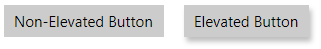

# ElevatedView

In many design languages (like [_Material Design_](https://material.io/design)), there's a notion of 'elevation' where a portion of the UI should be presented as being _elevated_ over the rest of the content.

In this case, WinUI's native elevation API can't work on all platforms because of technical limitations. To address this problem, Uno provides a control called `ElevatedView`, able to produce a similar elevated effect on all platforms (WinUI, Android, iOS, macOS, WebAssembly, and Skia).

This control is very useful for creating cards with both rounded corners and an elevated effect - which could otherwise be challenging to produce on some platforms.

## How to use the `ElevatedView`

First you need to add the `toolkit` namespace in your XAML file:

```xml
xmlns:toolkit="using:Uno.UI.Toolkit"
```

After that, use the `ElevatedView` to host the content you need to be elevated:

``` xml
<StackPanel Orientation="Horizontal" Spacing="20">

    <Button>Non-Elevated Button</Button>

    <toolkit:ElevatedView Elevation="10" Background="Gray" ShadowColor="Black">
        <Button>Elevated Button</Button>
    </toolkit:ElevatedView>

</StackPanel>
```

Will produce the following result:



> **ATTENTION FOR WinUI**: When there is an error resolving the `<toolkit:ElevatedView>` on WinUI, the common mistake is to forget to include the `Uno.WinUI` package for all platforms, including WinUI. On WinUI, the only component that the `Uno.WinUI` package adds is the Toolkit.

## Settings

You can set the following properties:

* `Elevation`: numeric number representing the level of the elevation effect. Typical values are between 5 and 30. The default is `0` - no elevation.
* `ShadowColor`: By default, the shadow will be `Black`, but you can set any other value. You can reduce the shadow effect by using the alpha channel.
* `Background`: The default is `null`, which does not show a shadow. You'll need to specify a color to avoid having a shadow below a transparent surface if the stretching does not match the child.
* `CornerRadius`: Use it to create rounded corner effects. The shadow will follow them.

## Particularities

* Make sure to _give room_ for the shadow in the layout (eg. by setting a `Margin` on the `ElevatedView`).  Some platforms like macOS may clip the shadow otherwise. For the same reason, avoid wrapping the `<toolkit:ElevatedView>` directly in a `<ScrollViewer>` because it's designed to clip its content.
