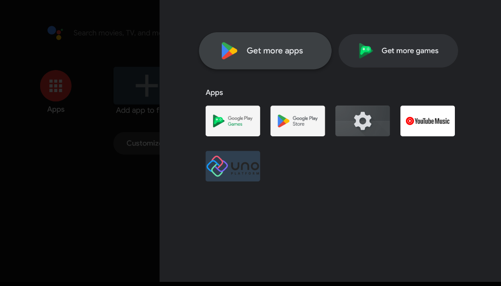

# Support for Android TV

Uno Platform is proud to support Android TV, enabling you to extend your application's reach to this wide family of devices with unique use cases.

## Enabling Android TV support via `UnoFeatures` (recommended)

For projects using the `Uno.Sdk`, the simplest way to add Android TV support is by adding the `AndroidTV` feature to your project's `<UnoFeatures>` property:

```xml
<UnoFeatures>$(UnoFeatures);AndroidTV</UnoFeatures>
```

This automatically adds a reference to the `Xamarin.AndroidX.Leanback` package. New projects created from the Uno Platform templates with the **Android TV** option enabled will also have the manifest, intent filter, banner, and focus highlight overrides stamped automatically. You can still apply the manual steps below if you need to fine-tune the configuration or are working with an older project layout.

## Enabling Android TV support manually

To make your application properly show up among installed apps on Android TV and to be able to publish the app to the store, you need to adjust the app manifest to declare support for Android TV.

First, open the `MainActivity` class in the `YourApp` project (or the `YourApp.Droid` project for older versions of Uno Platform), and add an `[IntentFilter]` attribute for `ActionMain` declaring support for `LeanbackLauncher` category.

> [!IMPORTANT]
> If your activity has multiple IntentFilter attributes, make sure ActionMain follows directly after the Activity attribute, otherwise, the app will not launch for debugging in Visual Studio.

```csharp
[Activity(
    MainLauncher = true,
    ConfigurationChanges = ActivityHelper.AllConfigChanges,
    WindowSoftInputMode = SoftInput.AdjustPan | SoftInput.StateHidden
  )]
[IntentFilter(
  new[] { Android.Content.Intent.ActionMain },
  Categories = new[] {
    Android.Content.Intent.CategoryLauncher,
    Android.Content.Intent.CategoryLeanbackLauncher 
  })]
public class MainActivity : Windows.UI.Xaml.ApplicationActivity
{
  ...
}
```

Next, every Android TV app must provide a banner image, which is used to display the app on the home screen. This can be set via the `Banner` property in the `ApplicationAttribute`, which can be found in the `Main.Android.cs` file (or the `Main.cs` file for older versions of Uno Platform):

```csharp
[global::Android.App.ApplicationAttribute(
  Label = "@string/ApplicationName",
  Banner = "@drawable/banner",
  LargeHeap = true,
  HardwareAccelerated = true,
  Theme = "@style/AppTheme"
)]
```

The banner then must be added to the `Resources/drawable-xhdpi` folder. For the banner, use an xhdpi resource with a size of 320 x 180 px. Text must be included in the image. If your app is available in more than one language, you must provide separate versions of the banner with text for each supported language. See [Android docs](https://developer.android.com/training/tv/start/start#banner) for more information.

Finally, to make your app work on both Android TV and Android mobile devices, declare that neither touchscreen nor leanback mode is required. You can do so using the assembly-wide `[UsesFeature]` attributes (you can place these in any file within the `Mobile` or `Droid` project, we recommend the `Main.Android.cs` or `Main.cs` file):

```csharp
[assembly: UsesFeature("android.software.leanback", Required = false)]
[assembly: UsesFeature("android.hardware.touchscreen", Required = false)]
```

You can now deploy your app on a Android TV emulator or actual device. It should show up among the installed apps:



## Remote control support

The integration of focus management allows the Android TV remote control to work seamlessly, just like normal keyboard focus navigation. To navigate the focus in your application via the directional pad of the remote control, you need to make sure `XYFocusKeyboardNavigation` is `Enabled` on all your pages:

```xml
<Page xmlns="http://schemas.microsoft.com/winfx/2006/xaml/presentation"
      xmlns:x="http://schemas.microsoft.com/winfx/2006/xaml"
      XYFocusKeyboardNavigation="Enabled">
    <!-- Your app's UI elements go here -->
</Page>
```

To disable the native Android highlighting of focused elements, the `styles.xml` file needs to be updated to make the highlight transparent:

```xml
<item name="android:colorControlHighlight">@android:color/transparent</item>
```

Please note, that this will disable all the highlights, even in embedded native controls you may host within the Uno Platform app.

## Shipping a TV-only app alongside a phone app

The opt-in described above produces a single APK that targets both phones and Android TVs. If you need to publish a separate experience on each form factor (for example, because the TV UI diverges substantially from the phone UI), the recommended approach is to ship **two separate Uno Platform apps**:

1. **A "phone" Uno Platform app** — your existing Uno project. Leave the `AndroidTV` opt-in disabled here.
2. **A "TV" Uno Platform app** — a second Uno project dedicated to Android TV with the `AndroidTV` opt-in enabled.

To set up the TV-only app:

- Create a new Uno Platform app (`dotnet new unoapp -o MyApp.TV`) targeting Android, and enable the `AndroidTV` opt-in.
- In `MyApp.TV/Platforms/Android/AndroidManifest.xml`, change `android:required` on the `android.software.leanback` `<uses-feature>` element from `false` to `true`. This makes the APK install only on devices that support leanback (i.e. Android TVs).
- Use a distinct application id (for example `com.companyname.myapp.tv`) so the TV app and phone app can coexist on the Play Store as separate listings.
- Move shared code (view models, services, resources) into a class library and reference it from both apps.
