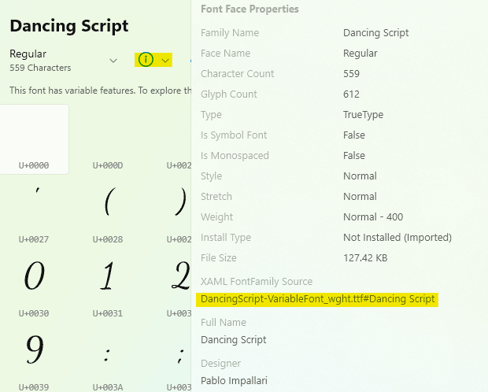

# Custom Fonts

The `FontFamily` of many controls (e.g. `TextBox` or `Control`) property allows you to customize the font used in your application's UI. Please note that in the following examples, `yourfont.ttf` is a placeholder for the font file name, and `Your Font Name` is a placeholder for its actual name. Use a font management app to make figuring out the correct format easier. The free application, [Character Map](https://www.microsoft.com/store/productId/9WZDNCRDXF41), can be used to extract the full string for your selected font:



## Adding a custom font in the App assets folder

In order to use a custom font in your application:

1. Add font file in a folder named `Assets/Fonts` in your application's **App Code Library** project. It should be using the `Content` build action (as seen in the properties for that file).
2. Reference it using the `ms-appx:///` scheme:

   ```xml
   <Setter Property="FontFamily" Value="ms-appx:///[MyApp]/Assets/Fonts/yourfont.ttf#Your Font Name" />
   ```

   You will need to replace `[MyApp]` by the name of the **App Code Library** project in your solution. It is generally of the same name as the solution when created from the Uno Platform templates.

## Fonts preloading on WebAssembly

On Wasm platform, fonts files are loaded by the browser and can take some time to load, resulting in performance degradation and potential flickering when the font is actually available for rendering. In order to prevent this, it is possible to instruct the browser to preload the font before the rendering:

``` csharp
// Preloading of font families on Wasm. Add this before the Application.Start() in the Program.cs

public static void main(string[] orgs)
{
    // Add this in your application to preload a font.
    // You can add more than one, but preloading too many fonts could hurt the user experience.
    // IMPORTANT: The string parameter should be exactly the same string (including casing)
    //            used as FontFamily in the application.
    Uno.UI.Xaml.Media.FontFamilyHelper.PreloadAsync("ms-appx:///[MyApp]/Assets/Fonts/yourfont01.ttf#ApplicationFont01");
    Uno.UI.Xaml.Media.FontFamilyHelper.PreloadAsync("https://fonts.cdnfonts.com/s/71084/antikythera.woff#Antikythera");

    // Preloads a font which has been specified as a CSS font, either with a data uri or a remote resource.
    Uno.UI.Xaml.Media.FontFamilyHelper.PreloadAsync("Roboto");

    Microsoft.UI.Xaml.Application.Start(_ => _app = new App());
}
```

Uno Platform for WebAssembly also supports remote fonts directly from the XAML, but it is exclusively supported on WebAssembly:

```xml
<!-- This is exclusive to Wasm platform -->
<Setter Property="FontFamily" Value="https://fonts.cdnfonts.com/s/71084/antikythera.woff#Antikythera" />
```

> [!NOTE]
> The `#` part is optional and is there for cross-platform compatibility. It is completely ignored on Uno WASM and can be omitted.

## Custom Fonts Notes

Please note that some custom fonts need the `FontFamily` and `FontWeight` properties to be set at the same time in order to work properly on `TextBlock`, `Runs`, and for styles Setters.
If that's your case, here are some examples of code:

```xml
<FontFamily x:Key="FontFamilyLight">ms-appx:///[MyApp]/Assets/Fonts/PierSans-Light.otf#Pier Sans Light</FontFamily>
<FontFamily x:Key="FontFamilyBold">ms-appx:///[MyApp]/Assets/Fonts/PierSans-Bold.otf#Pier Sans Bold</FontFamily>

<Style x:Key="LightTextBlockStyle"
      TargetType="TextBlock">
   <Setter Property="FontFamily"
         Value="{StaticResource FontFamilyLight}" />
   <Setter Property="FontWeight"
         Value="Light" />
   <Setter Property="FontSize"
         Value="16" />
</Style>

<Style x:Key="BoldTextBlockStyle"
      TargetType="TextBlock">
   <Setter Property="FontFamily"
         Value="{StaticResource FontFamilyBold}" />
   <Setter Property="FontWeight"
         Value="Bold" />
   <Setter Property="FontSize"
         Value="24" />
</Style>

<TextBlock Text="TextBlock with Light FontFamily and FontWeight."
         FontFamily="{StaticResource FontFamilyLight}"
         FontWeight="Light" />

<TextBlock Style="{StaticResource BoldTextBlockStyle}">
   <Run Text="TextBlock with Runs" />
   <Run Text="and  Light FontFamily and FontWeight for the second Run."
       FontWeight="Light"
       FontFamily="{StaticResource FontFamilyLight}" />
</TextBlock>
```

## Custom fonts in Uno Platform 4.6 or below

Uno Platform 4.7 introduces a unified way to include fonts in applications, but if you are still using a previous version of Uno Platform, you can use these directions.

### Custom Fonts on Android

Fonts must be placed in the `Assets` folder of the head project, matching the path of the fonts in Windows, and marked as `AndroidAsset`.
The format is the same as Windows:

```xml
<Setter Property="FontFamily" Value="/Assets/Fonts/yourfont.ttf#Your Font Name" />
```

   or

```xml
<Setter Property="FontFamily" Value="ms-appx:///Assets/Fonts/yourfont.ttf#Your Font Name" />
```

### Custom Fonts on iOS

Fonts must be placed in the `Resources/Fonts` folder of the head project, and be marked as
`BundleResource` for the build type.

Each custom font **must** then be specified in the `info.plist` file as follows:

```xml
<key>UIAppFonts</key>
<array>
    <string>Fonts/yourfont.ttf</string>
    <string>Fonts/yourfont02.ttf</string>
    <string>Fonts/yourfont03.ttf</string>
</array>
```

The format is the same as Windows, as follows:

```xml
<Setter Property="FontFamily" Value="/Assets/Fonts/yourfont.ttf#Your Font Name" />
```

or

```xml
<Setter Property="FontFamily" Value="ms-appx:///Assets/Fonts/yourfont.ttf#Your Font Name" />
```

## Custom Fonts on macOS

Fonts must be placed in the `Resources/Fonts` folder of the head project, and be marked as
`BundleResource` for the build type.

The fonts location path **must** then be specified in the `info.plist` file as follows:

```xml
<key>ATSApplicationFontsPath</key>
<string>Fonts</string>
```

> [!IMPORTANT]
> Please note that unlike iOS, for macOS only the path is specified. There is no need to list each font independently.

The format is the same as Windows, as follows:

```xml
<Setter Property="FontFamily" Value="/Assets/Fonts/yourfont.ttf#Your Font Name" />
```

or

```xml
<Setter Property="FontFamily" Value="ms-appx:///Assets/Fonts/yourfont.ttf#Your Font Name" />
```

### Custom fonts on WebAssembly

There are 3 ways to use fonts on the WebAssembly platform:

1. Referencing a **font defined in CSS**: Use a font defined using a `@font-face` CSS clause.

   > [!NOTE]
   > This was the only available way to define and use a custom font before Uno.UI v4.4. This is useful if the application is using externally referenced CSS as those commonly available on a CDN.

2. Referencing a **font file in application assets**: Use a font file (any web-compatible file format, such as `.ttf`, `.woff`, etc...). This can also be used to reference a font hosted elsewhere using an HTTP address.

#### Adding a custom font defined in CSS

First, the font needs to be defined in CSS.

```css
/* First way: defined locally using data uri */
@font-face {
  font-family: "RobotoAsBase64"; /* XAML: <FontFamily>RobotoAsBase64</FontFamily> */
  src: url(data:application/x-font-woff;charset=utf-8;base64,d09GMgABAAA...) format('woff');
}

/* Second way: defined locally using external uri targetting the font file */
@font-face {
  font-family: "Roboto"; /* XAML: <FontFamily>CssRoboto</FontFamily> */
  src: url(/Roboto.woff) format('woff');
}

/* Third way: Use an external font definition, optionally hosted on a CDN. */
@import url('http://fonts.cdnfonts.com/css/antikythera'); /* XAML: <FontFamily>Antikythera</FontFamily> + others available */
```

Second, you can use it in XAML in this way:

``` xml
<!-- XAML usage of CSS defined font -->

<TextBlock FontFamily="MyCustomFontAsBase64">This text should be rendered using the font defined as base64 in CSS.</TextBlock>

<TextBlock FontFamily="CssRoboto">This text should be rendered using the roboto.woff font referenced in CSS.</TextBlock>

<TextBlock FontFamily="Antikythera">This text should be rendered using the Antikythera font hosted on a CDN.</TextBlock>
```

> [!NOTE]
> This approach is nice and pretty flexible, but not friendly for multi-targeting. Until Uno.UI v4.4, this was the only way to define custom fonts on this platform.
