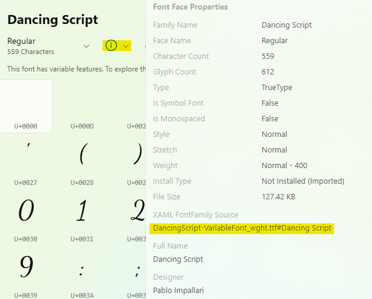

# Custom Fonts

The `FontFamily` of many controls (e.g. `TextBox` or `Control`) property allows you to customize the font used in your application's UI. Please note that in the following examples, `yourfont.ttf` is a placeholder for the font file name, and `Your Font Name` is a placeholder for its actual name. Use a font management app to make figuring out the correct format easier. The free application, [Character Map](https://www.microsoft.com/store/productId/9WZDNCRDXF41), can be used to extract the full string for your selected font:



## Default text font

The default text font on WinUI is [Segoe UI](https://learn.microsoft.com/en-us/typography/font-list/segoe-ui). However, Segoe UI isn't available on macOS, Linux, or Browsers running on macOS or Linux.

In order to get a consistent experience across targets, Uno Platform 5.3 or later automatically sets the default text font to OpenSans by using the [Uno.Fonts.OpenSans](https://nuget.org/packages/Uno.Fonts.OpenSans) NuGet package. This font is used on all targets except Windows App SDK, where Segoe UI continues to be used.

### Disabling Open Sans

If you are upgrading to 5.3 or later and your project uses the Uno.Sdk, but want to keep the legacy behavior (Segoe UI), add `<UnoDefaultFont>None</UnoDefaultFont>` to a `PropertyGroup` in `Directory.Build.props` or your `.csproj`.

### Using Open Sans in non-Uno.Sdk projects

If you are not using Uno.Sdk (Uno Platform 5.1 or earlier project templates), Segoe UI remains the default font even when using Uno Platform 5.3 and later. To switch to OpenSans, add a `PackageReference` to `Uno.Fonts.OpenSans` and also set `DefaultTextFontFamily` in the `App.xaml.cs` file:

```csharp
global::Uno.UI.FeatureConfiguration.Font.DefaultTextFontFamily = "ms-appx:///Uno.Fonts.OpenSans/Fonts/OpenSans.ttf";
```

## Adding a custom font in the App assets folder

In order to use a custom font in your application:

1. Add font file in a folder named `Assets/Fonts` in your application's **App Code Library** project. It should be using the `Content` build action (as seen in the properties for that file).
2. Reference it using the `ms-appx:///` scheme:

   ```xml
   <Setter Property="FontFamily" Value="ms-appx:///Assets/Fonts/yourfont.ttf#Your Font Name" />
   ```

   > [!TIP]
   > If your font is located in a **Class Library**, you'll need to use a path like `ms-appx:///MyClassLibrary1/Assets/Fonts/yourfont.ttf#Your Font Name`. You will need to replace `MyClassLibrary1` by the name class library project, or its `AssemblyName` if it was changed manually.

## Variable fonts and font manifest

Variable fonts are font files that can store multiple variants. They contain axes that define an aspect of design that can be varied. Common axes are width (`wdth`), weight (`wght`), italic (`ital`), and slant (`slnt`).

The width axis corresponds to `FontStretch` property in Uno Platform and WinAppSDK, the weight axis corresponds to the `FontWeight` property, and italic and slant axes correspond to the `FontStyle` property.

Variable fonts are currently properly supported on Android and Wasm, have partial support on iOS\*, and not supported on Skia due to [SkiaSharp issue](https://github.com/mono/SkiaSharp/issues/2318).

\* on Android and Wasm, if you set an aspect of a font that the variable font file doesn't have an axis for, the platform fakes it. For example, a variable font may have width and weight axes but not italic or slant. If you try to use italic, the platform will make "faux" italic. However, iOS doesn't have this behavior, which makes using variable fonts problematic in some cases.

To overcome the issues on Skia and iOS, we introduced the font manifest in Uno Platform 5.3. A font manifest is a JSON file that maps weight, stretch, and style to a static font. Note that the font manifest is only supported on Skia and iOS because other platforms don't need it.

### High level overview of how font manifest work

When you specify `FontFamily="ms-appx:///path/to/myfont.ttf`:

- On iOS and Skia, we check if `ms-appx:///path/to/myfont.ttf.manifest` exists. From there, we find the correct static font file to use.
- On other platforms, `ms-appx:///path/to/myfont.ttf` will be used right away. When this file is a variable font, it will work as expected.

### Example manifest file

You can see an example manifest file from `Uno.Fonts.OpenSans` NuGet package on [uno.fonts GitHub repository](https://github.com/unoplatform/uno.fonts/blob/cbb838712a299f9da4b424b9b5152cacccb15466/nuget/OpenSans/Uno.Fonts.OpenSans/Fonts/OpenSans.ttf.manifest).

## Fonts preloading on WebAssembly

On Wasm platform, fonts files are loaded by the browser and can take some time to load, resulting in performance degradation and potential flickering when the font is actually available for rendering. In order to prevent this, it is possible to instruct the browser to preload the font before the rendering:

```csharp
// Preloading of font families on Wasm. Add this before the Application.Start() in the Program.cs

public static void Main(string[] args)
{
    // Add this in your application to preload a font.
    // You can add more than one, but preloading too many fonts could hurt the user experience.
    // IMPORTANT: The string parameter should be exactly the same string (including casing)
    //            used as FontFamily in the application.
    Uno.UI.Xaml.Media.FontFamilyHelper.PreloadAsync("ms-appx:///[MyApp]/Assets/Fonts/yourfont01.ttf#ApplicationFont01");
    Uno.UI.Xaml.Media.FontFamilyHelper.PreloadAsync("https://fonts.cdnfonts.com/s/71084/antikythera.woff#Antikythera");

    // Preloads a font which has been specified as a CSS font, either with a data uri or a remote resource.
    Uno.UI.Xaml.Media.FontFamilyHelper.PreloadAsync("Roboto");

    Microsoft.UI.Xaml.Application.Start(_ => _app = new App());
}
```

Uno Platform for WebAssembly also supports remote fonts directly from the XAML, but it is exclusively supported on WebAssembly:

```xml
<!-- This is exclusive to Wasm platform -->
<Setter Property="FontFamily" Value="https://fonts.cdnfonts.com/s/71084/antikythera.woff#Antikythera" />
```

> [!NOTE]
> The `#` part is optional and is there for cross-platform compatibility. It is completely ignored on Uno WASM and can be omitted.

## Custom Fonts Notes

Please note that some custom fonts need the `FontFamily` and `FontWeight` properties to be set at the same time in order to work properly on `TextBlock`, `Runs`, and for styles Setters.
If that's your case, here are some examples of code:

```xml
<FontFamily x:Key="FontFamilyLight">ms-appx:///[MyApp]/Assets/Fonts/PierSans-Light.otf#Pier Sans Light</FontFamily>
<FontFamily x:Key="FontFamilyBold">ms-appx:///[MyApp]/Assets/Fonts/PierSans-Bold.otf#Pier Sans Bold</FontFamily>

<Style x:Key="LightTextBlockStyle"
      TargetType="TextBlock">
   <Setter Property="FontFamily"
         Value="{StaticResource FontFamilyLight}" />
   <Setter Property="FontWeight"
         Value="Light" />
   <Setter Property="FontSize"
         Value="16" />
</Style>

<Style x:Key="BoldTextBlockStyle"
      TargetType="TextBlock">
   <Setter Property="FontFamily"
         Value="{StaticResource FontFamilyBold}" />
   <Setter Property="FontWeight"
         Value="Bold" />
   <Setter Property="FontSize"
         Value="24" />
</Style>

<TextBlock Text="TextBlock with Light FontFamily and FontWeight."
         FontFamily="{StaticResource FontFamilyLight}"
         FontWeight="Light" />

<TextBlock Style="{StaticResource BoldTextBlockStyle}">
   <Run Text="TextBlock with Runs" />
   <Run Text="and  Light FontFamily and FontWeight for the second Run."
       FontWeight="Light"
       FontFamily="{StaticResource FontFamilyLight}" />
</TextBlock>
```

## Custom fonts in Uno Platform 4.6 or below

Uno Platform 4.7 introduces a unified way to include fonts in applications, but if you are still using a previous version of Uno Platform, you can use these directions.

### Custom Fonts on Android

Fonts must be placed in the `Assets` folder of the head project, matching the path of the fonts in Windows, and marked as `AndroidAsset`.
The format is the same as Windows:

```xml
<Setter Property="FontFamily" Value="/Assets/Fonts/yourfont.ttf#Your Font Name" />
```

   or

```xml
<Setter Property="FontFamily" Value="ms-appx:///Assets/Fonts/yourfont.ttf#Your Font Name" />
```

### Custom Fonts on iOS

Fonts must be placed in the `Resources/Fonts` folder of the head project, and be marked as
`BundleResource` for the build type.

Each custom font **must** then be specified in the `info.plist` file as follows:

```xml
<key>UIAppFonts</key>
<array>
    <string>Fonts/yourfont.ttf</string>
    <string>Fonts/yourfont02.ttf</string>
    <string>Fonts/yourfont03.ttf</string>
</array>
```

The format is the same as Windows, as follows:

```xml
<Setter Property="FontFamily" Value="/Assets/Fonts/yourfont.ttf#Your Font Name" />
```

or

```xml
<Setter Property="FontFamily" Value="ms-appx:///Assets/Fonts/yourfont.ttf#Your Font Name" />
```

## Custom Fonts on macOS

Fonts must be placed in the `Resources/Fonts` folder of the head project, and be marked as
`BundleResource` for the build type.

The fonts location path **must** then be specified in the `info.plist` file as follows:

```xml
<key>ATSApplicationFontsPath</key>
<string>Fonts</string>
```

> [!IMPORTANT]
> Please note that unlike iOS, for macOS only the path is specified. There is no need to list each font independently.

The format is the same as Windows, as follows:

```xml
<Setter Property="FontFamily" Value="/Assets/Fonts/yourfont.ttf#Your Font Name" />
```

or

```xml
<Setter Property="FontFamily" Value="ms-appx:///Assets/Fonts/yourfont.ttf#Your Font Name" />
```

### Custom fonts on WebAssembly

There are 3 ways to use fonts on the WebAssembly platform:

1. Referencing a **font defined in CSS**: Use a font defined using a `@font-face` CSS clause.

   > [!NOTE]
   > This was the only available way to define and use a custom font before Uno.UI v4.4. This is useful if the application is using externally referenced CSS as those commonly available on a CDN.

2. Referencing a **font file in application assets**: Use a font file (any web-compatible file format, such as `.ttf`, `.woff`, etc...). This can also be used to reference a font hosted elsewhere using an HTTP address.

#### Adding a custom font defined in CSS

First, the font needs to be defined in CSS.

```css
/* First way: defined locally using data uri */
@font-face {
  font-family: "RobotoAsBase64"; /* XAML: <FontFamily>RobotoAsBase64</FontFamily> */
  src: url(data:application/x-font-woff;charset=utf-8;base64,d09GMgABAAA...) format('woff');
}

/* Second way: defined locally using external uri targetting the font file */
@font-face {
  font-family: "Roboto"; /* XAML: <FontFamily>CssRoboto</FontFamily> */
  src: url(/Roboto.woff) format('woff');
}

/* Third way: Use an external font definition, optionally hosted on a CDN. */
@import url('http://fonts.cdnfonts.com/css/antikythera'); /* XAML: <FontFamily>Antikythera</FontFamily> + others available */
```

Second, you can use it in XAML in this way:

```xml
<!-- XAML usage of CSS defined font -->

<TextBlock FontFamily="MyCustomFontAsBase64">This text should be rendered using the font defined as base64 in CSS.</TextBlock>

<TextBlock FontFamily="CssRoboto">This text should be rendered using the roboto.woff font referenced in CSS.</TextBlock>

<TextBlock FontFamily="Antikythera">This text should be rendered using the Antikythera font hosted on a CDN.</TextBlock>
```

> [!NOTE]
> This approach is nice and pretty flexible, but not friendly for multi-targeting. Until Uno.UI v4.4, this was the only way to define custom fonts on this platform.

## Font fallback for unsupported codepoints

When the Skia rendering pipeline is asked to render a codepoint that the active font family cannot draw (for example, a CJK ideograph in a Latin-only font, or an emoji in `Segoe UI`), Uno Platform consults a *fallback service* to find a font that does cover that codepoint.

### The fallback service interface

Fallback resolution is expressed by a single interface that the rendering pipeline consults whenever it encounters an unsupported codepoint:

```csharp
namespace Microsoft.UI.Xaml.Documents.TextFormatting;

public interface IFontFallbackService
{
    Task<string?> GetFontFamilyForCodepoint(int codepoint);

    Task<Stream?> GetFontStreamForFontFamily(
        string fontFamily,
        Windows.UI.Text.FontWeight weight,
        Windows.UI.Text.FontStretch stretch,
        Windows.UI.Text.FontStyle style);
}
```

The two methods cooperate as a name-then-bytes lookup: the pipeline first asks which family covers a codepoint, then asks for the bytes of that family.

Both methods return `Task<…>`, so an implementation can do real I/O - download metadata, probe a CDN, fetch a font - before answering. The rendering pipeline calls into these methods from the UI thread but awaits the resulting `Task`, so the synchronous part of each method should return quickly and any work that may block belongs inside the returned task.

#### `GetFontFamilyForCodepoint(int codepoint)`

Return an identifier the implementation can later resolve back to font bytes. The string is opaque to the rendering pipeline - it is only used as the key passed to `GetFontStreamForFontFamily`, so the implementation may use any naming scheme it likes (real family names, file paths, internal tokens, etc.) provided the two methods agree.

- Return `null` when no font in the implementation's catalogue covers the codepoint.

#### `GetFontStreamForFontFamily(string fontFamily, FontWeight weight, FontStretch stretch, FontStyle style)`

Return a `Stream` over the font bytes for `fontFamily`, or `null` if unavailable.

- `weight`, `stretch`, and `style` describe the requested visual style. An implementation may serve a single regular file regardless for simplicity, or pick a separate file per style for higher quality.

### `CoverageTableFontFallbackService` (optional helper)

Implementations of `IFontFallbackService` are free to resolve fallback any way they like. As a convenience, Uno Platform ships `CoverageTableFontFallbackService` - a ready-made implementation that handles the common case where loading every possible fallback font upfront is impractical (especially on WebAssembly, where shipping the full set of CJK, Indic, emoji, and symbol fonts would dwarf the application itself).

It is built around a *coverage table*: a precomputed mapping from Unicode codepoint ranges to the font families that cover them. When asked about a codepoint, the service looks it up in the table and lazily fetches only the family that is actually needed. You are not required to use it - if its model doesn't fit your scenario, implement `IFontFallbackService` directly.

Using the helper is a matter of providing the table and a callback that produces the bytes for a given family on demand:

```csharp
using System.IO;
using System.Threading.Tasks;
using Microsoft.UI.Xaml.Documents.TextFormatting;

var table = new[]
{
    new FontFallbackCoverageRange(0x0600, 0x0700, ["My Arabic Font"]),
    new FontFallbackCoverageRange(0x4E00, 0xA000, ["My CJK Font"]),
    // ...
};

var service = new CoverageTableFontFallbackService(
    table,
    fontStreamProvider: async (family, weight, stretch, style, ct) =>
    {
        // Serve from the application package, a private CDN, IndexedDB, etc.
        var file = await StorageFile.GetFileFromApplicationUriAsync(
            new Uri($"ms-appx:///Assets/Fonts/{family}.ttf"));
        return await file.OpenStreamForReadAsync();
    });
```

The helper handles the machinery: it picks the minimal set of families needed to cover a batch of missing codepoints (set-cover), invokes the stream provider once per family, caches the bytes, and serves fresh streams to the rendering pipeline on demand. Returning `null` from the stream provider records the family as unsupported.

### Customizing fallback

Assign your own `IFontFallbackService` instance to `FeatureConfiguration.Font.FallbackService` during application startup, *before any text is rendered*. The value is read once when the font cache is initialized; later changes have no effect.

```csharp
// App.xaml.cs - in your application constructor or OnLaunched, before the visual tree is built.
Uno.UI.FeatureConfiguration.Font.FallbackService = new MyFallback();
```

The instance can be anything that implements the interface - a fully custom class, or a `CoverageTableFontFallbackService` configured with your own table and stream provider if that helper fits your scenario. A common reason to override on WebAssembly is to serve fallback fonts from the application package or a CORS-friendly mirror instead of the default location.

### Opting out of fallback entirely

To opt out of font fall back entirely, assign the empty service:

```csharp
Uno.UI.FeatureConfiguration.Font.FallbackService = EmptyFontFallbackService.Instance;
```

This is distinct from leaving the property at its `null` default, which means "use the platform-registered default service."

