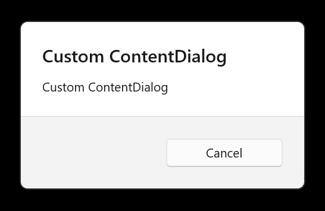
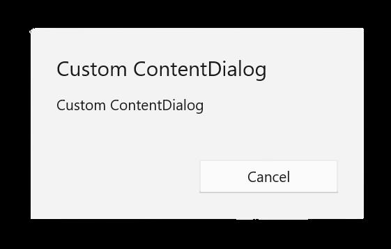

# Dialogs

> [!TIP]
> This article covers Uno-specific information for dialog controls in Uno Platform. For a full description of the feature and instructions on using it, see [Dialog controls | Microsoft Learn](https://learn.microsoft.com/windows/apps/design/controls/dialogs-and-flyouts/dialogs).

* The `Microsoft.UI.Xaml.Controls.ContentDialog` class provides a XAML-based and highly customizable user dialog.
* The `Windows.UI.Popups.MessageDialog` represents a legacy dialog which provides less control over UI.

## Using `ContentDialog`

The recommended way to display user dialogs is via the `Microsoft.UI.Xaml.Controls.ContentDialog` class.

```csharp
ContentDialog noWifiDialog = new ContentDialog
{
    Title = "No WiFi connection",
    Content = "Check your connection and try again.",
    CloseButtonText = "OK"
};

// Make sure to set the XamlRoot!
noWifiDialog.XamlRoot = anyLoadedControl.XamlRoot;

ContentDialogResult result = await noWifiDialog.ShowAsync();
```

It is crucial to set the `XamlRoot` property before calling `ShowAsync`. This way the dialog will become associated with the visual tree. `XamlRoot` can be retrieved from any loaded control in your window (e.g. a `Button`, your `Page`, etc.).

> [!WARNING]
> Only one ContentDialog can be open per thread at a time. Attempting to open two ContentDialogs will throw an exception, even if they are trying to open in separate AppWindows.

### Opening a `ContentDialog` from a Model/ViewModel

When you want to open a `ContentDialog` from a Model or ViewModel, you can pass the `XamlRoot` from the view to the model or view model by creating a service (e.g., `IXamlRootProvider`) that is initialized at the start of the app with the XamlRoot of the main window.
<!-- TODO: Add this magic IXamlRootProvider to Uno somewhere! Naming something not existing here, where someone new could just discover this whole topic will most likly not beeing able to get this correctly set up (remarks to UI thread and non UI-Thread)! -->

Here is a more detailed example of how to display a `ContentDialog` with result handling:

```csharp
private async Task DisplayDeleteFileDialog()
{
    ContentDialog deleteFileDialog = new ContentDialog
    {
        Title = "Delete file permanently?",
        Content = "If you delete this file, you won't be able to recover it. Do you want to delete it?",
        PrimaryButtonText = "Delete",
        CloseButtonText = "Cancel"
    };

    deleteFileDialog.XamlRoot = anyLoadedControl.XamlRoot;

    ContentDialogResult result = await deleteFileDialog.ShowAsync();

    // Delete the file if the user clicked the primary button.
    // Otherwise, do nothing.
    if (result == ContentDialogResult.Primary)
    {
        // Delete the file.
    }
    else
    {
        // The user clicked the CloseButton, pressed ESC, Gamepad B, or the system back button.
        // Do nothing.
    }
}
```

---
> [!NOTE]
> This example dialog task must run on the UI thread. If your app uses XAML markup, the best place to execute it is in the code-behind of your XAML page. If your app uses C# markup, execute it directly below the main UI definition of the page class, similar to a regular event handler.

---

> [!IMPORTANT]
> If you attempt to execute this task from within your Model or ViewModel without properly handling the `XamlRoot` (which belongs to the UI layer), you will encounter an exception. This occurs because UI-related code is being executed on a non-UI thread.

### [MVVM](#tab/mvvm)

If you are using the MVVM pattern, you can use the `AsyncRelayCommand` from the Uno Platform to bind the command to the dialog display method. Here is an example of how to bind the command to the dialog display method in the ViewModel:

```csharp
public MainViewModel()
{
    DisplayDeleteFileDialogCommand = new AsyncRelayCommand(DisplayDeleteFileDialog);
}

// ...

public ICommand DisplayDeleteFileDialogCommand { get; }

private async Task DisplayDeleteFileDialog()
{
    // ...
}
```

### [MVUX](#tab/mvux)

If you are using the MVUX pattern, you don't need to specify the Command. Instead, you can directly call the dialog display method in your view, it is generated automatically in `BindableModel`:

```csharp
public async Task DisplayDeleteFileDialogCommand()
{
    // ...
}
```

---

To bind the command to a button in your view, you can use the following code snippets:

### [XAML](#tab/xaml)

```xml
<Button Content="Delete file" Command="{Binding DisplayDeleteFileDialogCommand}" />
```

### [C# Markup](#tab/cs-markup)

```csharp
new Button()
    .Content("Delete file")
    .AutomationProperties(automationId: "DeleteFileButton")
    .Command(() => vm.DisplayDeleteFileDialogCommand)
```

---

If you are using Uno.Extensions Navigation, you can utilize its features to display a dialog. For more information, check out this documentation: [Dialogs with Uno.Extensions.Navigation](xref:Uno.Extensions.Navigation.HowToShowDialog).

Considering adding a dialog to your app? Check out our comprehensive video for detailed guidance on the implementation:

> [!Video https://www.youtube-nocookie.com/embed/VAUYH01LMEE]

## Customize a `ContentDialog`

You can use various properties to customize its display and also provide a custom XAML-based content for it. For more information, see [ContentDialog Class | Microsoft Learn](https://learn.microsoft.com/windows/windows-app-sdk/api/winrt/microsoft.ui.xaml.controls.contentdialog).

In order for your custom dialog to follow the Fluent design, it's important that you add the following line in the constructor of your dialog:

```csharp
Style = Application.Current.Resources["DefaultContentDialogStyle"] as Style;
```

Your dialog will look similar to this dialog:



If you omit this line, your dialog will look like this:



## Overlay Background (iOS/Android)

You can override the overlay background by adding the following resources to the application resources:

```xml
<SolidColorBrush x:Key="ContentDialogLightDismissOverlayBackground" Color="#99000000" />
```

> [!NOTE]
> There is no specific key to override for this other than `SystemControlPageBackgroundMediumAltMediumBrush` on Windows, see [Changing the Overlay background color for ContentDialog question on StackOverflow](https://stackoverflow.com/a/40397576).

## Using `MessageDialog`

> [!WARNING]
> `MessageDialog` is a legacy API that is no longer officially supported. If possible, please use `ContentDialog` instead.

For existing applications that rely on `MessageDialog`, updating to Uno Platform 5.2 and newer requires you to associate the `MessageDialog` with a window before it is displayed. This can be done via the `WinRT.Interop` APIs:

```csharp
var dialog = new MessageDialog();

// ...

// Get the current window's HWND by passing a Window object
var hwnd = WinRT.Interop.WindowNative.GetWindowHandle(window);
// Associate the HWND with the dialog
WinRT.Interop.InitializeWithWindow.Initialize(dialog, hwnd);

await dialog.ShowAsync();
```

### Using native or XAML-based UI for `MessageDialog`

Uno Platform targets offer two different display modes for `MessageDialog`. To switch between them, you can use the [`UseNativeDialog`](../feature-flags.md#messagedialog).
