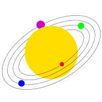

# Using SVG images

<<<<<<< HEAD
* Uno Platform supports using vector SVG graphics inside of your cross-platform applications using the `Uno.UI.Svg` package.
=======
Uno Platform supports using vector SVG graphics inside of your cross-platform applications using the `Uno.WinUI.Svg` (or `Uno.UI.Svg`) NuGet package.
>>>>>>> e07fb66b1f (docs: Adjust wording in svg support)



<!-- Add any additional information on platform-specific limitations and constraints -->

## How to use SVG

To use SVG, install the following packages into the iOS, macOS, Mac Catalyst, Android and Skia projects:

<<<<<<< HEAD
<<<<<<< HEAD
-`Uno.WinUI.Svg` (or `Uno.UI.Svg` if you are using UWP-based app template)
-`SkiaSharp.Views.Uno.WinUI` (or `SkiaSharp.Views.Uno` if you are using UWP-based app template).
=======
- `Uno.WinUI.Svg` (or `Uno.UI.Svg` if you are using a UWP-based app template)
- `SkiaSharp.Views.Uno.WinUI` (or `SkiaSharp.Views.Uno` if you are using a UWP-based app template)
>>>>>>> e07fb66b1f (docs: Adjust wording in svg support)
=======
* `Uno.WinUI.Svg` (or `Uno.UI.Svg` if you are using a UWP-based app template)
* `SkiaSharp.Views.Uno.WinUI` (or `SkiaSharp.Views.Uno` if you are using a UWP-based app template)
>>>>>>> 56b0960419 (chore: Adjust for linting)

> [!NOTE]
> If the `Uno.[UI|WinUI].Svg` package is not installed, you will get a warning when an `.svg` image is loaded.
>

> [!IMPORTANT]
> The `Uno.[UI|WinUI].Svg` package is not needed for WebAssembly, and must only be installed on the Mobile and Skia heads. It must not in any other class libraries of your solution.
> 

Add the SVG Image into the project's class library (or shared project) and make sure that the build action is set to Content.
Now, you can display the SVG image in an `Image` by referencing it from the `Source` property. For example:

```xml
<Image Source="ms-appx:///Assets/test.svg" Stretch="UniformToFill" Width="100" Height="100" />
```

You can also explicitly use `SvgImageSource`:

```xml
<Image>
  <Image.Source>
    <SvgImageSource UriSource="https://example.com/test.svg" />
  </Image.Source>
</Image>
```

## Supported features by platform

SVG is supported on all Uno Platform targets.

On Android, iOS, macOS, Mac Catalyst and Skia we are using SkiaSharp to render the SVG graphics.

On WebAssembly, the SVG images are rendered directly by the browser.

On Windows, the OS is responsible for SVG rendering (and complex SVG files may not render properly).

## When to use SVG

Because SVG requires to be parsed initially before rendering and its vector-based form needs to re-render each time the size of the image changes, it may not be suitable for all scenarios. For ideal performance we recommend using SVG for in-app vector graphics and icons, but prefer bitmap image formats in other cases. In case you run into performance issues, test switching from SVG to a bitmap image format to see if it alleviates the problem. You may also consider using SVG rasterization (see below).

If you need to keep your Android or iOS app package size as small as possible, it is also preferable to avoid using SVG, as the the package depends on SkiaSharp.

## SVG rasterization support

For improved performance you can use the `RasterizePixelHeight` and `RasterizePixelWidth` properties of `SvgImageSource` to rasterize SVG image when first loaded. When rasterized, the image will always scale this rasterized version of the SVG image instead of rendering the vector-based graphics.

For example:

```xml
<Image Stretch="UniformToFill" Width="100" Height="100">
  <Image.Source>
    <SvgImageSource 
      UriSource="ms-appx:///Assets/couch.svg" 
      RasterizePixelHeight="10" 
      RasterizePixelWidth="10" />
  </Image.Source>
<Image>
```

Will render as:


> Note that this feature is not available on WebAssembly where the rendering is handled directly by the browser.
