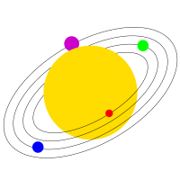
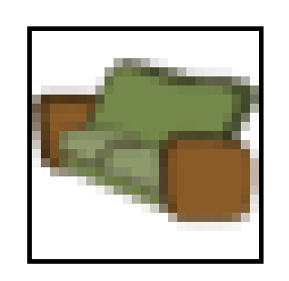

# Using SVG images

Uno Platform supports using vector SVG graphics inside of your cross-platform applications, using the `SvgImageSource` class. SVG Images can also be used through [`UnoImage` with Resizetizer](xref:Uno.Resizetizer.GettingStarted).



## How to use SVG

## [**Single Project**](#tab/singleproject)

SVG works on all Uno Platform targets without any additional package: Uno Platform includes a managed SVG engine (see [SVG renderers](#svg-renderers) below).

To render SVG files with [Svg.Skia](https://github.com/wieslawsoltes/Svg.Skia) instead, which covers more of the SVG specification, add the `Svg` [Uno Feature](xref:Uno.Features.Uno.Sdk#uno-platform-features) as follows:

```xml
<UnoFeatures>
    ...
    Svg;
    ...
</UnoFeatures>
```

The `Svg` feature applies to apps using the Skia renderer, which is the default. An app using only the WebGPU renderer keeps the managed engine.

To include an SVG file, you will need to place it in a folder named `Svg` (e.g. `Assets\Svg\MyFile.svg`). This is required in order to avoid [Uno.Resizetizer](xref:Uno.Resizetizer.GettingStarted) transform the file into a set of scaled PNGs files.

Now, you can display the SVG image in an `Image` by referencing it from the `Source` property. For example:

```xml
<Image Source="ms-appx:///Assets/Svg/test.svg" Stretch="UniformToFill" Width="100" Height="100" />
```

## [**Legacy Project**](#tab/legacyproject)

SVG works on all Uno Platform targets without any additional package, using the managed SVG engine built into Uno Platform.

To render SVG files with Svg.Skia instead, install the following NuGet packages into the app (head) projects:

* `Uno.WinUI.Svg`
* `Svg.Skia`

> [!IMPORTANT]
> The `Uno.WinUI.Svg` package must only be installed in the app (head) projects, not in class libraries of your solution.

Add the SVG Image to the app project and make sure that the build action is set to Content.

Now, you can display the SVG image in an `Image` by referencing it from the `Source` property. For example:

```xml
<Image Source="ms-appx:///Assets/test.svg" Stretch="UniformToFill" Width="100" Height="100" />
```

---

You can also explicitly use `SvgImageSource`:

```xml
<Image>
  <Image.Source>
    <SvgImageSource UriSource="https://example.com/test.svg" />
  </Image.Source>
</Image>
```

## SVG renderers

SVG is supported on all Uno Platform targets. On Windows (WinAppSDK), the OS is responsible for SVG rendering, and complex SVG files may not render properly. On the other targets, Uno Platform renders SVG with one of two renderers:

| Renderer | Used when | Coverage | Drawing backends |
|----------|-----------|----------|------------------|
| Managed engine (built into `Uno.WinUI`) | The `Uno.WinUI.Svg` package is not referenced | `svg`, `g`, `path`, `rect`, `circle`, `ellipse`, `line`, `polyline`, `polygon` and `use` elements, with solid and linear/radial gradient fills, strokes, opacity, fill rules, transforms, `viewBox` and inline styles. Text, clip paths, masks, filters, patterns, embedded images and CSS class styling are not supported yet. | Skia and WebGPU, drawn as vectors |
| Svg.Skia (`Uno.WinUI.Svg` package, added by the `Svg` feature) | The `Uno.WinUI.Svg` package is referenced | Most of the SVG specification, as supported by [Svg.Skia](https://github.com/wieslawsoltes/Svg.Skia) | Skia, drawn as vectors. WebGPU, rasterized once per displayed size. Requires SkiaSharp. |

The host builder picks the renderer automatically. An app can also register one explicitly, which takes precedence over both. Each renderer is created by its assembly's factory:

```csharp
var host = UnoPlatformHostBuilder.Create()
    .App(() => new App())
    // Svg.Skia (requires the Uno.WinUI.Svg package):
    .SvgRenderer(Uno.UI.Composition.Skia.SkiaBackend.CreateSvgRenderer())
    // or the managed engine:
    // .SvgRenderer(Uno.UI.Composition.Managed.ManagedBackend.CreateSvgRenderer())
    .Build();
```

`SkiaBackend.CreateSvgRenderer()` is added to `SkiaBackend` by the `Uno.WinUI.Svg` package, as a C# 14 extension member (the default from .NET 10). Explicit registration is required on a trimmed or AOT-compiled head (iOS, tvOS), where the host builder can't find the Svg.Skia renderer automatically.

## When to use SVG

Because SVG requires to be parsed initially before rendering and its vector-based form needs to re-render each time the size of the image changes, it may not be suitable for all scenarios. For ideal performance, we recommend using SVG for in-app vector graphics and icons but prefer bitmap image formats in other cases. In case you run into performance issues, test switching from SVG to a bitmap image format to see if it alleviates the problem. You may also consider using SVG rasterization (see below).

If you need to keep your app package size as small as possible, prefer the managed SVG engine over the `Svg` feature, which adds the Svg.Skia package and its dependencies.

## SVG rasterization support

For improved performance, you can use the `RasterizePixelHeight` and `RasterizePixelWidth` properties of `SvgImageSource` to rasterize the SVG image when first loaded. When rasterized, the image will always scale this rasterized version of the SVG image instead of rendering the vector-based graphics.

For example:

```xml
<Image Stretch="UniformToFill" Width="100" Height="100">
  <Image.Source>
    <SvgImageSource 
      UriSource="ms-appx:///Assets/couch.svg" 
      RasterizePixelHeight="10" 
      RasterizePixelWidth="10" />
  </Image.Source>
<Image>
```

Will render as:


