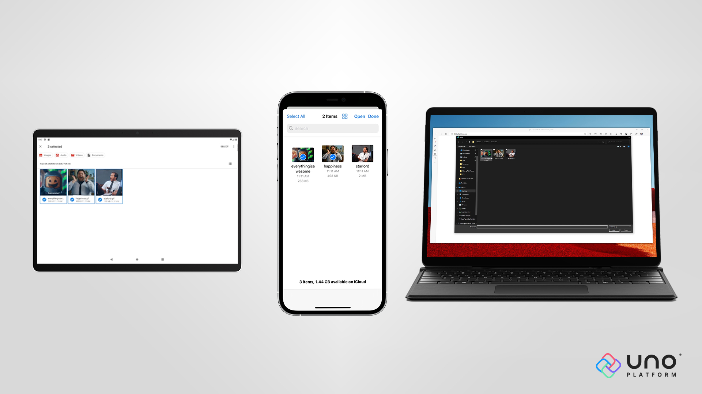

# File and Folder Pickers

> [!TIP]
> This article covers Uno-specific information for the `Windows.Storage.Pickers` namespace. For a full description of the feature and instructions on using it, see [Windows.Storage.Pickers Namespace](https://learn.microsoft.com/uwp/api/windows.storage.pickers).

* The `Windows.Storage.Pickers` namespace provides classes that allow the user to pick a folder or a file on the local file system so that the application can work with it.



The following table shows which file picker experiences are available across Uno Platform targets. For detailed information, see the next sections.

Legend

* ✔  Supported
* 💬 Partially supported (see below for more details)
* ✖ Not supported

| Picker         | Windows App SDK   | WebAssembly | Android | iOS    | Desktop |
|----------------|-------|-------------|---------|--------|-------|
| FileOpenPicker | ✔    | ✔ (1)       | ✔      | ✔      | ✔    |
| FileSavePicker | ✔    | ✔ (1)       | ✔      | 💬 (2) | ✔    |
| FolderPicker   | ✔    | ✔           | ✔      | ✔      | ✔    |

*(1) - Multiple implementations supported - see WebAssembly section below*\
*(2) - See iOS section below*

On some platforms, you can further customize the file-picking experience by utilizing additional properties:

| Feature                 | Windows App SDK  | WebAssembly | Android | iOS   | Desktop |
|-------------------------|------|-------------|---------|-------|-----|
| SuggestedFileName       | ✔   | ✔           | ✖      | ✖     | ✔ |
| SuggestedStartLocation  | ✔   | ✔ (1)       | 💬 (4) | ✔ (3) | ✔ |
| SettingsIdentifier      | ✔   | ✔ (1)       | ✔      | ✖     | ✔ |
| SetMultipleFilesLimit   | ✖   | ✖           | ✖      | ✔     | ✖ |

*(1) - Only for the native file pickers - see WebAssembly section below*\
*(2) - For FileOpenPicker, VideosLibrary and PicturesLibrary are used to apply `image/*` and `video/*` filters*\
*(3) - PicturesLibrary opens the picture library with the image picker controller*\
*(4) - See Android section below*

On platforms where the additional features are not supported yet, setting them will not have any effect.

## Uno.WinUI-specific Initialization

If you are using Uno.WinUI (Windows App SDK-based form of Uno Platform), you need to make sure the pickers are initialized for the current window, otherwise the code would fail on Windows. This is done using `WinRT.Interop` and it is required for all file and folder pickers. For example, in the case of `FileOpenPicker`:

```csharp
var picker = new FileOpenPicker();

// ...

// Get the current window's HWND by passing a Window object
var hwnd = WinRT.Interop.WindowNative.GetWindowHandle(window);
// Associate the HWND with the file picker
WinRT.Interop.InitializeWithWindow.Initialize(picker, hwnd);

await picker.PickSingleFileAsync();
```

To get the `Window` instance in single-window apps, it is easiest to create an `internal static MainWindow` property in the `App.cs` or `App.xaml.cs` file, initialize it in `OnLaunched`, and then use it for this purpose:

```csharp
var hwnd = WinRT.Interop.WindowNative.GetWindowHandle(App.MainWindow);
```

The latest Uno Platform app templates already contain such a `MainWindow` property, so you can use it out of the box.

## Examples

### FolderPicker

```csharp
var folderPicker = new FolderPicker();
folderPicker.SuggestedStartLocation = PickerLocationId.ComputerFolder;
folderPicker.FileTypeFilter.Add("*");

// For Uno.WinUI-based apps
var hwnd = WinRT.Interop.WindowNative.GetWindowHandle(App.MainWindow);
WinRT.Interop.InitializeWithWindow.Initialize(folderPicker, hwnd);

StorageFolder pickedFolder = await folderPicker.PickSingleFolderAsync();
if (pickedFolder != null)
{
    // Folder was picked you can now use it
    var files = await pickedFolder.GetFilesAsync();
}
else
{
    // No folder was picked or the dialog was cancelled.
}
```

> [!NOTE]
> While the `SuggestedStartLocation` has currently no effect in Uno Platform targets, and `FileTypeFilter` has no effect for `FolderPicker`, they both must be set, otherwise the dialog crashes on WinUI.

### FileOpenPicker

#### Picking a single file

```csharp
var fileOpenPicker = new FileOpenPicker();
fileOpenPicker.SuggestedStartLocation = PickerLocationId.ComputerFolder;
fileOpenPicker.FileTypeFilter.Add(".txt");
fileOpenPicker.FileTypeFilter.Add(".csv");

// For Uno.WinUI-based apps
var hwnd = WinRT.Interop.WindowNative.GetWindowHandle(App.MainWindow);
WinRT.Interop.InitializeWithWindow.Initialize(fileOpenPicker, hwnd);

StorageFile pickedFile = await fileOpenPicker.PickSingleFileAsync();
if (pickedFile != null)
{
    // File was picked, you can now use it
    var text = await FileIO.ReadTextAsync(pickedFile);
}
else
{
    // No file was picked or the dialog was cancelled.
}
```

> [!NOTE]
> While the `SuggestedStartLocation` has currently no effect on Uno Platform targets, it must be set, otherwise, the dialog crashes on WinUI. `FileTypes` must include at least one item. You can add extensions in the format `.extension`, with the exception of `*` (asterisk), which allows picking any type of file.

#### Picking multiple files

```csharp
var fileOpenPicker = new FileOpenPicker();
fileOpenPicker.SuggestedStartLocation = PickerLocationId.ComputerFolder;
fileOpenPicker.FileTypeFilter.Add(".jpg");
fileOpenPicker.FileTypeFilter.Add(".png");

// For Uno.WinUI-based apps
var hwnd = WinRT.Interop.WindowNative.GetWindowHandle(App.MainWindow);
WinRT.Interop.InitializeWithWindow.Initialize(fileOpenPicker, hwnd);

var pickedFiles = await fileOpenPicker.PickMultipleFilesAsync();
if (pickedFiles.Count > 0)
{
    // At least one file was picked, you can use them
    foreach (var file in pickedFiles)
    {
        global::System.Diagnostics.Debug(file.Name);
    }
}
else
{
    // No file was picked or the dialog was cancelled.
}
```

> [!IMPORTANT]
> On Uno Platform Targets, the `Path` information found on the `StorageFile` object returned from either the `PickMultipleFilesAsync()` or `PickSingleFileAsync()` method cannot be used with Windows File System APIs. This means that, for example, this `Path` cannot be used to initialize a `FileInfo` object.
> If you need to access file size, use the `GetBasicProperties()` or `GetBasicPropertiesAsync()` methods. Both methods provide access to the `Size` and the `DateModified.` For the file extension, use the `FileType` property.

##### Accessing information about the File

```csharp
var fileOpenPicker = new FileOpenPicker();
...

var pickedFile = await fileOpenPicker.PickSingleFileAsync();

if (pickedFile != null)
{
    var extension = pickedFile.FileType;

    var properties = await pickedFile.GetBasicPropertiesAsync();    
    var size = properties.Size;
}
```

> [!NOTE]
> On iOS, when making multiple selections, you can limit the number of items selected by calling the `SetMultipleFilesLimit()` method and specifying the maximum number of items.
>

##### Limiting the number of items

```csharp
var fileOpenPicker = new FileOpenPicker();
fileOpenPicker.SuggestedStartLocation = PickerLocationId.PicturesLibrary;
fileOpenPicker.FileTypeFilter.Add(".jpg");
fileOpenPicker.FileTypeFilter.Add(".png");
//The user will be able to pick up to three files.
fileOpenPicker.SetMultipleFilesLimit(3);

var pickedFiles = await fileOpenPicker.PickMultipleFilesAsync();
...
```

> [!NOTE]
> `SuggestedStartLocation` should be set to prevent crashes on WinUI. `FileTypes` must include at least one item. You can add extensions in the format `.extension`, with the exception of `*` (asterisk), which allows picking any type of file.
>
> [!NOTE]
> On iOS, the built-in image picker does not support the selection of multiple files. Therefore, we fall back to the document picker instead. However, this requires you to specify not only the `SuggestedStartLocation` set to `PicturesLibrary`, but also specify file type extensions in `FileTypeFilter` (e.g. `.jpg` and `.png`), otherwise the OS will not display the Photos app as a file provider in the picker.

### FileSavePicker

```csharp
var fileSavePicker = new FileSavePicker();
fileSavePicker.SuggestedStartLocation = PickerLocationId.ComputerFolder;
fileSavePicker.SuggestedFileName = "myfile.txt";
fileSavePicker.FileTypeChoices.Add("Plain Text", new List<string>() { ".txt", ".text" });

// For Uno.WinUI-based apps
var hwnd = WinRT.Interop.WindowNative.GetWindowHandle(App.MainWindow);
WinRT.Interop.InitializeWithWindow.Initialize(fileSavePicker, hwnd);

StorageFile saveFile = await fileSavePicker.PickSaveFileAsync();
if (saveFile != null)
{
    CachedFileManager.DeferUpdates(saveFile);

    // Save file was picked, you can now write in it
    await FileIO.WriteTextAsync(saveFile, "Hello, world!");

    await CachedFileManager.CompleteUpdatesAsync(saveFile);
}
else
{
    // No file was picked or the dialog was cancelled.
}
```

> [!NOTE]
> The `CachedFileManager` only affects Windows and WebAssembly. For more information, see [WebAssembly section](#webassembly) below.
>
> [!NOTE]
> While the `SuggestedStartLocation` has no effect, it must be set for WinUI. You must declare at least one item for `FileTypeChoices`. Each has a description and one or more extensions.

## Picker configuration

File pickers have various configuration options that customize the experience. For a full list of properties, see the [WinUI documentation](https://learn.microsoft.com/uwp/api/windows.storage.pickers.fileopenpicker). Not all options are supported on all target platforms, in which case these are ignored.

To set which file type extensions you want to allow, use the `FileTypeFilter` property on `FileOpenPicker` and `FolderPicker`, and the `FileTypeChoices` property on `FileSavePicker`. Extensions must be in the format ".xyz" (starting with a dot). For `FileOpenPicker` and `FolderPicker`, you can also include a "*" (star) entry, which represents the fact that any file extension is allowed.

Some systems use `MIME` types to specify the file type. Uno includes a list of common predefined mappings. For more information, see [Common MIME types in MDN docs](https://developer.mozilla.org/docs/Web/HTTP/Basics_of_HTTP/MIME_types/Common_types). If a MIME type you require is missing, you can provide it by adding it to the `Uno.WinRTFeatureConfiguration.FileTypes.FileTypeToMimeMapping` dictionary:

```csharp
Uno.WinRTFeatureConfiguration.FileTypes.FileTypeToMimeMapping.Add(".myextension", "some/mimetype");
```

For iOS and macOS, `UTType` is utilized for the same purpose. Here you can provide a custom mapping using `Uno.WinRTFeatureConfiguration.FileTypes.FileTypeToUTTypeMapping` dictionary:

```csharp
Uno.WinRTFeatureConfiguration.FileTypes.FileTypeToUTTypeMapping.Add(".myextension", "my.custom.UTType");
```

Custom Uniform Type Identifiers must be declared in the `info.plist` of your iOS and macOS applications. See a full example of this in [Uniform Type Identifiers Overview from Apple documentation](https://developer.apple.com/library/archive/documentation/FileManagement/Conceptual/understanding_utis/understand_utis_declare/understand_utis_declare.html).

## WebAssembly

There are two implementations of file pickers available in WebAssembly - **File System Access API pickers** and **download/upload pickers**.

### File System Access API pickers

The most powerful picker implementation on WebAssembly uses the <a href="https://wicg.github.io/file-system-access/" target="_blank">**File System Access API**</a>. This is not yet widely implemented across all browsers. See the following support tables for each picker:

* [`FolderPicker`](https://caniuse.com/?search=showDirectoryPicker)
* [`FileOpenPicker`](https://caniuse.com/?search=showOpenFilePicker)
* [`FileSavePicker`](https://caniuse.com/?search=showSaveFilePicker)

`FolderPicker` is only supported for these types of pickers.

File System Access API pickers allow direct access to the picked files and folders. This means that any modifications the user does to the files are persisted on the target file system.

However, writing to the target file system is limited, so when a write-stream is opened for a file, Uno Platform creates a copy of the file in temporary storage, and your changes are applied to this temporary file instead. When your file stream is then flushed, closed, or disposed of, the changes are written to the source file, and the temporary file is discarded.

### Download/upload pickers

In case the **File System Access API** is not available in the browser, Uno Platform also offers a fallback to "download" and "upload" experiences.

For the upload picker, the browser triggers a file picker dialog and Uno Platform then copies the selected files into temporary storage of the app. The `StorageFile` instance you receive is private for your application and the changes are not reflected in the original file. To save the changes, you need to trigger the "download picker".

For the download picker, the experience requires the use of [`CachedFileManager`](https://learn.microsoft.com/uwp/api/Windows.Storage.CachedFileManager). Triggering `PickSaveFileAsync` does not actually show the download picker to the user. Instead, only a temporary file is created to allow you to write any content. Afterward, calling `CompleteUpdatesAsync` opens the download dialog, which allows the user to save the file.

The `CachedFileManager` class works transparently with both the **Download picker** and the **File System Access API**, which means you can write a single snippet of code that handles both scenarios correctly:

```csharp
var savePicker = new FileSavePicker():
savePicker.SuggestedStartLocation = PickerLocationId.DocumentsLibrary;
savePicker.FileTypeChoices.Add("Text file", new List<string>() { ".txt" });
savePicker.SuggestedFileName = "New Document";

// For Uno.WinUI-based apps
var hwnd = WinRT.Interop.WindowNative.GetWindowHandle(App.MainWindow);
WinRT.Interop.InitializeWithWindow.Initialize(savePicker, hwnd);

// For download picker, no dialog is actually triggered here
// and a temporary file is returned immediately.
// For File System Access API, this triggers the picker to allow
// user to select a local file.
var file = await savePicker.PickSaveFileAsync();

CachedFileManager.DeferUpdates(file);

// Write some content to the file
await FileIO.WriteTextAsync(file, "Hello, world!");

// For download picker this starts the download process of the browser
// and triggers the save dialog for the user.
// For File System Access API, this is a no-op and immediately
// completes.
await CachedFileManager.CompleteUpdatesAsync(file);
```

### Checking whether File System Access API is supported

In some cases, you might want to check whether File System Access API is supported in the current runtime environment. A typical reason might be to ensure only **Save As** functionality is available to the user when the browser only supports download pickers. You can utilize the WASM specific `Uno.Storage.Pickers.FileSystemAccessApiInformation` API:

```csharp
#if __WASM__
if (FileSystemAccessApiInformation.IsOpenPickerSupported)
{
    // File System Access API open picker is available.
}

if (FileSystemAccessApiInformation.IsSavePickerSupported)
{
    // File System Access API open picker is available.
}

if (FileSystemAccessApiInformation.AreFilePickersSupported)
{
    // Both file open and file save pickers from the
    // File System Access API are available.
}

if (FileSystemAccessApiInformation.IsFolderPickerSupported)
{
    // File System Access API folder picker is available.
}
#endif
```

### Checking the source of opened file

To know how the file needs to be handled, you need to check the type of storage provider it comes from. To do this, access the `Provider` property of the file:

```csharp
if (file.Provider.Id == "jsfileaccessapi")
{
    // File was picked using File System Access pickers.
}

if (file.Provider.Id == "computer")
{
    // File is a temporary file created using Upload picker.
}
```

The local files have a provider ID of `computer`, which matches the WinUI behavior. `jsfileaccessapi` is used for files coming from the File System Access API.

### Choosing supported type of pickers

By default, Uno Platform attempts to use File System Access API and falls back to download/upload pickers if not available. To control this behavior, you can use `WinRTFeatureConfiguration`:

```csharp
#if __WASM__
Uno.WinRTFeatureConfiguration.Storage.Pickers.WasmConfiguration =
    WasmPickerConfiguration.FileSystemAccessApiWithFallback;
#endif
```

The allowed values for the configuration are:

-`FileSystemAccessApiWithFallback` - defaults to File System Access API, but falls back to download/upload pickers if not available
-`FileSystemAccessApi` - uses File System Access API only. If not available, pickers will throw `NotSupportedException`
-`DownloadUpload` - uses download/upload pickers only.

### Security considerations

Browsers generally treat file opening/saving operations as sensitive operations, and the following message may appear when using this APIs:

```output
SecurityError: Failed to execute 'showSaveFilePicker' on 'Window': Must be handling a user gesture to show a file picker.
```

This generally means that the Uno file picking APIs have been invoked without explicit user interaction or have been rescheduled from the original user interaction callback (e.g., using `DispatcherQueue.TryRun()` inside a `Button.Click` handler to open a picker).

## Android

Files picked from file pickers on Android are provided by the *Storage Access Framework API*. Due to its limitations, it is not possible to write to existing file in-place. Instead, Uno Platform creates a copy of the file in temporary storage and your changes are applied to this temporary file instead. When your file stream is then flushed, closed, or disposed of, the changes are written to the source file, and the temporary file is discarded.

The `SuggestedStartLocation` property has no effect on certain Android devices, and the file picker will always open in the root directory of the internal storage. When using VideosLibrary or PicturesLibrary locations, the file picker will open the picture library with the image picker controller. Still, for those devices that do not support it, it will open the root directory of the internal storage and suggest all the applications that can handle file types.

The `FileSavePicker` API, which uses `ACTION_CREATE_DOCUMENT` on Android, has various limitations. To allow for the best possible compatibility across different Android versions, you should always add your file type extension to `FileTypeChoices`, and, if possible, provide only one such file type. In addition, if the `SuggestedFileName` or the user-typed file name matches an existing file, the resulting file will be renamed with `(1)` in the name, e.g., `test.txt` will become `test (1).txt` and the existing file will not be overwritten. However, if the user explicitly taps an existing file in the file browser, the system will show a dialog allowing the app to overwrite the existing file. This inconsistent behavior is caused by Android itself, so there is, unfortunately, no way to work around it from our side. See [this issue](https://issuetracker.google.com/issues/37136466) for more information.

If you want to have further influence on the pickers and, for example, create permanent access to the file for the `FileOpenPicker` (flag with GrantPersistableUriPermission), you can do this with the `FilePickerHelper`. The `FolderPicker` can be extended analogue, the `FolderPickerHelper` is available for this purpose.

```csharp
FileOpenPicker fileOpenPicker = new FileOpenPicker
{
    SuggestedStartLocation = PickerLocationId.ComputerFolder
};

#if __ANDROID__
FilePickerHelper.RegisterOnBeforeStartActivity(fileOpenPicker, (intent) =>
{
    // your code... for example
    intent.AddFlags(Android.Content.ActivityFlags.GrantPersistableUriPermission);
});
#endif

var result = await fileOpenPicker.PickSingleFileAsync();
```

## iOS

iOS does not offer a built-in `FileSavePicker` experience. Luckily, it is possible to implement this functionality, for example, using a combination of a `FolderPicker` and `ContentDialog`.

To provide your own custom implementation, create a class that implements the `IFileSavePickerExtension`, which is only available on iOS. This class must have a `public` constructor with an `object` parameter. This will actually be an instance of `FileSavePicker` when invoked later. Then implement the `PickSaveFileAsync` method:

```csharp
#if __IOS__
namespace Custom.Pickers
{
    public class CustomFileSavePickerExtension : IFileSavePickerExtension
    {
        private readonly FileSavePicker _fileSavePicker;

        public CustomFileSavePickerExtension(object owner)
        {
            _fileSavePicker = (FileSavePicker)owner;
        }

        public async Task<StorageFile> PickSaveFileAsync(CancellationToken token)
        {
            // ... your own implementation
        }
    }
}
#endif
```

When done, register this extension in `App.cs` or `App.xaml.cs`:

```csharp
public App()
{
...
#if __IOS__
    ApiExtensibility.Register(
        typeof(Uno.Extensions.Storage.Pickers.IFileSavePickerExtension),
        picker => new CustomFileSavePickerExtension(picker));
#endif
...
}
```

As this is quite complex, you can find a working implementation of a folder-based save file picker in [Uno.Samples repository](https://github.com/unoplatform/Uno.Samples/tree/master/UI/FileSavePickeriOS). You can modify and adjust this implementation as you see fit for your specific use case.
