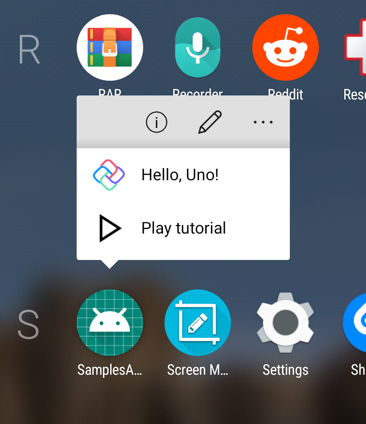
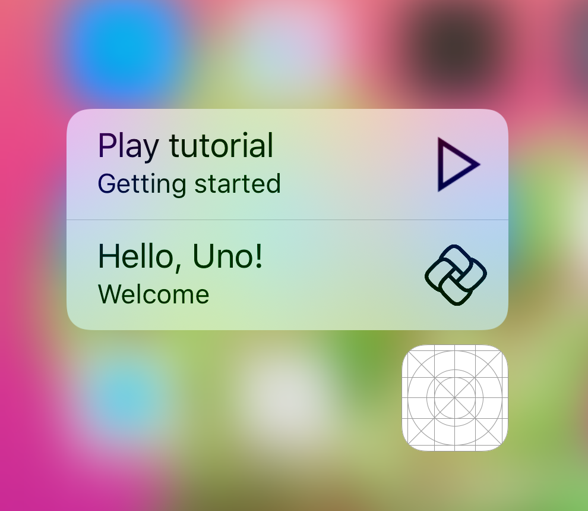

# Start Screen

> [!TIP]
> This article covers Uno-specific information for the `Windows.UI.StartScreen` namespace. For a full description of the feature and instructions on using it, see [Windows.UI.StartScreen Namespace](https://learn.microsoft.com/uwp/api/windows.ui.startscreen).

* The `Windows.UI.StartScreen` namespace provides classes for creating and managing app jump lists.

## `JumpList` &amp; `JumpListItem`

The APIs are implemented on iOS and Android. Other platforms return `false` when calling the `JumpList.IsSupported()` method.

`JumpListItem` supports `DisplayName`, `Description`, `Arguments`, and `Logo` properties on both Android and iOS.

`DisplayName` may not be empty on Android and iOS - this behavior differs from UWP. If left empty, a single space will be used instead.

`Logo` property can be initialized only with `ms-appx:`-based images. This behavior matches UWP and actually matches native support on both platforms as well.

To handle `JumpListItem` activation, check the `LaunchActivatedEventArgs.Arguments` in `App.OnLaunched` method. Note that when the application is running, the method will still be called again (this behavior matches UWP).

The API supports interoperability with native "app shortcuts". This means items you add using native API instead of `JumpList` API will not be overwritten by `JumpList` and will appear first in the list of shortcuts. These non-Uno shortcuts will not be accessible in the `JumpList.Items` collection. To identify Uno-specific app shortcuts, a `UnoShortcut` key is used and set in `ShortcutInfo.Extras` on Android and `UIApplicationShortcutItem.UserInfo` on iOS.

Note the order of shortcut items on iOS is **reversed**. This is system default, but you can write a platform-specific snippet that reverses the list before saving to have the same top-down order as on Android and UWP. iOS also limits the number of items that can be displayed at the same time (for example 4 on iPhone 6 Plus), this is device specific.

## Example

