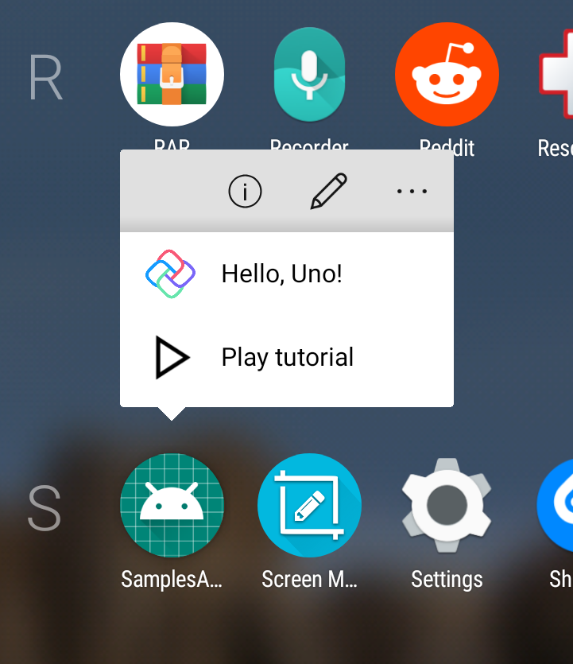
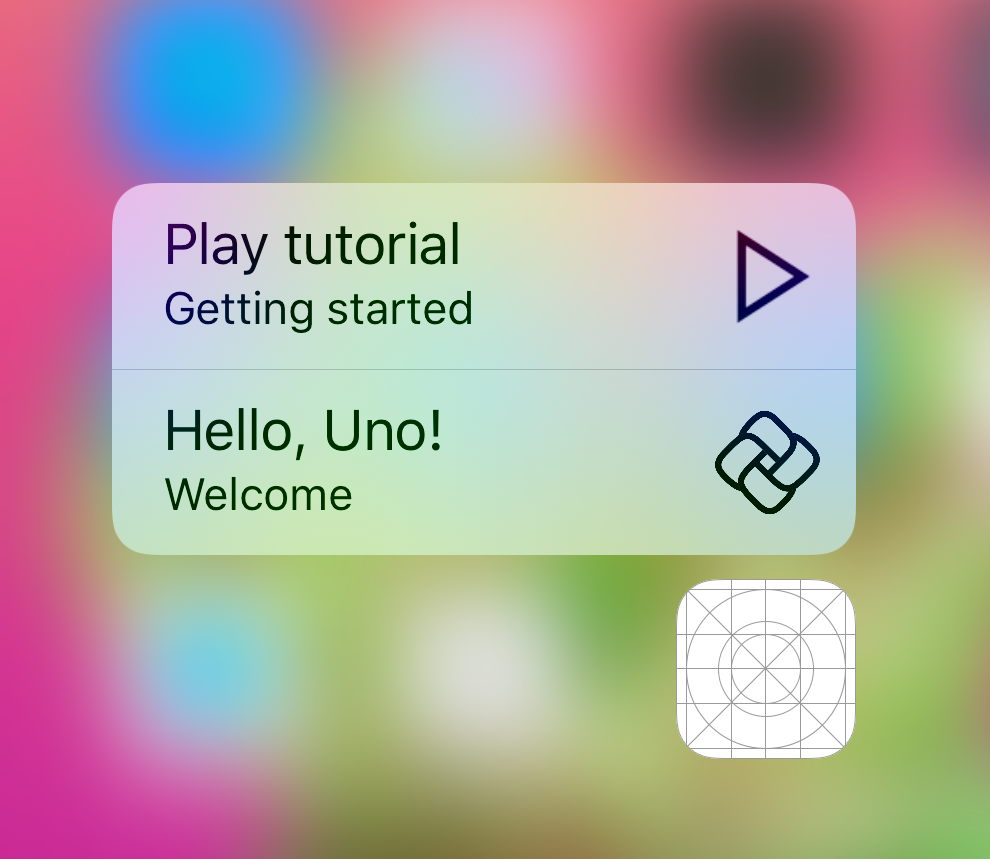

# Start Screen

> [!TIP]
> This article covers Uno-specific information for the `Windows.UI.StartScreen` namespace. For a full description of the feature and instructions on using it, see [Windows.UI.StartScreen Namespace](https://learn.microsoft.com/uwp/api/windows.ui.startscreen).

* The `Windows.UI.StartScreen` namespace provides classes for creating and managing app jump lists.

## `JumpList` &amp; `JumpListItem`

`JumpList` is implemented on **Android** and **iOS**. On **tvOS**, **WebAssembly**, and the **Skia desktop** heads (Windows, macOS, and Linux), `JumpList.IsSupported()` returns `false` and the remaining members are not implemented.

`JumpListItem` supports `DisplayName`, `Description`, `Arguments`, and `Logo` properties on both Android and iOS.

`DisplayName` may not be empty on Android and iOS - this behavior differs from WinUI. If left empty, a single space will be used instead.

`Logo` property can be initialized only with `ms-appx:`-based images. This behavior matches WinUI and actually matches native support on both platforms as well.

The API supports interoperability with native "app shortcuts". This means items you add using the native API instead of `JumpList` API will not be overwritten by `JumpList` and will appear first in the list of shortcuts. These non-Uno shortcuts will not be accessible in the `JumpList.Items` collection. To identify Uno-specific app shortcuts, a `UnoShortcut` key is used and set in `ShortcutInfo.Extras` on Android and `UIApplicationShortcutItem.UserInfo` on iOS.

Note the order of shortcut items on iOS is **reversed**. This is the default system, but you can write a platform-specific snippet that reverses the list before saving to have the same top-down order as on Android and WinUI. iOS also limits the number of items that can be displayed at the same time (for example, 4 on iPhone 6 Plus), this is device-specific.

## Handling a `JumpListItem` activation

Tapping a jump list item activates the app with the item's `Arguments`, reported as an
`ExtendedActivationKind.Launch` activation. Read it from
`Microsoft.Windows.AppLifecycle.AppInstance` — at startup with `GetActivatedEventArgs()`, and while the
app is already running from the `Activated` event:

```csharp
private void HandleActivation(AppActivationArguments args)
{
    if (args.Kind == ExtendedActivationKind.Launch &&
        args.Data is Windows.ApplicationModel.Activation.LaunchActivatedEventArgs launch &&
        !string.IsNullOrEmpty(launch.Arguments))
    {
        // launch.Arguments is the JumpListItem.Arguments of the item that was tapped
    }
}
```

On a cold start the same value also reaches `App.OnLaunched` as `LaunchActivatedEventArgs.Arguments`.
`OnLaunched` runs once, when the app launches, so it is not called again for an item tapped while the app
is already running — that is what `AppInstance.Activated` is for. See
[Custom protocol activation](xref:Uno.Features.ProtocolActivation) for a complete `App.xaml.cs` wiring
both entry points.

Jump list activation is delivered on **Android** and **iOS**. tvOS has no home screen shortcut items,
and the desktop heads have no jump list.

## Example




