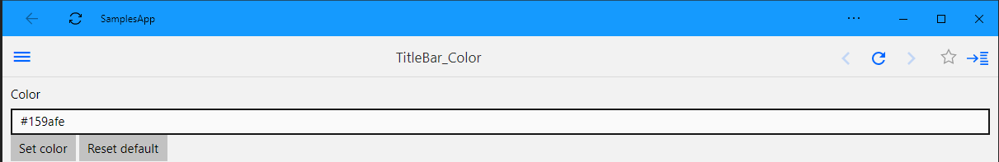
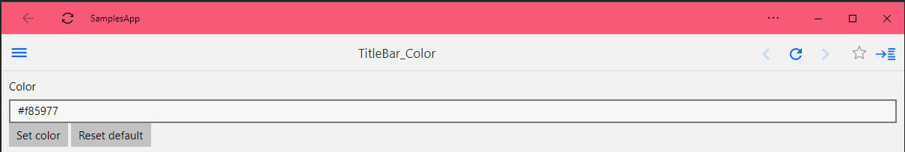

# Uno Support for Windows.UI.ViewManagement

## `ApplicationViewTitleBar`

The `BackgroundColor` property is implemented on WASM and uses the `theme-color` `<meta>` tag.

Is you set `theme_color` in the PWA application manifest, setting this property will override this configuration.

This functionality is currently supported in Chrome, Edge (Chromium) and Opera when app is installed as PWA and in Chrome mobile (even without installing).

