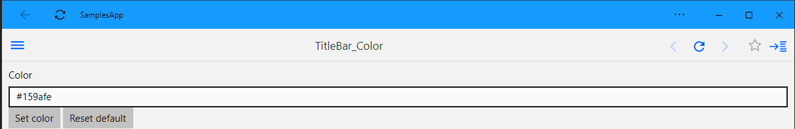
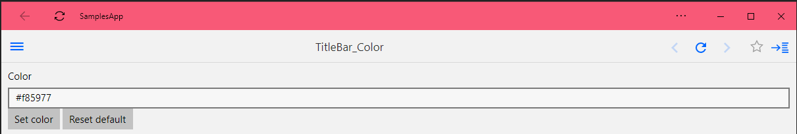
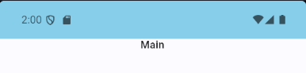
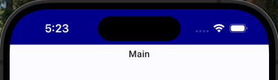

---
uid: Uno.Features.WinUIViewManagement
---

# View Management

> [!TIP]
> This article covers Uno-specific information for the `Windows.UI.ViewManagement` namespace. For a full description of the feature and instructions on using it, see [Windows.UI.ViewManagement Namespace](https://learn.microsoft.com/uwp/api/windows.ui.viewmanagement).

* The `Windows.UI.ViewManagement.ApplicationViewTitleBar` class allows working with the title bar of the application window.
* The `Windows.UI.ViewManagement.StatusBar` class allows working with the status bar on mobile.
* The `Windows.UI.ViewManagement.UISettings` class allows retrieving the current system visual settings.

## `ApplicationViewTitleBar` class

The `BackgroundColor` property is implemented on WASM and uses the `theme-color` `<meta>` tag.

If you set `theme_color` in the PWA application manifest, setting this property will override this configuration.

This functionality is currently supported in Chrome, Edge (Chromium), and Opera when the app is installed as PWA and in Chrome mobile (even without installing).

## `StatusBar` class

The `StatusBar` is located at the top of the screen on mobile devices. The properties below are implemented for both iOS and Android.

You may style the status bar using the `BackgroundColor` and `ForegroundColor` properties.

> [!NOTE]
> While you can assign any color to `ForegroundColor`, the status bar will render it as either light or dark. It will automatically choose the closest match to the specified color.

If you don’t explicitly set the `ForegroundColor`, the app will automatically choose between a light or dark foreground to try to maximize contrast with the `BackgroundColor` you provide.

> [!IMPORTANT]
> In order for the status bar colors to be customizable on iOS, the [`UIViewControllerBasedStatusBarAppearance` property](https://developer.apple.com/documentation/bundleresources/information-property-list/uiviewcontrollerbasedstatusbarappearance) needs to be set to false in the platform's Info.plist file.

## `UISettings`

Using the `GetColorValue` method, you can retrieve the system `Background` and `Foreground` color, which is useful to check if the system is currently using dark or light theme. To get notified about the color scheme changes, subscribe to the `ColorValuesChanged` event. Similarly to UWP, make sure to keep a reference to the `UISettings` instance, otherwise the instance will be collected and the event will not be raised.

### System accent color

`GetColorValue` also returns the system accent color and its variants: `UIColorType.Accent`, `AccentLight1` to `AccentLight3`, and `AccentDark1` to `AccentDark3`. The same values back the `SystemAccentColor`, `SystemAccentColorLight1` to `SystemAccentColorDark3` theme resources and the `SystemColorControlAccentBrush` brush used by the built-in control styles, so controls follow the accent color of the operating system without any code. See [Accent color palette](https://learn.microsoft.com/windows/apps/design/style/color#accent-color-palette) for the WinUI description of these values.

| Platform | Accent color source | Live updates |
|----------|---------------------|--------------|
| Windows | Windows accent palette | ✔ |
| Windows (Skia) | Windows accent palette (registry) | ✔ |
| macOS (Skia) | System Settings → Appearance accent color | ✔ |
| Linux (Skia, X11) | `accent-color` from the XDG Settings portal (GNOME 47+, KDE Plasma 6, or any backend implementing version 2 of `org.freedesktop.portal.Settings`) | ✔ |
| Android | Material You dynamic colors (Android 12 and later) | Read at startup |
| iOS, WebAssembly, Linux (framebuffer) | Not available, default palette | ✖ |

When the platform does not expose an accent color, the default blue palette (`#0078D7`) is used. Windows exposes its full palette of seven shades; the other platforms expose a single color and Uno Platform derives the lighter and darker shades from it, so they can differ slightly from the shades Windows would produce for the same accent.

`ColorValuesChanged` is raised when the accent color changes at runtime. `{ThemeResource}` references to the accent resources update automatically; as in WinUI, `{StaticResource}` references keep the value they resolved to.

> [!NOTE]
> On Linux, the accent color is read asynchronously from the desktop portal when the app starts, so the first frames use the default palette until the value arrives, and `{StaticResource}` references resolved during `OnLaunched` keep the default accent. See [X11 specifics](using-skia-desktop.md#x11-specifics) for the portal requirements.

To force a specific accent color regardless of the operating system, set `Uno.UI.FeatureConfiguration.AccentColor.OverrideAccentColor`, see [Configuring Uno's behavior globally](../feature-flags.md#accent-color).

On Android, the `AnimationsEnabled` property is implemented and allows you to check whether animations were disabled on the system level (for accessibility or battery saving). You can then use this information to disable custom animations within your app.
