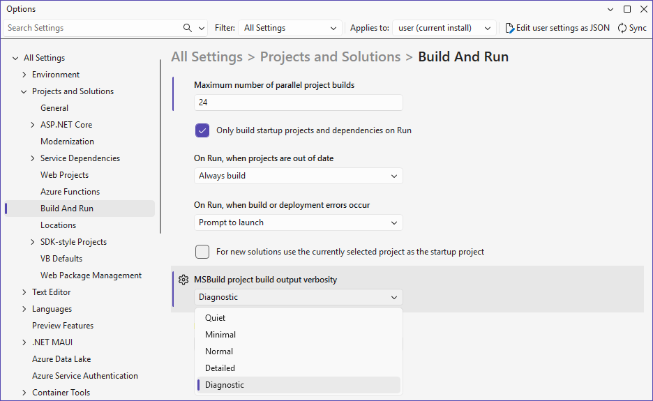

# Hot Reload

The Uno Platform **Hot Reload** feature provides a way to modify the XAML and C# of your running application, in order to iterate faster on UI or code changes. This makes the inner developer loop faster.

**Hot Reload** is part of the **Uno Platform Studio**, a suite of tools designed to streamline your cross-platform app development and boost productivity.

[➜ Learn more about Uno Platform Studio](xref:Uno.Platform.Studio.Overview)

## Features

- Supported in **Visual Studio 2022/2026** (Windows), **VS Code** (Linux, macOS, Windows, and CodeSpaces), and **Rider** (Linux, macOS, Windows).
- XAML and [C# Markup](xref:Uno.Extensions.Markup.Overview) Hot Reload for **iOS, Android, WebAssembly, and Skia (X11, Windows, macOS and FrameBuffer)**.
- All **[C# of Hot Reload](https://learn.microsoft.com/visualstudio/debugger/hot-reload)** in both Visual Studio, VS Code and Rider. See [supported code changes](https://learn.microsoft.com/visualstudio/debugger/supported-code-changes-csharp).
- **Simulator and physical devices** support.
- **Hot Reload Indicator** visuals for an enhanced development experience on Uno Platform targets (not currently supported on WinAppSDK target).
- What can be Hot Reloaded:
  - **XAML files** in the **main project** and **referenced projects libraries**
  - **C# Markup controls**
  - **Bindings**
  - **x:Bind expressions**
  - **App.xaml** and **referenced resource dictionaries**
  - **DataTemplates**
  - **Styles**
  - Extensible [**State restoration**](xref:Uno.Contributing.Internals.HotReload)
  - Support for partial **tree hot reload**, where modifying a `UserControl` instantiated in multiple locations will reload it without reloading its parents.

Hot Reload features are now consistent across platforms and IDEs, but with some debugger-specific variations. You can check below the list of currently supported features.

For existing applications, take this opportunity to update to the [latest **Uno.Sdk** version](https://www.nuget.org/packages/Uno.Sdk/latest) to take advantage of all the latest improvements and support. Refer to our [migration guide](xref:Uno.Development.MigratingFromPreviousReleases) for upgrade steps.

> [!IMPORTANT]
> When upgrading to **Uno.Sdk 5.5 or higher**, the `EnableHotReload()` method in `App.xaml.cs` is deprecated and should be replaced with `UseStudio()`.

## How to use Hot Reload

### [**Visual Studio 2022/2026**](#tab/vswin)

- Setup your environment by following our [getting started guides](xref:Uno.GetStarted.vs2022).
- Start your application (with or without the debugger, depending on the supported features below).
- Make changes to your XAML or C# code, save your file then press the red flame button in the toolbar or use `Alt+F10`.
  
  
  
### [**Visual Studio Code**](#tab/vscode)

- Setup your environment by following our [getting started guide](xref:Uno.GetStarted.vscode).
- Start the application (with or without the debugger, depending on the supported features below).
- Wait a few seconds for the hot reload engine to become available (see our troubleshooting tips below).
- Make changes to your XAML or C# code, then save your file.

### [**Rider**](#tab/rider)

- Setup your environment by following our [getting started guide](xref:Uno.GetStarted.Rider).
- Start the application without the debugger.
- Wait a few seconds for the hot reload engine to become available (see our troubleshooting tips below).
- Make changes to your XAML or C# code, then save your file.

---

> [!IMPORTANT]
> Using [.NET 9](https://dotnet.microsoft.com/download/dotnet/9.0) or later (`net9.0` in the `TargetFrameworks` property) is required for Hot Reload to be available when your solution contains iOS, Android, or WebAssembly project heads. On Windows, [Visual Studio 17.12](https://visualstudio.microsoft.com/vs) or later is required.

## Supported features per OS

<!-- Styles applied specifically to the following tables -->
<style>
    /* Center all non-first-column content horizontally */
    table th:not(:first-child),
    table td:not(:first-child) {
        text-align: center !important;
    }

    /* Ensure ALL table cells are vertically centered */
    table th,
    table td {
        vertical-align: middle !important;
        display: table-cell !important;
    }

    /* Keep first column text left-aligned */
    table td:first-child {
        text-align: left;
    }

    /* Specifically center the '🐞 Debugger' text in the first column header */
    table th:first-child {
        text-align: center !important;
    }
</style>

### [**Windows**](#tab/windows)

<table>
    <thead>
        <tr>
            <th></th>
            <th colspan="2">Visual Studio</th>
            <th colspan="2">VS Code</th>
            <th colspan="2">Rider</th>
        </tr>
        <tr>
            <th>🐞 Debugger</th>
            <th>With</th>
            <th>Without</th>
            <th>With</th>
            <th>Without</th>
            <th>With</th>
            <th>Without</th>
        </tr>
    </thead>
    <tbody>
        <tr>
            <td>Desktop<br /><small><code>net9.0-desktop</code></code></small></td>
            <td>✅</td><td>✅</td>
            <td>❌<sup><a href="#hr-footnotes">[5]</a></sup></td><td>✅</td>
            <td>❌<sup><a href="#hr-footnotes">[6]</a></sup></td><td>✅</td>
        </tr>
        <tr>
            <td>Desktop - WSL<br /><small><code>net9.0-desktop</code></small></td>
            <td>⌛<sup><a href="#hr-footnotes">[1]</a></sup></td><td>⌛<sup><a href="#hr-footnotes">[1]</a></sup></td>
            <td>❌<sup><a href="#hr-footnotes">[5]</a></sup></td><td>✅</td>
            <td>❌<sup><a href="#hr-footnotes">[2]</a></sup><sup><a href="#hr-footnotes">[6]</a></sup></td><td>❌<sup><a href="#hr-footnotes">[2]</a></sup></td>
        </tr>
        <tr>
            <td>iOS<br /><small><code>net9.0-ios</code></small></td>
            <td>✅</a></sup></td><td>❌</td>
            <td>🛜</a></td><td>🛜</td>
            <td>❌</a></td><td>✅</td>
        </tr>
        <tr>
            <td>Android<br /><small><code>net9.0-android</code></small></td>
            <td>✅</td><td>❌</td>
            <td>✅</a></td><td>✅</td>
            <td>❌</a></td><td>✅</td>
        </tr>
        </tr>
        <tr>
            <td>WinAppSDK<br /><small><code>net9.0-windows10.x.x</code></small></td>
            <td>✅<sup><a href="#hr-footnotes">[3]</a></sup></td><td>✅<sup><a href="#hr-footnotes">[4]</a></sup></td>
            <td>❌<sup><a href="#hr-footnotes">[5]</a></sup></td><td>❌</td>
            <td>❌<sup><a href="#hr-footnotes">[6]</a></sup></td><td>❌</td>
        </tr>
        <tr>
            <td>WebAssembly<br /><small><code>net9.0-browserwasm</code></small></td>
            <td>✅</td><td>✅</td>
            <td>❌<sup><a href="#hr-footnotes">[5]</a></sup></td><td>✅</td>
            <td>❌<sup><a href="#hr-footnotes">[6]</a></sup></td><td>✅</td>
        </tr>
    </tbody>
</table>

### [**macOS**](#tab/macOS)

<table>
    <thead>
        <tr>
            <th></th>
            <th colspan="2">VS Code</th>
            <th colspan="2">Rider</th>
        </tr>
        <tr>
            <th>🐞 Debugger</th>
            <th>With</th>
            <th>Without</th>
            <th>With</th>
            <th>Without</th>
        </tr>
    </thead>
    <tbody>
        <tr>
            <td>Desktop<br /><small><code>net9.0-desktop</code></code></small></td>
            <td>❌<sup><a href="#hr-footnotes">[5]</a></sup></td><td>✅</td>
            <td>❌<sup><a href="#hr-footnotes">[6]</a></sup></td><td>✅</td>
        </tr>
        <tr>
            <td>Desktop - WSL<br /><small><code>net9.0-desktop</code></small></td>
            <td>❌<sup><a href="#hr-footnotes">[5]</a></sup></td><td>❌</td>
            <td>❌<sup><a href="#hr-footnotes">[6]</a></sup></td><td>❌</td>
        </tr>
        <tr>
            <td>iOS<br /><small><code>net9.0-ios</code></small></td>
            <td>✅</td><td>✅</td>
            <td>❌</td><td>✅</td>
        </tr>
        <tr>
            <td>Android<br /><small><code>net9.0-android</code></small></td>
            <td>✅</td><td>✅</td>
            <td>❌</td><td>✅</td>
        </tr>
        <tr>
            <td>WinAppSDK<br /><small><code>net9.0-windows10.x.x</code></small></td>
            <td>❌<sup><a href="#hr-footnotes">[5]</a></sup></td><td>❌</td>
            <td>❌<sup><a href="#hr-footnotes">[6]</a></sup></td><td>❌</td>
        </tr>
        <tr>
            <td>WebAssembly<br /><small><code>net9.0-browserwasm</code></small></td>
            <td>❌<sup><a href="#hr-footnotes">[5]</a></sup></td><td>✅</td>
            <td>❌<sup><a href="#hr-footnotes">[6]</a></sup></td><td>✅</td>
        </tr>
    </tbody>
</table>

### [**Linux**](#tab/linux)

<table>
    <thead>
        <tr>
            <th></th>
            <th colspan="2">VS Code</th>
            <th colspan="2">Rider</th>
        </tr>
        <tr>
            <th>🐞 Debugger</th>
            <th>With</th>
            <th>Without</th>
            <th>With</th>
            <th>Without</th>
        </tr>
    </thead>
    <tbody>
        <tr>
            <td>Desktop<br /><small><code>net9.0-desktop</code></code></small></td>
            <td>❌<sup><a href="#hr-footnotes">[5]</a></sup></td><td>✅</td>
            <td>❌<sup><a href="#hr-footnotes">[6]</a></sup></td><td>✅</td>
        </tr>
        <tr>
            <td>Desktop - WSL<br /><small><code>net9.0-desktop</code></small></td>
            <td>❌<sup><a href="#hr-footnotes">[5]</a></sup></td><td>❌</td>
            <td>❌<sup><a href="#hr-footnotes">[6]</a></sup></td><td>❌</td>
        </tr>
        <tr>
            <td>iOS<br /><small><code>net9.0-ios</code></small></td>
            <td>🛜</td><td>🛜</td>
            <td>❌</td><td>❌</td>
        </tr>
        <tr>
            <td>Android<br /><small><code>net9.0-android</code></small></td>
            <td>✅</td><td>✅</td>
            <td>❌</td><td>✅</td>
        </tr>
        <tr>
            <td>WinAppSDK<br /><small><code>net9.0-windows10.x.x</code></small></td>
            <td>❌<sup><a href="#hr-footnotes">[5]</a></sup></td><td>❌</td>
            <td>❌<sup><a href="#hr-footnotes">[6]</a></sup></td><td>❌</td>
        </tr>
        <tr>
            <td>WebAssembly<br /><small><code>net9.0-browserwasm</code></small></td>
            <td>❌<sup><a href="#hr-footnotes">[5]</a></sup></td><td>✅</td>
            <td>❌<sup><a href="#hr-footnotes">[6]</a></sup></td><td>✅</td>
        </tr>
    </tbody>
</table>

---

Legend:

- ✅ Supported
- 🛜 Supported through [SSH to a Mac](xref:Uno.GettingStarted.CreateAnApp.VSCode#debug-the-app)
- ⌛ Upcoming support
- ❌ Currently not supported by the environment/IDE

### Notes

<a href="hr-footnotes"/>

- [1]: Support is [pending support](https://github.com/dotnet/sdk/pull/40725) in the .NET SDK.
- [2]: Support is [not available](https://youtrack.jetbrains.com/issue/RIDER-53302/launchSettings.json-WSL2-command-support).
- [3]: Unpackaged: C# & XAML / Packaged: XAML only
- [4]: Unpackaged: C# / Packaged: none
- [5]: VS Code Desktop and WASM [requested](https://developercommunity.visualstudio.com/t/Building-a-cross-targeted-project-with-m/651372)
- [6]: Rider Desktop and WASM [requested](https://youtrack.jetbrains.com/issue/RIDER-124189/MetadataUpdateHandlerAttribute-Not-Working-On-Hot-Reload)

## Supported features per Platform

### [**Desktop**](#tab/skia-desktop)

Skia-based targets provide support for full XAML Hot Reload and C# Hot Reload. There are some restrictions that are listed below:

- The Visual Studio 2022/2026 for Windows support is fully available, with and without running under the debugger
- As of VS 2022/2026 17.9 XAML or C# Hot Reload under WSL is not supported
- VS Code
  - With the debugger: The C# Dev Kit is handling hot reload [when enabled](https://code.visualstudio.com/docs/csharp/debugging#_hot-reload). As of December 20th, 2023, C# Dev Kit hot reload does not handle class libraries. To experience the best hot reload, do not use the debugger.
  - Without the debugger: The VS Code Uno Platform extension is handling Hot Reload (C# and XAML).
  - Adding new C# or XAML files to a project is not yet supported.
- Rider
  - Hot Reload is only supported without the debugger.
  - Adding new C# or XAML files to a project is not yet supported.

### [**WebAssembly**](#tab/wasm)

WebAssembly is currently providing full Hot Reload support.

- In Visual Studio Code:
  - Both C# and XAML Hot Reload are fully supported.
  - Adding new C# or XAML files to the project is not yet supported.
  - Hot Reload is not supported when using the debugger.
- In Rider:
  - Both C# and XAML Hot Reload are fully supported.
  - Adding new C# or XAML files to the project is not yet supported.
  - Hot Reload is not supported when using the debugger.

### [**iOS, Android**](#tab/mobile)

Mobile targets now support both XAML and C# Hot Reload. Debugger-specific variations apply depending on the IDE.

- In Visual Studio:
  - The debugger **has** to be attached.
- In VS Code, and Rider:
  - Hot Reload is not supported when using the debugger.
- XAML `x:Bind` Hot Reload is limited to simple expressions and events.

### [**WinAppSDK**](#tab/winappsdk)

- Hot Reload is supported by Visual Studio for WinAppSDK and provides support in unpackaged deployment mode.
- Hot Reload is not supported in VS Code and Rider.

---

## Hot Reload Indicator

> [!NOTE]
> The **Hot Reload indicator** is currently not supported for the **WinAppSDK** target.

Hot Reload displays a visual indicator to help you further monitor changes while developing. It displays new information every time Hot Reload is triggered. The indicator is enabled by default within the `UseStudio()` method which is located in the root `App.xaml.cs` file. This displays an overlay that hosts the visual indicator. If you wish to disable it, you simply have to provide the following boolean: `UseStudio(showHotReloadIndicator: false)`, removing the overlay from the view.

To start using the **Hot Reload indicator** using the **latest stable 5.5 Uno.Sdk version or higher**, ensure you are signed in with your Uno Platform account. Follow [these instructions](xref:Uno.GetStarted.Licensing) to register and sign in.

<p align="center">
  
</p>

For existing applications, take this opportunity to update to the [latest **Uno.Sdk** version](https://www.nuget.org/packages/Uno.Sdk/latest) to take advantage of all the latest improvements and support. Refer to our [migration guide](xref:Uno.Development.MigratingFromPreviousReleases) for upgrade steps.

> [!IMPORTANT]
> When upgrading to **Uno.Sdk 5.5 or higher**, the `EnableHotReload()` method in `App.xaml.cs` is deprecated and should be replaced with `UseStudio()`.

<p align="center">
  
</p>

> [!TIP]
> The overlay can be moved by using the anchor on the left-hand side.

The indicator displays the current connection status. Clicking on it will open a flyout containing all events or changes that were applied by Hot Reload. These events display more details about Hot Reload changes, such as its status and impacted files.

<p align="center">
  
</p>

### Statuses

Here's a summary of the Hot Reload connection statuses and their corresponding icons:

#### Connection

-  **Not Signed In**  
  _User needs to sign in to enable Hot Reload._

-  **Connecting**  
  _Establishing a connection._

-  **Connected**  
  _Connection established._

-  **Warning**  
  _Usually indicates an issue that can be resolved by restarting your IDE._

-  **Connection Failed**  
  _A connection error occurred. Refer to the [troubleshooting documentation](#troubleshooting) for possible solutions._

-  **Server Unreachable**  
  _Hot Reload could not connect to the server. Check the [troubleshooting documentation](#troubleshooting) for guidance._

#### Operation

-  **Success**  
  _The Hot Reload changes have been applied successfully._

-  **Failed**  
  _Hot Reload encountered an error and could not apply the changes._

-  **Processing**  
  _Hot Reload is applying changes or initializing._

## Troubleshooting

### [**Common issues**](#tab/common-issues)

- If the Hot Reload Indicator is red and shows a connection failure, ensure that you have the [latest stable version](https://www.nuget.org/packages/Uno.Sdk/latest) of [Uno.SDK](xref:Uno.Features.Uno.Sdk) and the latest version of your IDE’s extension ([Visual Studio](https://aka.platform.uno/vs-extension-marketplace), [Visual Studio Code](https://aka.platform.uno/vscode-extension-marketplace), or [Rider](https://aka.platform.uno/rider-extension-marketplace)). Additionally, [re-run Uno.Check](xref:UnoCheck.UsingUnoCheck) to update dependencies, then relaunch your IDE, [sign in with your Uno Platform account](xref:Uno.GetStarted.Licensing), and rebuild your application.

  For existing applications, refer to our [migration guide](xref:Uno.Development.MigratingFromPreviousReleases) for upgrade steps.
  > [!IMPORTANT]
  > When upgrading to **Uno.Sdk 5.5 or higher**, the `EnableHotReload()` method in `App.xaml.cs` is deprecated and should be replaced with `UseStudio()`.
- Observe the application logs, you should see diagnostics messages in the app when a XAML file is reloaded.
- WinAppSDK on Windows-specific issues
  - Grid Succinct syntax [is not supported](https://github.com/microsoft/microsoft-ui-xaml/issues/7043#issuecomment-1120061686)
- You can troubleshoot **Hot Reload** further by adjusting the **logging level** in your app.

  - **For Blank App Preset** (in `App.xaml.cs`, inside `InitializeLogging`):
  
    ```csharp
    // Adjust logging level
    builder.SetMinimumLevel(LogLevel.Debug); // or LogLevel.Trace

    // Uncomment and adjust logging level
    builder.AddFilter("Uno.UI.RemoteControl", LogLevel.Debug); // or LogLevel.Trace
    ```

  - **For Recommended App Preset** (in `App.xaml.cs`, inside `UseLogging`):

    ```csharp
    // Adjust logging level
    logBuilder.SetMinimumLevel(LogLevel.Debug); // or LogLevel.Trace

    // Uncomment and adjust logging level
    logBuilder.HotReloadCoreLogLevel(LogLevel.Debug); // or LogLevel.Trace
    ```

  The diagnostic messages will appear in the app's **Debug Output**.

  If you need to share logs when opening an issue on the GitHub [Uno Platform repository](https://github.com/unoplatform/uno), it is recommended to set `LogLevel` to **Trace** to provide the most detailed logs for investigation.

- If you're getting `ENC0003: Updating 'attribute' requires restarting the application`, add the following in the `Directory.Build.props` (or in each .csproj project head):

  ```xml
  <PropertyGroup>
    <!-- Required for Hot Reload (See https://github.com/unoplatform/uno.templates/issues/376) -->
    <GenerateAssemblyInfo Condition="'$(Configuration)'=='Debug'">false</GenerateAssemblyInfo>
  </PropertyGroup>
  ```
  
  Also [make sure](https://github.com/dotnet/sdk/issues/36666#issuecomment-2162173453) that you're not referencing `Microsoft.SourceLink.*` packages.

- If you're getting the `Unable to access Dispatcher/DispatcherQueue` error, you'll need to update your app to Uno.Sdk 5.6 or later, and update your `App.cs` file:

    ```csharp
    using Uno.UI;

    //... in the OnLaunched method

    #if DEBUG
            MainWindow.UseStudio();
    #endif
    ```

### [**Visual Studio 2022/2026**](#tab/vswints)

- Ensure that **C# Hot Reload** is enabled in Visual Studio by going to **Tools > Options**, searching for **.NET / C++ Hot Reload**, and making sure the following checkboxes are checked:
  - ✅ **Enable Hot Reload when debugging**
  - ✅ **Enable Hot Reload without debugging**
  - ✅ **Apply Hot Reload on File Save**
- The Output window in Visual Studio includes an output category named `Uno Platform` in its drop-down menu. Diagnostic messages from the Uno Platform VS extension appear there. To enable logging, you need to set **MSBuild project build output verbosity** to **at least "Normal"** (above "Minimal"). These changes should take effect immediately without requiring a Visual Studio restart. However, if you do not see additional logs, try restarting Visual Studio. For more details on build log verbosity, refer to the [official Visual Studio documentation](https://learn.microsoft.com/en-us/visualstudio/ide/how-to-view-save-and-configure-build-log-files?view=vs-2022#to-change-the-amount-of-information-included-in-the-build-log).  

    If you need to share logs when opening an issue on the GitHub [Uno Platform repository](https://github.com/unoplatform/uno), it is recommended to set verbosity to **Diagnostic** to provide the most detailed logs for investigation.

    **Steps to change MSBuild output verbosity:**  
    1. Open **Tools > Options > Projects and Solutions > Build and Run**, then set **MSBuild output verbosity** to **Diagnostic** or the required level.

       
    2. Restart Visual Studio, re-open your solution, and wait a few seconds.
    3. Go to **View > Output**.
    4. In the Output window, select `Uno Platform` from the drop-down.

       
- When a file is reloaded, XAML parsing errors will appear in the application's logs, on the device or in the browser.
- If there are multiple versions of the Uno.WinUI Package present in the solution, the newest will be used, regardless of the started application
- For `net9.0-windows10.xx`:
  - Ensure that the `net9.0-windows10.xxx` target framework **is selected in the top-left dropdown list of the XAML editor**. Selecting any other platform will break Hot Reload.
  - [A VS issue for WinUI may be hit](https://developercommunity.visualstudio.com/t/net80-windows10-needs-to-be-first-for-W/10643724). If XAML Hot Reload does not work, ensure that the `Uno Platform` output window exists, and that it mentions that the extension has successfully loaded. To do so, try closing and reopening the solution, and make sure that the [Visual Studio extension is installed](xref:Uno.GetStarted.vs2022).
  - [A known VS issue for WinUI](https://github.com/microsoft/microsoft-ui-xaml/issues/5944) breaks Hot Reload when using "simplified" `RowDefinitions`/`ColumnDefinitions`.

### [**Visual Studio Code**](#tab/vscodets)

- Hot Reload **is not supported** when using the debugger. Start your app using `Ctrl+F5`.
- The Output window in Visual Studio Code includes an output category named `Uno Platform - Hot Reload` in its drop-down menu. Diagnostic messages from the Uno Platform VS Code extension appear there.

    **Steps to see the `Uno Platform - Hot Reload` output:**  
    1. In the status bar at the bottom left of VS Code, ensure `NameOfYourProject.csproj` is selected (by default `NameOfYourProject.sln` is selected).

       
    2. Wait a few seconds.
    3. Go to **View > Output**.
    4. In the Output window, select `Uno Platform - Hot Reload` from the drop-down.

       
- Depending on your machine's performance, the Hot Reload engine may take a few moments to initialize and take your project modifications into account.
- Make sure that the selected project in the status bar (or using the "Uno Platform: Select Active Project" in the command palette) is not the solution file, but rather the project file (i.e. ending by `.csproj`).
- Align the "Debug profile" (at the top of the "Run and Debug" pane) with the platform you chose to debug within the status bar (or using the "Uno Platform: Select the Target Platform Moniker (TFM)")
  - "Uno Platform Desktop Debug" profile for `net9.0-desktop`
  - "Uno Platform Mobile Debug" profile for `net9.0-ios` and `net9.0-android`
  - "Uno Platform WebAssembly Debug" profile for `net9.0-browserwasm`
- If Hot Reload does not function properly, you can try using the `Developer: Reload Window` command in the palette (using `Ctrl+Shift+P`)
- The TCP port number used by the app to connect back to the IDE is located in the `<UnoRemoteControlPort>` property of the `[ProjectName].csproj.user` file. If the port number does not match with the one found in the `Uno Platform - Hot Reload` output window, restart Code or use `Developer: Reload Window` in the command palette.

### [**Rider**](#tab/riderts)

- Hot Reload **is not supported** when using the debugger. Start your app without the debugger.
- The Output window in Rider includes an output category named `Uno Platform` in its sidebar. Diagnostic messages from the Uno Platform Rider plugin appear there.

    **Steps to see the `Hot Reload` output:**  
    1. In the sidebar at the bottom left of Rider, click on the Uno Platform logo.

       
    2. In the Output window, select **LEVEL: Trace** from the drop-down.

       
- Depending on your machine's performance, the Hot Reload engine may take a few moments to initialize and take your project modifications into account.
- If Hot Reload does not function properly, you can try closing and reopening the solution.
- The TCP port number used by the app to connect back to the IDE is located in the `<UnoRemoteControlPort>` property of the `[ProjectName].csproj.user` file. If the port number does not match the one found in the **Uno Platform** output window, close and reopen the solution.

---

## Next Steps

Learn more about:

- [Uno Platform features and architecture](xref:Uno.GetStarted.Explore)
- [Uno Platform App solution structure](xref:Uno.Development.AppStructure)
- [Troubleshooting](xref:Uno.UI.CommonIssues)
- [List of views implemented in Uno](../implemented-views.md) for the set of available controls and their properties.
- You can head to [How-tos and tutorials](xref:Uno.Tutorials.Intro) on how to work on your Uno Platform app.
