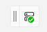
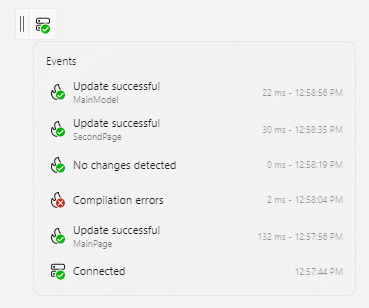

# Hot Reload

The Uno Platform Hot Reload feature provides a way to modify the XAML and C# of your running application, in order to iterate faster on UI or code changes. This makes the inner developer loop faster.

## Features

- Supported in **Visual Studio 2022** (Windows), **VS Code** (Linux, macOS, Windows, CodeSpaces, and GitPod) and Rider (Linux, macOS, Windows)
- XAML and [C# Markup](xref:Uno.Extensions.Markup.Overview) Hot Reload for **iOS, Catalyst, Android, WebAssembly, and Skia (X11, Windows, macOS and FrameBuffer)**
- All **[C# of Hot Reload](https://learn.microsoft.com/visualstudio/debugger/hot-reload)** in both Visual Studio and VS Code. See [supported code changes](https://learn.microsoft.com/visualstudio/debugger/supported-code-changes-csharp).
- **Simulator and physical devices** support
- Hot Reload **Indicator** visuals for an enhanced development experience on Uno Platform targets
- What can be Hot Reloaded:
  - **XAML files** in the **main project** and **referenced projects libraries**
  - **C# Markup controls**
  - **Bindings**
  - Full **x:Bind expressions**
  - **App.xaml** and **referenced resource dictionaries**
  - **DataTemplates**
  - **Styles**
  - Extensible [**State restoration**](xref:Uno.Contributing.Internals.HotReload)
  - Support for partial **tree hot reload**, where modifying a `UserControl` instantiated in multiple locations will reload it without reloading its parents

Hot Reload features vary between platforms and IDE, you can check below the list of currently supported features.

## How to use Hot Reload

### [**Visual Studio 2022**](#tab/vswin)

- Setup your environment by following our [getting started guides](xref:Uno.GetStarted.vs2022).
- Start your application (with or without the debugger, depending on the supported features below)
- Make changes to your XAML or C# code, save your file then press the red flame icon in the toolbar or use `Alt+F10`

### [**Visual Studio Code**](#tab/vscode)

- Setup your environment by following our [getting started guide](xref:Uno.GetStarted.vscode)
- Start the application (with or without the debugger, depending on the supported features below)
- Wait a few seconds for the hot reload engine to become available (see our troubleshooting tips below)
- Make changes to your XAML or C# code, then save your file

### [**Rider**](#tab/rider)

- Setup your environment by following our [getting started guide](xref:Uno.GetStarted.Rider)
- Start the application without the debugger
- Wait a few seconds for the hot reload engine to become available (see our troubleshooting tips below)
- Make changes to your XAML or C# code, then save your file

---

> [!IMPORTANT]
> Using [.NET 8](https://dotnet.microsoft.com/download/dotnet/8.0) or later (`net8.0` in the `TargetFrameworks` property) is required for Hot Reload to be available when your solution contains iOS, Android, Mac Catalyst, or WebAssembly project heads. On Windows, [Visual Studio 17.8](https://visualstudio.microsoft.com/vs) or later is required.

## Supported features per OS

### [**Windows**](#tab/windows)

<table>
    <thead>
        <tr>
            <th></th>
            <th colspan="2">Visual Studio</th>
            <th colspan="2">VS Code</th>
            <th colspan="2">Rider</th>
        </tr>
        <tr>
            <th>Target</th>
            <th>C#</th>
            <th>XAML</th>
            <th>C#</th>
            <th>XAML</th>
            <th>C#</th>
            <th>XAML</th>
        </tr>
    </thead>
    <tbody>
        <tr>
            <td>Desktop Windows</td>
            <td>✅🐞</td><td>✅🐞</td>
            <td>✅🐞</td><td>✅🐞</td>
            <td>✅</td><td>✅</td>
        </tr>
        <tr>
            <td>Desktop/WSL</td>
            <td>⌛<sup><a href="#hr-footnotes">[1]</a></sup> </td><td>⌛<sup><a href="#hr-footnotes">[1]</a></sup></td>
            <td>✅</td><td>✅</td>
            <td>🔳<sup><a href="#hr-footnotes">[2]</a></sup></td><td>🔳<sup><a href="#hr-footnotes">[2]</a></sup></td>
        </tr>
        <tr>
            <td>iOS</td>
            <td>⌛<sup><a href="#hr-footnotes">[3]</a></sup></td><td>✅<sup><a href="#hr-footnotes">[4]</a></sup></td>
            <td>⌛<sup><a href="#hr-footnotes">[3]</a></sup>🛜</td><td>✅<sup><a href="#hr-footnotes">[4]</a></sup>🛜</td>
            <td>🔳</td><td>🔳</td>
        </tr>
        <tr>
            <td>Android</td>
            <td>⌛<sup><a href="#hr-footnotes">[3]</a></sup></td><td>✅<sup><a href="#hr-footnotes">[4]</a></sup></td>
            <td>⌛<sup><a href="#hr-footnotes">[3]</a></sup></td><td>✅<sup><a href="#hr-footnotes">[4]</a></sup></td>
            <td>⌛<sup><a href="#hr-footnotes">[3]</a></sup></td><td>✅<sup><a href="#hr-footnotes">[4]</a></sup></td>
        </tr>
        </tr>
        <tr>
            <td>WinAppSDK</td>
            <td>✅<sup><a href="#hr-footnotes">[5]</a></sup>🐞</td><td>✅🐞</td>
            <td>🔳</td><td>🔳</td>
            <td>🔳</td><td>🔳</td>
        </tr>
        <tr>
            <td>WebAssembly</td>
            <td>✅🐞</td><td>✅🐞</td>
            <td>✅</td><td>✅</td>
            <td>✅</td><td>✅</td>
        </tr>
        <tr>
            <td>Catalyst</td>
            <td>🔳</td><td>🔳</td>
            <td>⌛<sup><a href="#hr-footnotes">[3]</a></sup>🛜</td><td>✅<sup><a href="#hr-footnotes">[4]</a></sup>🛜</td>
            <td>🔳</td><td>🔳</td>
        </tr>
    </tbody>
</table>

### [**macOS**](#tab/macOS)

<table>
    <thead>
        <tr>
            <th></th>
            <th colspan="2">VS Code</th>
            <th colspan="2">Rider</th>
        </tr>
        <tr>
            <th>Target</th>
            <th>C#</th>
            <th>XAML</th>
            <th>C#</th>
            <th>XAML</th>
        </tr>
    </thead>
    <tbody>
        <tr>
            <td>Desktop macOS</td>
            <td>✅</td><td>✅</td>
            <td>✅</td><td>✅</td>
        </tr>
        <tr>
            <td>iOS</td>
            <td>⌛<sup><a href="#hr-footnotes">[3]</a></sup></td><td>✅<sup><a href="#hr-footnotes">[4]</a></sup></td>
            <td>⌛<sup><a href="#hr-footnotes">[3]</a></sup></td><td>✅<sup><a href="#hr-footnotes">[4]</a></sup></td>
        </tr>
        <tr>
            <td>Android</td>
            <td>⌛<sup><a href="#hr-footnotes">[3]</a></sup></td><td>✅<sup><a href="#hr-footnotes">[4]</a></sup></td>
            <td>⌛<sup><a href="#hr-footnotes">[3]</a></sup></td><td>✅<sup><a href="#hr-footnotes">[4]</a></sup></td>
        </tr>
        </tr>
        <tr>
            <td>Catalyst</td>
            <td>⌛<sup><a href="#hr-footnotes">[3]</a></sup></td><td>✅<sup><a href="#hr-footnotes">[4]</a></sup></td>
            <td>⌛<sup><a href="#hr-footnotes">[3]</a></sup></td><td>✅<sup><a href="#hr-footnotes">[4]</a></sup></td>
        </tr>
        <tr>
            <td>WinAppSDK</td>
            <td>🔳</td><td>🔳</td>
            <td>🔳</td><td>🔳</td>
        </tr>
        <tr>
            <td>WebAssembly</td>
            <td>✅</td><td>✅</td>
            <td>✅</td><td>✅</td>
        </tr>
    </tbody>
</table>

### [**Linux**](#tab/linux)

<table>
    <thead>
        <tr>
            <th></th>
            <th colspan="2">VS Code</th>
            <th colspan="2">Rider</th>
        </tr>
        <tr>
            <th>Target</th>
            <th>C#</th>
            <th>XAML</th>
            <th>C#</th>
            <th>XAML</th>
        </tr>
    </thead>
    <tbody>
        <tr>
            <td>Desktop Linux</td>
            <td>✅</td><td>✅</td>
            <td>✅</td><td>✅</td>
        </tr>
        <tr>
            <td>Android</td>
            <td>⌛<sup><a href="#hr-footnotes">[3]</a></sup></td><td>✅<sup><a href="#hr-footnotes">[4]</a></sup></td>
            <td>⌛<sup><a href="#hr-footnotes">[3]</a></sup></td><td>✅<sup><a href="#hr-footnotes">[4]</a></sup></td>
        </tr>
        <tr>
            <td>WebAssembly</td>
            <td>✅</td><td>✅</td>
            <td>✅</td><td>✅</td>
        </tr>
        <tr>
            <td>iOS</td>
            <td>⌛<sup><a href="#hr-footnotes">[3]</a></sup>🛜</td><td>✅<sup><a href="#hr-footnotes">[4]</a></sup>🛜</td>
            <td>🔳</td><td>🔳</td>
        </tr>
        <tr>
            <td>Catalyst</td>
            <td>⌛<sup><a href="#hr-footnotes">[3]</a></sup>🛜</td><td>✅<sup><a href="#hr-footnotes">[4]</a></sup>🛜</td>
            <td>🔳</td><td>🔳</td>
        </tr>
        <tr>
            <td>WinAppSDK</td>
            <td>🔳</td><td>🔳</td>
            <td>🔳</td><td>🔳</td>
        </tr>
    </tbody>
</table>

---

Legend:

- ✅ Supported
- 🐞 Supported with the debugger
- ⌛ Upcoming support
- 🛜 Supported through [SSH to a Mac](xref:Uno.GettingStarted.CreateAnApp.VSCode#debug-the-app)
- 🔳 Not supported by the environment/IDE

### Notes

<a href="hr-footnotes"/>

- [1]: Support is [pending support](https://github.com/dotnet/sdk/pull/40725) in the .NET SDK.
- [2]: Support is [not available](https://youtrack.jetbrains.com/issue/RIDER-53302/launchSettings.json-WSL2-command-support).
- [3]: C# Hot Reload is affected by a [.NET Runtime issue](https://github.com/dotnet/android/issues/9120).
- [4]: XAML Hot Reload is using the XAML Reader, [pending C# Hot Reload update](https://github.com/unoplatform/uno/issues/15918) and a [VS/VS Code update](https://developercommunity.visualstudio.com/t/net70-iosnet70-android-MetadataUpd/10279604).
- [5]: C# Markup Hot Reload is supported when running in Unpackaged mode only

## Supported features per Platform

### [**Desktop**](#tab/skia-desktop)

Skia-based targets provide support for full XAML Hot Reload and C# Hot Reload. There are some restrictions that are listed below:

- The Visual Studio 2022 for Windows support is fully available, with and without running under the debugger
- As of VS 2022 17.9 XAML or C# Hot Reload under WSL is not supported
- VS Code
  - With the debugger: The C# Dev Kit is handling hot reload [when enabled](https://code.visualstudio.com/docs/csharp/debugging#_hot-reload). As of December 20th, 2023, C# Dev Kit hot reload does not handle class libraries. To experience the best hot reload, do not use the debugger.
  - Without the debugger: The VS Code Uno Platform extension is handling Hot Reload (C# or XAML)
  - Adding new C# or XAML files to a project is not yet supported
- Rider
  - Hot Reload is only supported without the debugger.
  - Adding new C# or XAML files to a project is not yet supported

### [**WebAssembly**](#tab/wasm)

WebAssembly is currently providing both full and partial Hot Reload support, depending on the IDE.

- In Visual Studio Code:
  - Both C# and XAML Hot Reload are fully supported
  - Adding new C# or XAML files to the project is not yet supported
  - Hot Reload is not supported when using the debugger
- In Rider:
  - Both C# and XAML Hot Reload are fully supported
  - Adding new C# or XAML files to the project is not yet supported
  - Hot Reload is not supported when using the debugger
- In Visual Studio for Windows:
  - [`MetadataUpdateHandlers`](https://learn.microsoft.com/dotnet/api/system.reflection.metadata.metadataupdatehandlerattribute) are invoked without the list of changed types, which means that some hot reload features may not be available. This feature is slated to be available for .NET 9.

### [**iOS, Android, and Catalyst**](#tab/mobile)

Mobile targets are currently using a limited version of XAML Hot Reload and do not support C# Hot Reload until [this dotnet runtime](https://github.com/dotnet/android/issues/9120) issue is fixed.

- In Visual Studio, the "Hot Reload on File Save" feature must be disabled to avoid crashing the app. You can find this feature by clicking on the down arrow next to the red flame in the Visual Studio toolbar.
- In VS, VS Code, and Rider, [C# Hot Reload is not yet fully supported](https://developercommunity.visualstudio.com/t/net70-iosnet70-android-MetadataUpd/10279604#T-ND10384434)
- XAML `x:Bind` hot reload is limited to simple expressions and events

### [**WinAppSDK**](#tab/winappsdk)

- Hot Reload is supported by Visual Studio for WinAppSDK and provides support in unpackaged deployment mode.
- Hot Reload is not supported in Rider

---

## Hot Reload Indicator

Hot Reload displays a visual indicator to help you further monitor changes while developing. It displays new information every time Hot Reload is triggered. The indicator is enabled by default within the `UseStudio()` method which is located in the root `App.xaml.cs` file. This displays an overlay which hosts the visual indicator. If you wish to disable it, you simply have to provide the following boolean: `EnableHotReload(disableIndicator: true)`, removing the overlay from the view.

<p align="center">
  
</p>

> [!TIP]
> The overlay can be moved by using the anchor on the left hand side.

The indicator displays the current connection status. Clicking on it will open a flyout containing all events or changes that were applied by Hot Reload. These events display more details about Hot Reload changes, such as its status and impacted files.

<p align="center">
  
</p>

### Statuses

Here's a summary of what icons and statuses you can expect:

**Connection**:

 Success

 Failed

 Warning (Usually indicates an issue that can be solved by restarting your IDE)

**Operation**:

 Success

 Failed

 Processing (Hot Reload is processing the changes or initializing)

## Troubleshooting

### [**Common issues**](#tab/common-issues)

- Observe the application logs, you should see diagnostics messages in the app when a XAML file is reloaded.
- WinAppSDK on Windows-specific issues
  - Grid Succinct syntax [is not supported](https://github.com/microsoft/microsoft-ui-xaml/issues/7043#issuecomment-1120061686)
- You can troubleshoot hot reload further from the DevServer client running in the app by:
  - Setting `builder.SetMinimumLevel(LogLevel.Information)` to `LogLevel.Debug` or `Trace`
  - Setting `builder.AddFilter("Uno.UI.DataBinding.BinderReferenceHolder", LogLevel.Debug )` to `LogLevel.Debug` or `Trace`

  The diagnostics messages will appear in the app's debug output.
- If you're getting `ENC0003: Updating 'attribute' requires restarting the application`, add the following in the `Directory.Build.props` (or in each csproj project heads):

  ```xml
  <PropertyGroup>
    <!-- Required for Hot Reload (See https://github.com/unoplatform/uno.templates/issues/376) -->
    <GenerateAssemblyInfo Condition="'$(Configuration)'=='Debug'">false</GenerateAssemblyInfo>
  </PropertyGroup>
  ```
  
  Also [make sure](https://github.com/dotnet/sdk/issues/36666#issuecomment-2162173453) that you're not referencing `Microsoft.SourceLink.*` packages.

- If you're getting the `Unable to access Dispatcher/DispatcherQueue` error, you'll need to update your app startup to Uno 5 or later:
  - Add the following lines to the shared library project `csproj` file :

    ```xml
    <ItemGroup>
        <PackageReference Include="Uno.WinUI.DevServer" Version="$UnoWinUIVersion$" Condition="'$(Configuration)'=='Debug'" />
    </ItemGroup>
    ```

    > [!NOTE]
    > If your application is using the UWP API set (Uno.UI packages) you'll need to use the `Uno.UI.DevServer` package instead.
  - Then, in your `App.cs` file, add the following:
  
    ```csharp
    using Uno.UI;

    //... in the OnLaunched method

    #if DEBUG
            MainWindow.UseStudio();
    #endif
    ```

### [**Visual Studio 2022**](#tab/vswints)

- Make sure that **C# Hot Reload** is not disabled in Visual Studio
  - Open Tools / Options
  - Search for **.NET / C++ Hot Reload**
  - Ensure that all three checkboxes are checked (_**Enable hot reload when debugging**_, _**Enable Hot Reload without debugging**_ and _**Apply Hot Reload on File Save**_)
The output window in Visual Studio has an output named `Uno Platform` in its drop-down. Diagnostics messages from the VS integration appear there. You will need to have the **MSBuild project build output verbosity** above "minimal" in **Tools > Options > Projects and Solutions > Build And Run** to start having some logs in the `Uno Platform` output. These changes should take effect immediately without requiring a restart of Visual Studio. However, if you seem to not have more additional logs, try restarting Visual Studio. For more information regarding verbosity for build log, see the [related VS documentation](https://learn.microsoft.com/en-us/visualstudio/ide/how-to-view-save-and-configure-build-log-files?view=vs-2022#to-change-the-amount-of-information-included-in-the-build-log).
- When a file is reloaded, XAML parsing errors will appear in the application's logs, on the device or in the browser.
- If there are multiple versions of the Uno.WinUI Package present in the solution, the newest will be used, regardless of the started application
- For `net8.0-windows10.xx`:
  - Ensure that the `net8.0-windows10.xxx` target framework **is selected in the top-left dropdown list of the XAML editor**. Selecting any other platform will break hot reload.
  - [A VS issue for WinUI may be hit](https://developercommunity.visualstudio.com/t/net80-windows10-needs-to-be-first-for-W/10643724). If XAML hot reload does not work, ensure that the `Uno Platform` output window exists, and that it mentions that the extension has successfully loaded. To do so, try closing and reopening the solution, and make sure that the [Visual Studio extension is installed](xref:Uno.GetStarted.vs2022).
  - [A known VS issue for WinUI](https://github.com/microsoft/microsoft-ui-xaml/issues/5944) breaks hot reload when using "simplified" `RowDefinitions`/`ColumnDefinitions`.
- If the indicator is red and indicates that connection failed, make sure that you have the latests versions of Uno.SDK and the VS extension, then rebuild your application.

### [**Visual Studio Code**](#tab/vscodets)

- Hot Reload **is not supported for WebAssembly and Skia Desktop** when using the debugger. Start your app using `Ctrl+F5`.
- The output window in Code has an output named **Uno Platform - Hot Reload** in its drop-down. Diagnostics messages from the extension appear there.
- Depending on your machine's performance, the hot reload engine may take a few moments to initialize and take your project modifications into account.
- Make sure that the selected project in the status bar is:
  - Not the solution file, but rather the project platform you are debugging.
  - Aligned with the platform you chose to debug with (`net8.0-desktop` with `Desktop` debug profile, `net8.0-ios`/`android` for `Mobile debug`, etc...)
- If Hot Reload does not function properly, you can try using the `Developer: Reload Window` command in the palette (using `Ctrl+Shift+P`)
- When working on Skia Desktop apps, make sure to start the app without the debugger, and make sure that in the debugger tab, the `Uno Platform Desktop (Debug)` target is selected.
- The TCP port number used by the app to connect back to the IDE is located in the `obj/Debug/net8.0-XXX/RemoteControl.config` file. If the port number does not match with the one found in the **Uno Platform - Hot Reload** output window, restart Code or use `Developer: Reload Window` in the command palette.

### [**Rider**](#tab/riderts)

- Hot Reload **is not supported** when using the debugger. Start your app without the debugger.
- The output window in Rider has an output named **Uno Platform** in its sidebar. Diagnostics messages from the extension appear there.
- Depending on your machine's performance, the hot reload engine may take a few moments to initialize and take your project modifications into account.
- If Hot Reload does not function properly, you can try closing and reopening the solution.
- The TCP port number used by the app to connect back to the IDE is located in the `obj/Debug/net8.0-XXX/RemoteControl.config` file. If the port number does not match with the one found in the **Uno Platform** output window, close and reopen the solution.

---

## Next Steps

Learn more about:

- [Uno Platform features and architecture](xref:Uno.GetStarted.Explore)
- [Uno Platform App solution structure](xref:Uno.Development.AppStructure)
- [Troubleshooting](xref:Uno.UI.CommonIssues)
- [List of views implemented in Uno](../implemented-views.md) for the set of available controls and their properties.
- You can head to [How-tos and tutorials](xref:Uno.Tutorials.Intro) on how to work on your Uno Platform app.
