# How to build a simple login page with the Uno Figma plugin, for designers

Follow this step-by-step guide, and you’ll learn how to build this page.

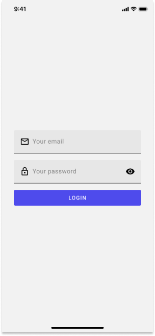

**Step 1:** Setting the page template
- How to Create a New Page?
- What are the Layers in a Page Template?

**Step 2:** Creating a form
- How to Add a Text Box?
- How to Change the Icon of a Text Box?
- What Are the Layers in a Text Box?
- How to Add a Password Box?
- How to Change the Icon of a Password Box?
- What Are the Layers in a Password Box?
- How to Add a Button?

**Step 3:** Adjusting the layout
- How to Edit the Spacing Between the Elements?
- How to Edit the Padding Around the Items?
- How to Make the Content Centered Vertically?

## Prerequisites and setup
To get started with the Uno Figma plugin, review the  guide.

## Step 1: Setting the page template

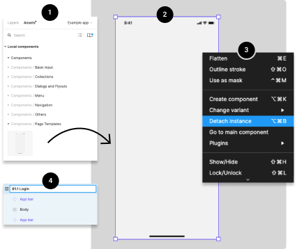
### How to Create a New Page?
1. **Drag the Page Template** from the Page Templates components library (left side of your screen) into your Figma project.

2. **Select the page** by clicking on it. You should see a purple outline around the page.

3. **Detach the page component** from his instance by right-clicking directly on the page or the page's layers), and choosing the Detach Instance option

4. **Rename the page** by double-clicking the layer's name directly from the layers panel (right side of your screen).

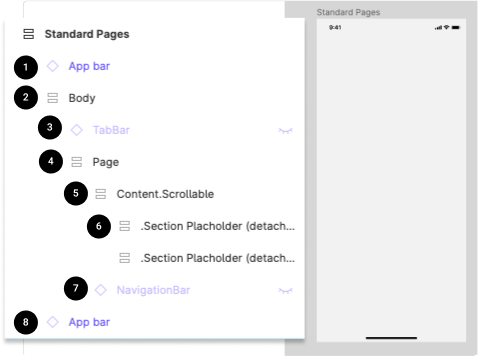
### What Are the Layers in a Page Template?
1. **App bar:** iOS or Android bottom app bar. Not part of the actual app, but it's only for presentation purposes.

2. **Body:** Contain the Bottom Navigation Bar component and the Page layers.

3. **Top App Bar:** The sticky top bar that contains the commands and page title. If this layer is invisible, this component is not relevant to the actual page, and it could be deleted from the layers.

4. **Page:** Contain all the Content. Scrollable layers and the Top App Bar component.

5. **Content.Scrollable:** Contain all the scrollable content.

6. **Section Placeholder (2):** We added 2 section placeholder to help you insert content faster into your design

7. **Navigation Bar:** The sticky bottom navigation bar. If this layer is invisible, this component is not relevant to the actual page, and it could be deleted from the layers.

8. **App bar:** iOS or Android top app bar. Not part of the actual app, but it's only for presentation purposes.

## Step 2: Creating a form

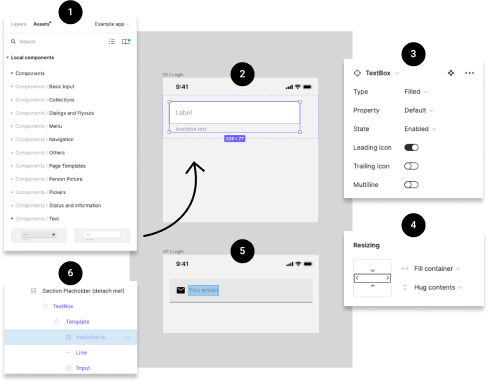
### How to Add a Text Box?
1. **Drag the Text Box** from the Text components library (left side of your screen) into your Figma project.

2. **Select the Text Box** by clicking on it. You should see a purple outline around the component.

3. **Customize the look and content** of the Text Box with the options you need from the variants control panel (right side of your screen).

4. **Adjust the width of the Text Box** by changing the value from "fixed width" to "fill container" in the Resizing panel (right side of your screen)

5. **Edit the text of the Text Box.** To do so, you could click on the label until the text becomes highlighted or select the label layer from the layers panel (left side of the screen). Once selected, use your keyboard to enter new text.

6. **Make the Assistive label invisible** if you are not using it.

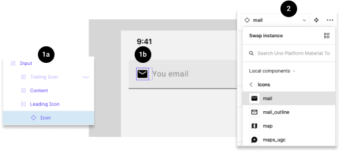
### How to Change the Icon of a Text Box?
1. **Select the icon** from a Text Box by clicking directly on the icon multiple times until the icon becomes highlighted (1b) or by selecting the Icon layer from the layer panel (left side of your screen - 1a).

2. **Choose a new icon** from the drop-down menu in the components control panel (right side of the screen).

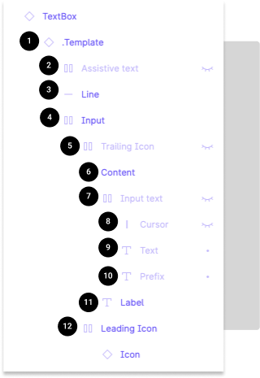
### What Are the Layers in a Text Box?
1. **Template:** Link to the main template

2. **Assistive text:** Text displayed under the text box

3. **Line:** Horizontal line under the text box (only in filled type text box)

4. **Input:** Group containing the Suffix, Icons, and Input text

5. **TrailingIcon:** Icon displayed on the right

6. **Content:** Group containing the Input text and Label

7. **Input text:** Group containing the Cursor, Text, and Prefix

8. **Cursor:** Vertical bar on the right of the text (used only for illustrative purposes)

9. **Text:** Text input by the user

10. **Prefix:** Text displayed on the left

11. **Label:** Name of the text box

12. **LeadingIcon:** Icon displayed on the left

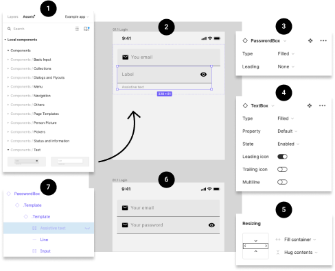
### How to Add a Password Box?
1. **Drag the Password Box** from the Text components library (left side of your screen) into your Figma project.

2. **Select the Password Box** by clicking on it. You should see a purple outline around the component.

3. **Customize the look and content** of the Password Box with the options you need from the variants control panel (right side of your screen).

4. **Also customize the look and content** of the Text Box template with the options you need from the variants control panel (right side of your screen). To have access to these options you must select the second . Template in the layer panel (left side of your screen)

5. **Adjust the width of the Password Box** by changing the value from "fixed width" to "fill container" in the Resizing panel (right side of your screen).

6. **Edit the text of the Password Box.** To do so, you could click on the label until the text becomes highlighted or select the label layer from the layers panel (left side of the screen). Once selected, use your keyboard to enter new text.

7. **Make the Assistive label invisible** if you are not using it.

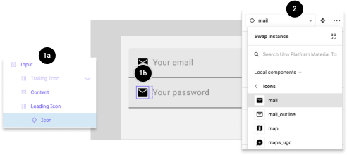
### How to Change the Icon of a Password Box?
1. **Select the icon** from a Password Box by clicking directly on the icon multiple times until the icon becomes highlighted (1b) or by selecting the Icon layer from the layer panel (left side of your screen - 1a).

2. **Choose a new icon** from the drop-down menu in the components control panel (right side of the screen).

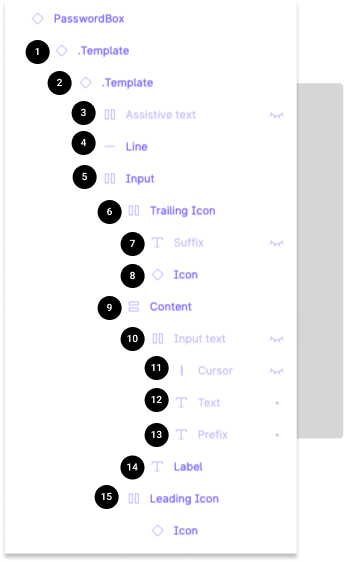
### What Are the Layers in a Password Box?
1. **Template 1:** Link to the main Password Box template

2. **Template 2:** Link to the Text Box template

3. **Assistive text:** Text displayed under the text box

4. **Line:** Horizontal line under the text box (only in filled type text box)

5. **Input:** Group containing the TraillingIcon, and content

6. **TrailingIcon:** Group containing the Suffix, and Icon

7. **Suffix:** Text displayed on the right

8. **Icon:** Icon displayed on the right

9. **Content:** Group containing the Input text and Label

10. **Input text:** Group containing the Cursor, Text, and Prefix

11. **Cursor:** Vertical bar on the right of the text (used only for illustrative purposes)

12. **Text:** Text input by the user

13. **Prefix:** Text displayed on the left

14. **Label:** Name of the text box

15. **LeadingIcon:** Icon displayed on the left

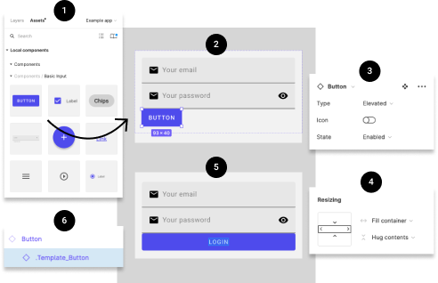
### How to Add a Button?
1. **Drag** the Button from the Basic Input components library (left side of your screen) into your Figma project.

2. **Select** the Button by clicking on it. You should see a purple outline around the component.

3. **Customize the look and content** of the Button with the options you need from the variants control panel (right side of your screen).

4. **Adjust the width** of the Button by changing the value from "fixed width" to "fill container" in the Resizing panel (right side of your screen). You will also need to repeat this action on the . Template_Button (6).

5. **Edit the text** of the Button. To do so, you could click on the label until the text becomes highlighted or select the label layer from the layers panel (left side of the screen). Once selected, use your keyboard to enter new text.

## Step 3: Adjusting the layout

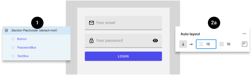
### How to Edit the Spacing Between the Elements?
1. **Select the layer group** from the layer panel on the left side of the screen.

2. **Go to the Auto layout panel** on the right side of the screen. Change the value of the spacing between elements.

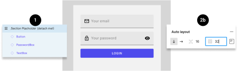
### How to Edit the Padding Around the Items?

1. **Select the layer group** from the layer panel on the left side of the screen.

2. **Go to the Auto layout panel** on the right side of the screen. Change the value of the padding around the items.

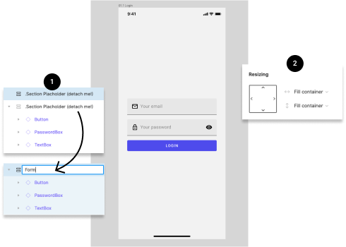
### How to Make the Content Centered Vertically?
1. For this example, I suggest you first delete the unused Section Placeholder from the layer panel (left side of your screen). Also, you should remain the layer containing the form.

2. Adjust the height of the form section by changing the value from "fixed height" to "fill container" in the Resizing panel (right side of your screen).

## You did it!
Your page is now complete, and should now look like this.

