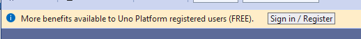
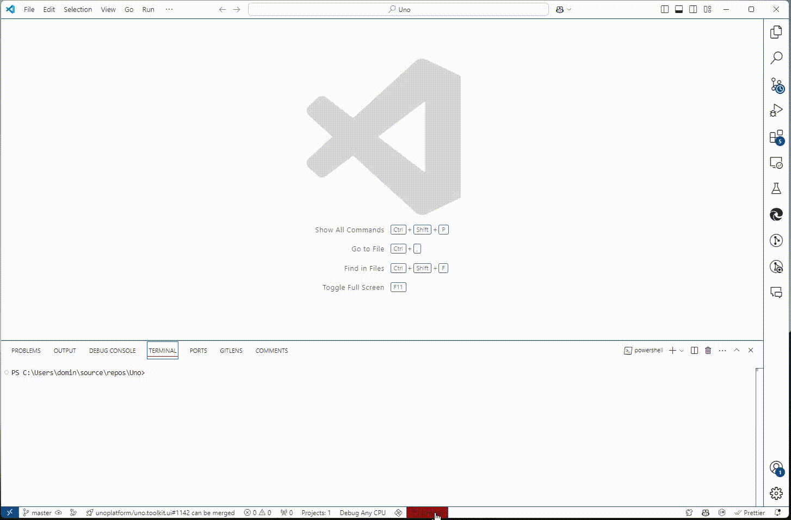

# Sign in with Uno Platform

Sign in with your Uno Platform account directly in your favorite IDE—Visual Studio, VS Code, or Rider—to unlock powerful tools like Hot Reload, helping you speed up development. With a single registration, you also get early access to new features and the opportunity to connect with the Uno community to share feedback and network.

## Create your account

1. Go to our website, [platform.uno](https://platform.uno/), and click on the **Sign in** button in the top right corner, or go directly to [platform.uno/my-account](https://platform.uno/my-account).
2. Enter your email address and click on **Register**.
3. On the registration page, fill in your information. Once done, click on **Sign up**.
4. You will receive a confirmation email from **no-reply@platform.uno**. Click on the **Confirm Email** button in the content of the email to activate your account.
5. You should then see the sign-in page. Enter your email and password and click on **Sign in** to access your account details, where you can update information or add more details.

## Sign in to your IDE of choice

After creating your Uno Platform account, follow the steps below to sign in to your preferred IDE:

**I am developing on...**

### [**Visual Studio 2022**](#tab/vs2022)

If you’ve already set up **Visual Studio 2022** by following [Get Started on Visual Studio 2022](xref:Uno.GettingStarted.CreateAnApp.VS2022), you can sign in with your Uno Platform account as follows:

1. Create a new Uno Platform project or open an existing one with `Uno.Sdk` version 5.5 or higher.
2. After opening and loading completely your project, a popup should appear. Click **Sign In / Register**.
   
   >![NOTE]
   > If the popup doesn’t appear, access Uno Platform settings by clicking on **View** > **Other Windows** > **Uno Platform Settings**.
   > 

### [**Visual Studio Code**](#tab/vscode)

If you’ve already set up **Visual Studio Code** by following [Get Started on VS Code documentation](xref:Uno.GettingStarted.CreateAnApp.VSCode), sign in as follows:

1. Create a new Uno Platform project or open an existing one with `Uno.Sdk` version 5.5 or higher.
2. After opening and loading completely your project, click the red Solution Button in the bottom status bar and switch to `.csproj` instead of `.sln`.
   
3. Access **Uno Platform** extension settings by selecting **View** > **Command Palette...** and typing `Uno Platform: Open Settings`.
   

### [**JetBrains Rider**](#tab/rider)

If you’ve already set up **JetBrains Rider** by following [Get Started on JetBrains Rider documentation](xref:Uno.GetStarted.Rider), sign in as follows:

1. Create a new Uno Platform project or open an existing one with `Uno.Sdk` version 5.5 or higher.
2. Go to **Tools** > **Uno Platform** > **Settings...**.
   

---

1. In the Uno Platform Settings window, click on **Sign in**. You’ll be redirected to your browser to enter your Uno Platform account credentials.
   
2. Once signed in, you’ll see confirmation of your account with license details and can use the **Hot Reload** feature to speed up your workflow and test changes in real time. For more information, see the [Hot Reload documentation](xref:Uno.Features.HotReload).
   

## Questions

For general questions about Uno Platform, refer to the [general FAQ](xref:Uno.Development.FAQ) or see the [troubleshooting section](xref:Uno.UI.CommonIssues) for common issues and solutions.

If you encounter any issues or need further assistance, reach out on our [community forum](https://platform.uno/community) or connect with us via the [Uno Platform GitHub](https://github.com/unoplatform).
