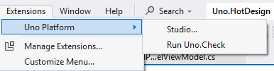
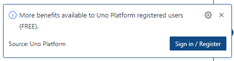
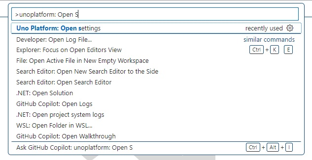
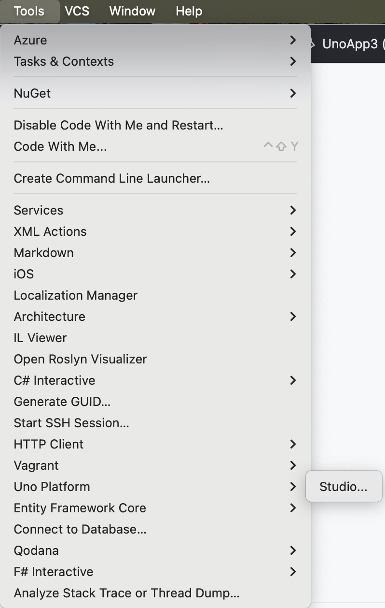
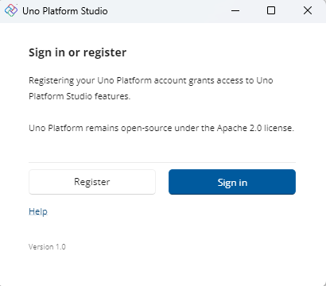
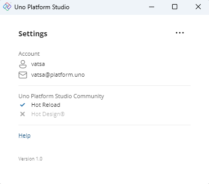
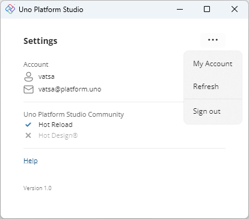

# Sign in with Uno Platform

Sign in with your Uno Platform account directly in your favorite IDE (Visual Studio, VS Code, or Rider), to unlock powerful tools like Hot Reload, helping you speed up development. With a single registration, you also get early access to new features and the opportunity to connect with the Uno Platform community to share feedback and network.

## Create your account

1. Go to our website, [platform.uno](https://platform.uno/), and click on the **Sign in** button in the top right corner, or go directly to [platform.uno/my-account](https://platform.uno/my-account).
1. Enter your email address and click on **Register**.
1. On the registration page, fill in your information. Once done, click on **Sign up**.
1. You will receive a confirmation email from `no-reply@platform.uno`. Follow the instructions in the email to activate your account.
1. You should then see the sign-in page. Enter your email and password and click on **Sign in** to access your account details, where you can update information or add more details.

## Sign in to your IDE of choice

After creating your Uno Platform account, follow the steps below to sign in to your preferred IDE:

**I am developing on...**

### [**Visual Studio 2022**](#tab/vs2022)

If you’ve already set up **Visual Studio 2022** by following the [Get Started on Visual Studio 2022](xref:Uno.GetStarted.vs2022) documentation, sign in as follows:

1. Create a new Uno Platform project by following the [Creating an app with Visual Studio 2022](xref:Uno.GettingStarted.CreateAnApp.VS2022) documentation or open an existing one with Uno.Sdk version 5.5 or higher.

   For existing applications, you should take this opportunity to update to the [latest `Uno.Sdk` version](https://www.nuget.org/packages/Uno.Sdk). See our [migration guide](xref:Uno.Development.MigratingFromPreviousReleases) to upgrade.

1. After your project has finished loading, a notification should appear. Click on the **Sign in / Register** button.

   

   > [!TIP]
   > Ensure that the lower left IDE icon shows a check mark and says "Ready" . This ensures that the projects have been created, and their dependencies have been restored completely.
   >
   > [!NOTE]
   > If the notification doesn’t appear, access the Settings app by clicking on **Extensions** > **Uno Platform** > **Settings...**.
   >
   > 

### [**Visual Studio Code**](#tab/vscode)

If you’ve already set up **Visual Studio Code** by following the [Get Started on VS Code](xref:Uno.GetStarted.vscode) documentation, sign in as follows:

1. Create a new Uno Platform project by following the [Creating an app with VS Code](xref:Uno.GettingStarted.CreateAnApp.VSCode) documentation or open an existing one with Uno.Sdk version 5.5 or higher.

   For existing applications, you should take this opportunity to update to the [latest `Uno.Sdk` version](https://www.nuget.org/packages/Uno.Sdk). See our [migration guide](xref:Uno.Development.MigratingFromPreviousReleases) to upgrade.

1. After your project has finished loading, a notification should appear. Click on the **Sign in / Register** button.

   

   > [!NOTE]
   > If the notification doesn’t appear, access the Settings app by selecting **View** > **Command Palette...** and typing `Uno Platform: Open Settings`.
   >
   > 

### [**JetBrains Rider**](#tab/rider)

If you’ve already set up **JetBrains Rider** by following the [Get Started on JetBrains Rider](xref:Uno.GetStarted.Rider) documentation, sign in as follows:

1. Create a new Uno Platform project by following the [Create an app with JetBrains Rider](xref:Uno.GettingStarted.CreateAnApp.Rider) documentation or open an existing one with Uno.Sdk version 5.5 or higher.

   For existing applications, you should take this opportunity to update to the [latest `Uno.Sdk` version](https://www.nuget.org/packages/Uno.Sdk). See our [migration guide](xref:Uno.Development.MigratingFromPreviousReleases) to upgrade.

1. After your project has finished loading, a notification should appear. Click on the **Sign in / Register** button.

   

   > [!NOTE]
   > If the notification doesn’t appear, access the Settings app by selecting **Tools** > **Uno Platform** > **Settings...**.
   >
   > 

---

### Uno Platform Settings window

1. In the Uno Platform Settings window, click on **Sign in**. You’ll be redirected to your browser to enter your Uno Platform account credentials.

   

1. Once signed in, you’ll see a confirmation of your account along with your license details.

   You can then use the **Hot Reload** feature to speed up your workflow and test changes in real-time. For more information, refer to the [Hot Reload documentation](xref:Uno.Features.HotReload).

   

   > [!TIP]
   > You can also access a menu where you can select **My Account** to view your account details, **Refresh** the account changes, and **Sign out**.
   >
   > 

1. After you are done, feel free to close the Uno Platform Settings window. You can always access it again from your IDE menu by following the steps above.

## Questions

For general questions about Uno Platform, refer to the [general FAQ](xref:Uno.Development.FAQ) or see the [troubleshooting section](xref:Uno.UI.CommonIssues) for common issues and solutions.

If you encounter any issues or need further assistance, join our [Discord server](https://platform.uno/discord), connect with us via [GitHub](https://github.com/unoplatform/uno/discussions), or reach out on our [contact page](https://platform.uno/contact).
