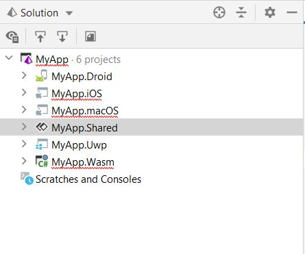

# Get Started on JetBrains Rider

## Prerequisites
* [**Rider Version 2020.2+**](https://www.jetbrains.com/rider/download/)
* [**Rider Xamarin Android Support Plugin**](https://plugins.jetbrains.com/plugin/12056-rider-xamarin-android-support/) (you may install it directly from Rider)

## Rider Platforms support

|                       | Windows (UWP/WinUI) | Android | iOS  | Wasm | macOS | Skia-GTK (Linux) | Skia-WPF |
| --------------------- | ------------------- | ------- | ---- | ---- | ----- | -------- | -------- |
| **Rider for Linux**   | ❌                   | ✔️       | ❌    | ✔️†   | ❌     | ✔️        | ❌        |
| **Rider for Mac**     | ❌                   | ✔️       | ✔️    | ✔️†   | ✔️     | ✔️†       | ❌        |
| **Rider for Windows** | ✔️                   | ✔️       | ✔️†   | ✔️†   | ❌     | ✔️        | ✔️        |

† Notes:

* **Wasm**: debugging from the IDE is not available yet on Rider.  But you can use the [Chromium in-browser debugger](https://github.com/unoplatform/Uno.Wasm.Bootstrap#how-to-use-the-browser-debugger) instead.

  To start the app from the IDE (using the "Run" button), **dotnet core 3.1** must be installed on the machine:

  ``` bash
  # dotnet 3.1 sdk is required to launch Wasm app from Rider
  # For Ubuntu, use apt install like that:
  sudo apt install dotnet-sdk-3.1
  ```

  For Mac, you should install it [from here](https://dotnet.microsoft.com/download/dotnet-core/thank-you/runtime-aspnetcore-3.1.10-macos-x64-binaries).

* **Skia-GTK** on Mac: you need to make sure to install `gtk+3` package using the following command line:
  
  ```bash
  brew install gtk+3
  ```

* **iOS** on Windows: An attached Mac is needed, the iOS simulator will open on the Mac.

## Creating a new Uno Platform project

At this time, there isn't a template for the Rider IDE like there is for Visual Studio, so you can create a new project
[using dotnet new](get-started-dotnet-new.md) by following these steps:

1. In your terminal, navigate to the folder that contains your Rider solutions.

2. Run these commands:

Installs Uno template:  
```bash
dotnet new -i Uno.ProjectTemplates.Dotnet
```
Creates a new project:  
```bash
dotnet new unoapp -o MyApp
```

You should now have a folder structure that looks like this:  


### Android
1. Remove the following line from the `YourProject.Droid.csproj` file:  
`<Target Name="GenerateBuild" DependsOnTargets="SignAndroidPackage" AfterTargets="Build" Condition="'$(BuildingInsideVisualStudio)'==''" />`
2. Set Android as your startup project. Run.  


Note: Whether you're using a physical device or the emulator, the app will install but will not automatically open.
You will have to manually open.

### Wasm
1. Select Wasm as your startup project. Run.  
  
A new browser window will automatically run your application.  

Note: There is no debugging for Wasm within Rider, but you debug using the built in Chrome tools. 

### MacOS
You will be able to build the MacOS project.  
  
Alternatively, you can use a tool like VNC to run the simulator on a mac.  

### UWP
You will be able to build the UWP project, however, Rider currently does not support debugging or deploying for UWP.   
  


### Video Tutorial

[](http://www.youtube.com/watch?v=HgwL0al5bfo)

### Troubleshooting Uno Platform Installation Issues

If you're not sure whether your environment is correctly configured for Uno Platform development, running the [`uno-check` command-line tool](uno-check.md) should be your first step.

### Getting Help

If you continue experiencing issues with Visual Studio and Uno Platform, please visit our [Discord](https://www.platform.uno/discord) - #uno-platform channel or [StackOverflow](https://stackoverflow.com/questions/tagged/uno-platform) where our engineering team and community will be able to help you. 