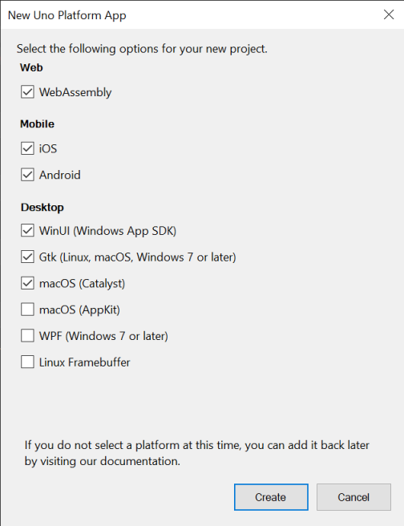
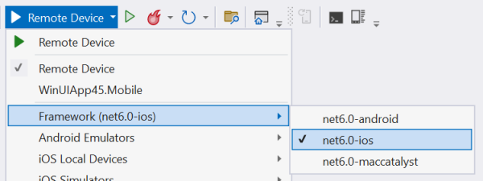

# Get Started on Visual Studio 2022

This getting started will guide you through the creation of an Uno Platform App using C# and .NET, based in the WinUI 3 XAML.

> [!TIP] 
> This guide covers development on Windows using Visual Studio. If you want to use another environment or IDE, see our [general getting started](get-started.md).

> [!IMPORTANT] 
> To use Xamarin (as opposed to .NET 6 Mobile) and Visual Studio 2019, [follow this guide](get-started-vs.md).

## Prerequisites
To create Uno Platform applications you will need [**Visual Studio 2022 17.3 or later**](https://visualstudio.microsoft.com/vs/):

1. **ASP**.**NET and web** workload installed, along with .NET 6.0 (for WebAssembly development)

    

1. **.NET Multi-platform App UI development** workload installed.

    

1. **.NET desktop development** workload installed.

        
    
1. **Universal Windows Platform** workload installed.

    

> [!IMPORTANT] 
> To build Xamarin-based projects in Visual Studio 2022, in Visual Studio's installer `Individual components` tab, search for Xamarin and select `Xamarin` and `Xamarin Remoted Simulator`. See [this section on migrating Xamarin projects](migrating-from-xamarin-to-net6.md) to .NET 6, 

> [!NOTE]
> For information about connecting Visual Studio to a Mac build host to build iOS apps, see [Pairing to a Mac for Xamarin.iOS development](https://docs.microsoft.com/en-us/xamarin/ios/get-started/installation/windows/connecting-to-mac/).

[!include[getting-help](use-uno-check-inline-windows.md)]

## Install the Solution Templates

1. Launch Visual Studio 2022, then click `Continue without code`. Click `Extensions` -> `Manage Extensions` from the Menu Bar.

    

2. In the Extension Manager expand the **Online** node and search for `Uno`, install the <code>Uno Platform Solution Templates</code> extension or download it from the [Visual Studio Marketplace](https://marketplace.visualstudio.com/items?itemName=unoplatform.uno-platform-addin-2022), then restart Visual Studio.

    

## Create an application

To create an Uno Platform app:
1. Create a new C# solution using the **Uno Platform App** template, from Visual Studio's **Start Page**
1. Choose the list of targets platforms you want to be generated

    > [!TIP] 
    > If you do not select platforms, you still can [add them later](guides/how-to-add-platforms-existing-project.md).
   
    

1. Wait for the projects to be created, and their dependencies to be restored

1. To debug the **Windows** head:
    - Right click on the `MyApp.Windows` project, select **Set as startup project**
    - Select the `Debug|x86` configuration
    - Press the `MyApp.Windows` button to deploy the app
    - If you've not enabled Developer Mode, the Settings app should open to the appropriate page. Turn on Developer Mode and accept the disclaimer.
1. To run the **WebAssembly** (Wasm) head:
    - Right click on the `MyApp.Wasm` project, select **Set as startup project**
    - Press the `MyApp.Wasm` button to deploy the app
1. To run the ASP.NET Hosted **WebAssembly** (Server) head:
    - Right click on the `MyApp.Server` project, select **Set as startup project**
    - Press the `MyApp.Server` button to deploy the app
1. To debug for **iOS**:
    - Right click on the `MyApp.Mobile` project, select **Set as startup project**
    - In the "Debug toolbar" drop down, select framework `net6.0-ios`:

      
      
    - Select an active device
1. To debug the **Android** platform:
    - Right click on the `MyApp.Mobile` project, select **Set as startup project**
    - In the **Debug toolbar** drop down, select framework `net6.0-android`
    - Select an active device in "Device" sub-menu

You're all set! You can now head to [our tutorials](getting-started-tutorial-1.md) on how to work on your Uno Platform app.

> [!NOTE] 
> Debugging either the macOS and macCatalyst targets is not supported from Visual Studio on Windows.

## Troubleshooting Installation Issues

You may encounter installation and/or post-installation Visual Studio issues for which workarounds exist. Please see [Common Issues](https://platform.uno/docs/articles/get-started-wizard.html) we have documented.

[!include[getting-help](getting-help.md)]

## Further reading
- [Special considerations for the WinAppSDK project](features/winapp-sdk-specifics.md)
