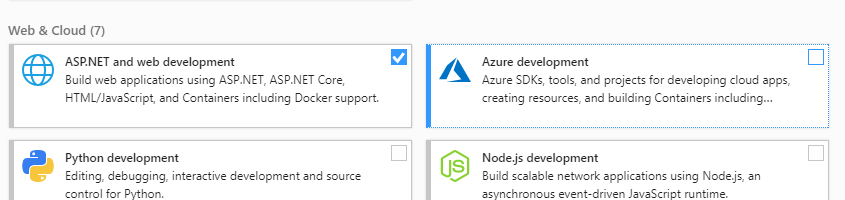
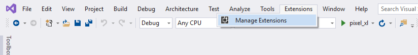
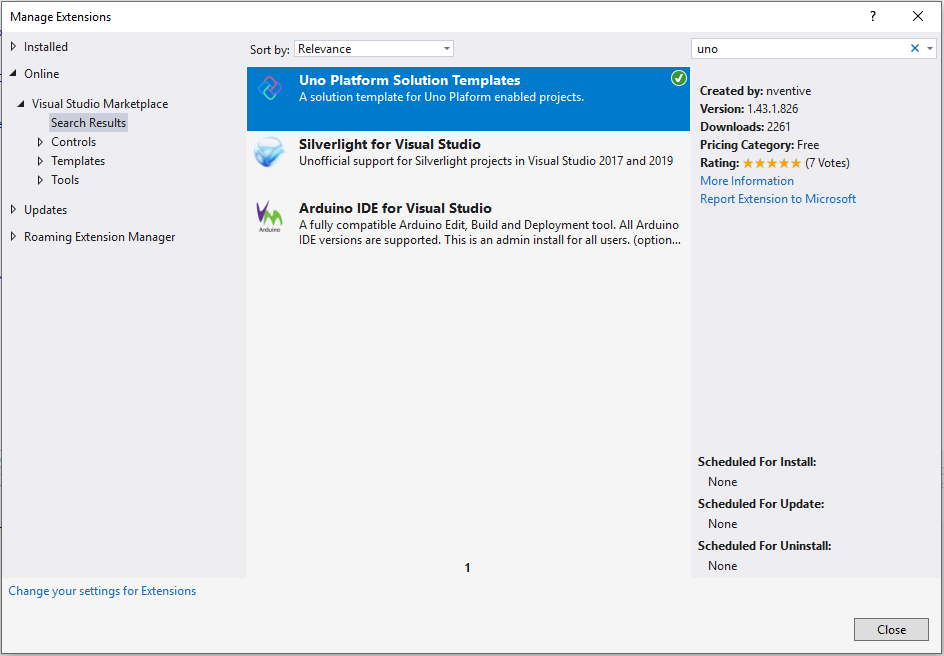

## Get Started on Visual Studio 2022/2026

This getting started will guide you through setting up your environment to create Uno Platform applications using C#, .NET and Copilot with Visual Studio 2022/2026.

> [!TIP]
> If you want to use another environment or IDE, see our [general getting started](get-started.md).

## Install Visual Studio with Workloads

To create Uno Platform applications you will need [**Visual Studio 2022 (17.9+) or later**](https://visualstudio.microsoft.com/vs/):

1. **ASP.NET and web development** workload installed (for WebAssembly development)

    

1. **.NET Multi-platform App UI development** workload installed (for iOS, Android development).

    

1. **.NET desktop development** workload installed (for Skia-based targets development)

    

> [!NOTE]
> If you intend to do Linux development with WSL, make sure to select **.NET Debugging with WSL** in the **Individual components** section.
> [!IMPORTANT]
> Uno Platform 5.0 and later [does not support Xamarin projects anymore](xref:Uno.Development.MigratingToUno5). To build Xamarin-based projects in Visual Studio, in Visual Studio's installer `Individual components` tab, search for Xamarin and select `Xamarin` and `Xamarin Remoted Simulator`. See [this section on migrating Xamarin projects](migrating-from-xamarin-to-net6.md) to .NET 6.

## Check your environment

[!include[use-uno-check](includes/use-uno-check-inline-windows-noheader.md)]

## Install the Uno Platform Extension

1. Launch Visual Studio 2022/2026, then click `Continue without code`. Click `Extensions` -> `Manage Extensions` from the Menu Bar.  

      

2. In the Extension Manager expand the **Online** node and search for `Uno`, install the `Uno Platform` extension or download it from the [Visual Studio Marketplace](https://marketplace.visualstudio.com/items?itemName=unoplatform.uno-platform-addin-2022), then restart Visual Studio.  

    

> [!NOTE]
> The Uno Platform extension provides all the tooling needed to enable AI agents from Visual Studio, VS Code, Claude Code, GitHub Copilot CLI, Codex, and more.
> 
> **Uno MCP** provides structured, semantic access to Uno Platform’s complete knowledge base—covering documentation, APIs, and best practices—empowering AI agents and developers with the intelligence they need to build better experiences. Meanwhile, **App MCP** brings intelligent automation to life by enabling AI agents to interact directly with live Uno Platform applications, creating a seamless bridge between design, development, and execution.
> 
> Uno Platform's MCP tools are available when you [sign in to your Uno Platform account](xref:Uno.GetStarted.Licensing). For more information, see [Using the Uno Platform MCPs](xref:Uno.Features.Uno.MCPs).

## Additional Setup for Android & iOS

For assistance configuring Android or iOS emulators, see the [Android & iOS emulator troubleshooting guide](xref:Uno.UI.CommonIssues.MobileDebugging).

## Additional Setup for Windows Subsystem for Linux (WSL)

It is possible to build and debug Skia Desktop projects under WSL if you choose to do so.

To setup your environment for WSL:

- Install [WSL Ubuntu 22.04 or later](https://learn.microsoft.com/windows/wsl/install-win10)
- Install the prerequisites for Linux mentioned below, in your installed distribution using the Ubuntu shell

> [!NOTE]
> Running Uno Platform apps using WSL makes use of [WSLg's support for Wayland](https://github.com/microsoft/wslg#install-instructions-existing-wsl-install). In general, running `wsl --update`, then optionally rebooting the Windows machine can get you started.

## Additional Setup for Skia Desktop projects

### WSL

[!include[linux-setup](includes/additional-linux-setup-inline.md)]

---

## Next Steps

You're all set to create your [first Uno Platform app](xref:Uno.GettingStarted.CreateAnApp.VS2022)!
