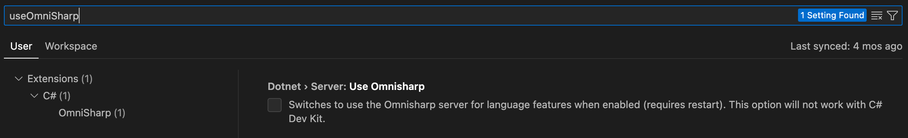

# How to switch to OmniSharp Mode

## Enable OmniSharp mode

* Open the VS Code Settings using `Ctrl` + `,` (or `⌘` + `,` on a Mac)
* Search for `useOmnisharp`
    
* Enable it (checkbox)
* Search for `preferCSharpExtension`
    
* Enable it (checkbox)

## Reload the window

Press `F1` and select `Developer: Reload Window`. VS Code will reload itself and restart its extensions.

## Validation

You can verify that the **Uno Platform** extension is working by looking at the **Uno Platform** logs inside the **Output** pane by using `Ctrl` + `Shift` + `U` (`Shift` + `⌘` + `,` on a Mac). After reloading the window you should see a line with `[Info] Running in OmniSharp mode` inside the logs.
