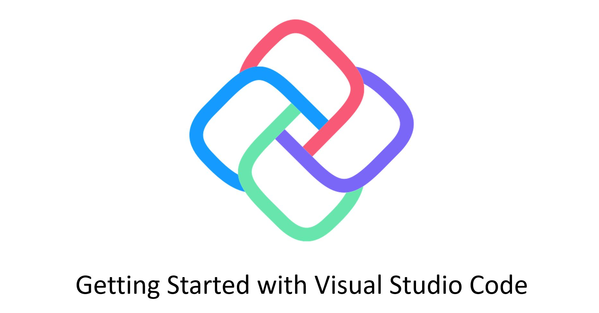

# Get Started on VS Code

This guide will walk you through the set-up process for building WebAssembly apps with Uno under Windows, Linux, or macOS.

## Prerequisites

* [**Visual Studio Code**](https://code.visualstudio.com/)

* [**Mono**](https://www.mono-project.com/download/stable/)

* **.NET Core SDK** (NOTE: You need BOTH v3 AND v5 installed)
    * [.NET Core 3.1 SDK](https://dotnet.microsoft.com/download/dotnet-core/3.1) (**version 3.1.8 (SDK 3.1.402)** or later)
    * [.NET Core 5.0 SDK](https://dotnet.microsoft.com/download/dotnet-core/5.0) (**version 5.0 (SDK 5.0.100)** or later)

    > Use `dotnet --version` from the terminal to get the version installed.

## Create an Uno Platform project

### Install Uno Platform Template

Launch Visual Studio Code and open a new terminal.

In the terminal, type the following to install the [Uno Platform templates](get-started-dotnet-new.md):

```bash
dotnet new -i Uno.ProjectTemplates.Dotnet
```

### Create the project

In the terminal, type the following to create a new project:

```bash
dotnet new unoapp -o MyApp -ios=false -android=false -macos=false -uwp=false --vscodeWasm
```

> `MyApp` is the name you want to give to your project.

This will create a solution that only contains the WebAssembly platform support.

## Prepare the WebAssembly application for debugging

1. In Visual Studio Code install these extensions:

    * [C# extension](https://marketplace.visualstudio.com/items?itemName=ms-dotnettools.csharp)

    * [JavaScript Debugger (Nightly) extension](https://marketplace.visualstudio.com/items?itemName=ms-vscode.js-debug-nightly)

    > Configure this extension with the `debug.javascript.usePreview` setting set to true. (**File** -> **Preference** -> **Settings** and search for `Use preview`).

2. Open the project using Visual Studio Code. In the terminal type

    ```bash
    code ./MyApp
    ```

    > For this command to work you need to previously have configured Visual Studio Code to be launched from the terminal.

3. Visual Studio Code will ask to restore the NuGet packages.

## Modify the template

1. In `MainPage.xaml`, replace the Grid's content with the following:

    ```xml
    <StackPanel>
        <TextBlock x:Name="txt"
                    Text="Hello, world!"
                    Margin="20"
                    FontSize="30" />
        <Button Content="click"
                Click="{x:Bind OnClick}" />
    </StackPanel>
    ```

2. In your `MainPage.xaml.cs`, add the following method:

    ```csharp
    private void OnClick()
    {
        var dt = DateTime.Now.ToString();
        txt.Text = dt;
    }
    ```

## Run and Debug the application

1. Starting the app with the WebAssembly debugger is a two-step process. Move to the **Run** tab on Visual Studio Code and

    * Start the app first using the **.NET Core Launch (Uno Platform App)** launch configuration
    * Then start the browser using the **.NET Core Debug Uno Platform WebAssembly in Chrome** launch configuration (requires Chrome).

        > To use the latest stable release of Edge instead of Chrome, change the type of the launch configuration in `.vscode/launch.json` from `pwa-chrome` to `pwa-msedge`

2. Place a breakpoint inside the `OnClick` method
3. Click the button in the app, and the breakpoint will hit

## Updating an existing application to work with VS Code

If you already have an Uno application, you can add some missing support files for VS Code to recognize your project.

Here's how to do this:

1. Use the same command line above to create a project with the same name as your current project, in a different location.
2. Once created, copy the generated `.vscode` folder next to your `.sln` file
3. Update the `Uno.UI` package version to the latest stable version
4. Update the `Uno.Wasm.Bootstrap` package to 1.3.4 or later version
5. Add a reference to `Uno.Wasm.Bootstrap.DevServer` version 1.3.4 or later.
6. In your Wasm project file, if you had a `<DotNetCliToolReference />` line, remove it
7. Restore your nuget packages

    ```bash
    dotnet restore
    ```

You should now be in the same configuration as the generated template files.

### Video Tutorial

[](http://www.youtube.com/watch?v=O9qgw1Q445M "")

### Troubleshooting Uno Platform Installation Issues

If you're not sure whether your environment is correctly configured for Uno Platform development, running the [`uno-check` command-line tool](uno-check.md) should be your first step.

### Getting Help

If you continue experiencing issues with Visual Studio and Uno Platform, please visit our [Discord](https://www.platform.uno/discord) - #uno-platform channel or [StackOverflow](https://stackoverflow.com/questions/tagged/uno-platform) where our engineering team and community will be able to help you. 