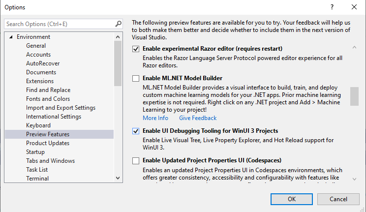

# Create a new WinUI 3 and Uno Platform app

Uno Platform apps can be created in both UWP-compatible (`Windows.UI.Xaml`, also known as _WUX_) and WinUI 3-compatible (`Microsoft.UI.Xaml`, also known as _MUX_) flavors. In the latter case, you can use the latest features of .NET 5 and [Project Reunion](https://docs.microsoft.com/en-us/windows/apps/project-reunion/) for WinUI 3 Desktop apps. This article takes you through the steps of creating a WinUI 3-flavored Uno Platform app and running the app with Project Reunion for Desktop.

## Prerequisites

 * [Visual Studio 2019 16.10 preview 1 or higher](https://visualstudio.microsoft.com/vs/preview/) (for Live Visual Tree, Live Property Explorer and XAML Hot Reload), with following workloads installed:
    * Universal Windows Platform development
    * .NET desktop development
 * [.NET SDK](https://docs.microsoft.com/en-us/dotnet/core/install/windows) (.NET 5 or higher)

## Set up your environment

1. Install the [Uno Platform dotnet templates](get-started-dotnet-new.md). From a command-line prompt, run the following command:
    ```shell
    dotnet new -i Uno.ProjectTemplates.Dotnet
    ```

## Create a new app

1. Create a folder for your app.
2. From a command-line prompt at that folder location, run the following command:
    ```shell
    dotnet new unoapp-winui
    ```
3. Open the solution file you created.
4. UI Tooling features (Live Visual Tree, Live Property Explorer, and Hot Reload) for WinUI 3 need to be enabled in Visual Studio as a Preview Feature. Navigate to `Tools -> Options -> Environment -> Preview Features` and toggle "Enable UI Debugging Tooling for WinUI 3 Projects".
    
5. To debug the WinUI 3 Desktop project, set `[MyAppName].Windows.Package` as the startup project, set the Solution Platform to `x86`, and run the application.

## Further reading

 * [WinUI 3, UWP, and Uno Platform](uwp-vs-winui3.md)
 * [Migrating existing Uno Platform app to WinUI 3](updating-to-winui3.md)
 * [Get started with Project Reunion (Microsoft)](https://docs.microsoft.com/en-us/windows/apps/project-reunion/get-started-with-project-reunion)
