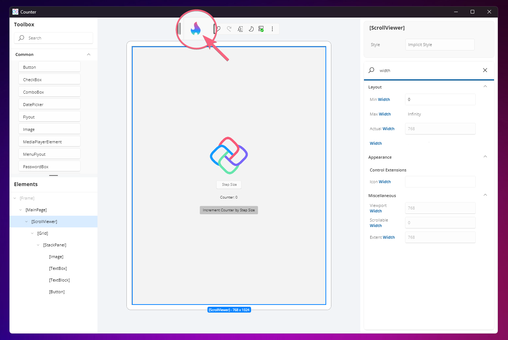

<!-- TITLE SECTION -->

  <h1>Welcome to Uno Platform! Important Next Steps</h1>

<!-- COUNTER - HOT DESIGN TUTORIAL - SECTION -->

  Create a simple cross-platform Counter application (Time to complete &lt; 5 min):

<!-- markdownlint-disable MD001 -->

<!-- Centered first item -->

<a href="studio/Hot Design/hot-design-getstarted-counter-tutorial.md">

#### Hot Design®

Use Hot Design®, Uno Platform's visual designer, to design and develop the app visually. You can also enable the Hot Design® Agent feature for AI-assisted UI creation within the same experience.

</a>

  

 

<!-- COUNTER - OTHER VARIANTS TUTORIALS - SECTION -->

    Prefer to start from code? Choose one of the 4 variants of the Counter tutorial, combining markup language (XAML or C# Markup) and presentation framework (MVVM or MVUX).

 

<a href="getting-started/counterapp/get-started-counter-xaml-mvux.md">

#### XAML + MVUX

Use XAML for layout and MVUX for state management

</a>

<a href="getting-started/counterapp/get-started-counter-xaml-mvvm.md">

#### XAML + MVVM

Use XAML for layout and MVVM for state management

</a>

<a href="getting-started/counterapp/get-started-counter-csharp-mvux.md">

#### C# Markup + MVUX

Use C# Markup for layout and MVUX for state management

</a>

<a href="getting-started/counterapp/get-started-counter-csharp-mvvm.md">

#### C# Markup + MVVM

Use C# Markup for layout and MVVM for state management

</a>

 

<!-- GETTING HELP SECTION -->

[!include[getting-help](includes/getting-help.md)]
