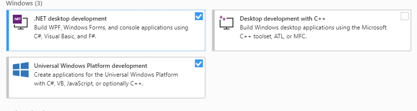
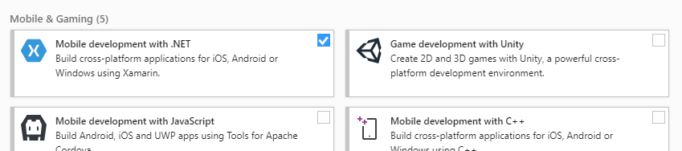
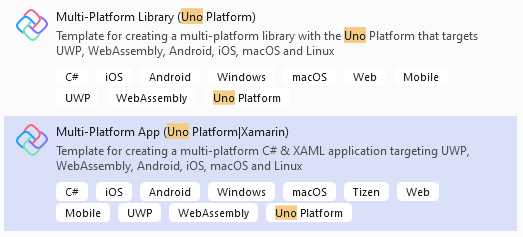
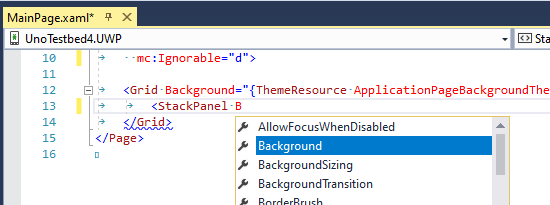

# Setting up your development environment

This guide will walk you through the set-up process for building cross-platform apps with Uno.

## Prerequisites
* [**Visual Studio 2017 15.5 or later**](https://visualstudio.microsoft.com/), with:
    * **Universal Windows Platform** workload installed.

    

	* **Mobile development with .NET (Xamarin)** workload installed.

    

    *
        * the iOS Remote Simulator installed (for iOS development)
	    * A working Mac with Visual Studio for Mac, XCode 8.2 or later installed (for iOS development)
	    * Google's Android x86 emulators or a physical Android device (for Android development)

    * **ASP**.**NET and web** workload installed, along with .NET Core 2.2 (for WASM development)

    

For more information about these prerequisites, see [Installing Xamarin](https://docs.microsoft.com/en-us/xamarin/get-started/installation/). For information about connecting Visual Studio to a Mac build host, see [Pair to Mac for Xamarin.iOS development](https://docs.microsoft.com/en-us/xamarin/ios/get-started/installation/windows/connecting-to-mac/).

## Installing the Uno Platform Solution Templates with Visual Studio

1. Launch Visual Studio, then click `Continue without code`. Click `Extensions` -> `Manage Extensions` from the Menu Bar.

    

1. In the Extension Manager expand the Online node and search for `Uno`. Download the [`Uno Platform Solution Templates`](https://marketplace.visualstudio.com/items?itemName=nventivecorp.uno-platform-addin) extension and restart Visual Studio.

    

## Create an application from the solution template

To easily create a multi-platform application:
* Create a new C# solution using the **Cross-Platform App (Uno Platform)** template, from Visual Studio's **Start Page**:

* Update to the latest NuGet package named `Uno.UI`. To get the very latest features, check the `pre-release` box.
* To debug the iOS head, select the `Debug|iPhoneSimulator` configuration
* To debug the Android head, select the `Debug|AnyCPU` configuration
* To debug the UWP head, select the `Debug|x86` configuration
* To run the WebAssembly (Wasm) head, select **IIS Express** and press **Ctrl+F5** or choose 'Start without debugging' from the menu. Note that **F5** will *not* work because Visual Studio debugging isn't supported. See [here](debugging-wasm.md) for debugging instructions through Chrome.

### Make sure XAML Intellisense is enabled

[Intellisense](https://docs.microsoft.com/en-us/visualstudio/ide/using-intellisense) is supported in XAML when the UWP head is active:

If XAML Intellisense isn't working on a freshly-created project, try the following steps:
1. Build the UWP head.
2. Close all XAML documents.
3. Close and reopen Visual Studio.
4. Reopen XAML documents.

<h5>Next:</h5>

[In the Creating an App tutorial you'll create your first working app with Uno.](getting-started-tutorial-1.md) 

