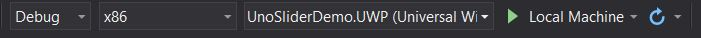
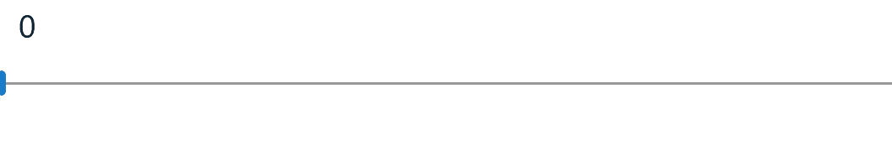

# Create a Single Page App with Uno

[Download the complete sample](https://github.com/nventive/uno.GettingStartedTutorial)

In this tutorial you will learn how to:

- Add the Uno Platform Project Templates to Visual Studio
- Create a new Project with Uno Platform
- Learn basics on Model Binding

The tutorial walks you through creating a cross platform application with Uno Platform - a simple Bug Tracking app - which enables you to see a single Issue entry.

<div class="NOTE alert alert-info">
<h5>Before you start the tutorial</h5>

[If you haven't prepared your dev environment for Uno app development yet, the Setting up the Environment page will guide you through installing all the prerequisites.](get-started.md)

</div>

## Getting Started

1. Open Visual Studio and click on `Create new project`. 

    

2. Search for the `Uno` templates, select the `Cross-Platform App (Uno Platform)` then click `Next`.

    

3. Name your app then click `Next`.

4. In your `Shared` project, open up `MainPage.xaml`

5. Add a `StackPanel` around your `TextBlock`
``` xaml
<Grid Background="{ThemeResource ApplicationPageBackgroundThemeBrush}">
    <StackPanel>
        <TextBlock Text="Hello World" Margin="20" FontSize="30" />
    </StackPanel>
</Grid>
```
6. Add a `Slider`
``` xaml
<Grid Background="{ThemeResource ApplicationPageBackgroundThemeBrush}">
    <StackPanel>
        <TextBlock Text="Hello World" Margin="20" FontSize="30" />
        <Slider x:Name="slider"/>
    </StackPanel>
</Grid>
```
7. Bind the `Text` value of your `TextBlock` to the value of the `Slider`
``` xaml
<Grid Background="{ThemeResource ApplicationPageBackgroundThemeBrush}">
    <StackPanel>
        <TextBlock Text="{Binding Value, ElementName=slider}" Margin="20" FontSize="30" />
        <Slider x:Name="slider"/>
    </StackPanel>
</Grid>
```
8. Select `UWP` as the Startup Project and `Run`  
  

Result!  


Next, walk through a the [`BugTracker` sample](getting-started-tutorial-2.md) and build out a full Uno app. 
<div class="NOTE alert alert-info">
<h5>Next:</h5>

[Got questions? Want to learn more? Looking for production-ready examples? Check out the Next Steps page.](get-started-next-steps.md) 

</div>
