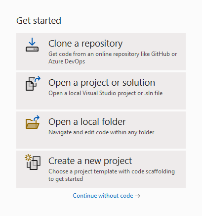
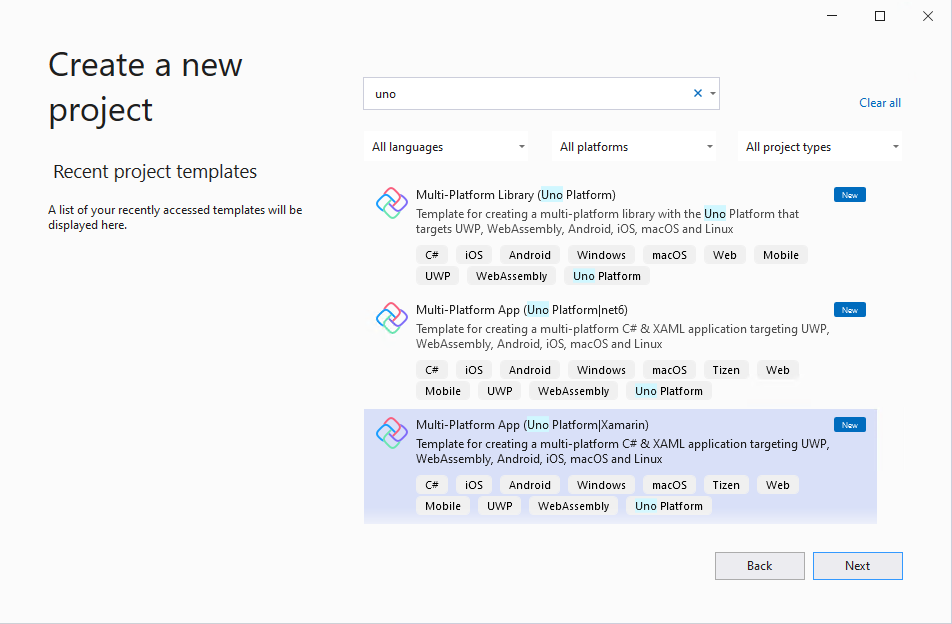
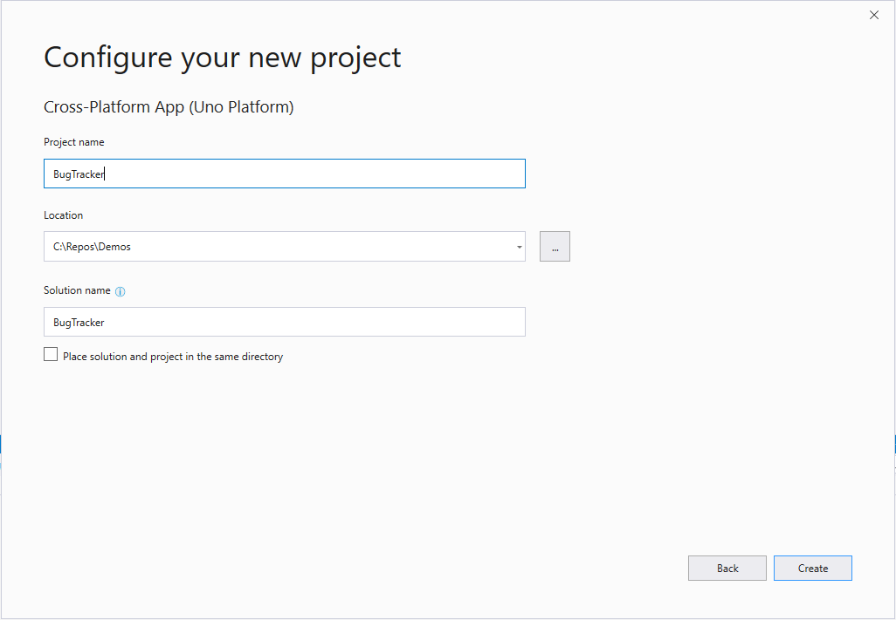
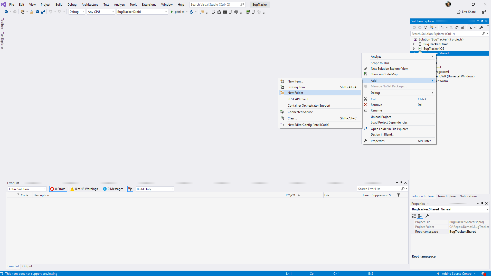
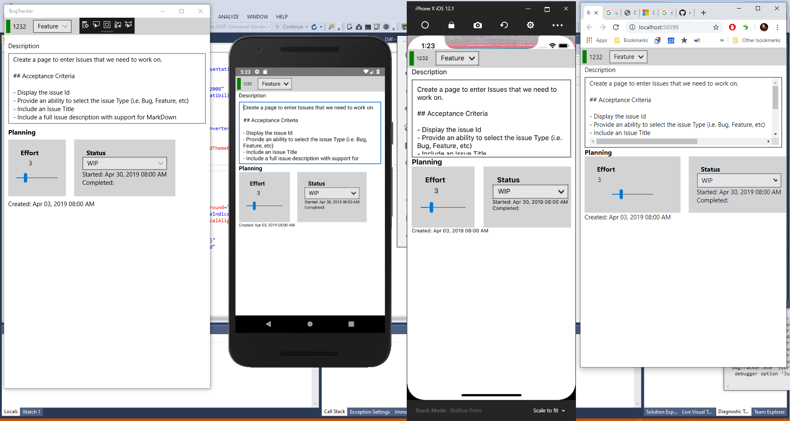

# Create a Single Page App with Uno

[Download the complete sample](https://github.com/nventive/uno.GettingStartedTutorial)

In this tutorial you will learn how to:

- Add the Uno Platform Project Templates to Visual Studio
- Create a new Project with Uno Platform
- Learn basics on Model Binding

The tutorial walks you through creating a cross platform application with Uno Platform - a simple Bug Tracking app - which enables you to see a single Issue entry.

<div class="NOTE alert alert-info">
<h5>Before you start the tutorial</h5>

[If you haven't prepared your dev environment for Uno app development yet, the Setting up the Environment page will guide you through installing all the prerequisites.](get-started.md)

</div>

## Getting Started

1. Open Visual Studio and click on `Create new project`. 

    

1. Search for the `Uno` templates, select the `Cross-Platform App (Uno Platform)` then click `Next`.

    

1. In the `Configure your new project` window, set the `Project name` to `BugTracker`, choose where you would like to save your project and click the `Create` button.

    

    > [!IMPORTANT]
    > The C# and XAML snippets in this tutorial requires that the solution is named **BugTracker**. Using a different name will result in build errors when you copy code from this tutorial into the solution.

1. Right click on the Solution and select `Manage NuGet Packages for Solution` from the context menu.
    - Make sure to select **nuget.org** or **NuGet official package source** as the package source
    - Click on the Updates tab. Update the following packages to the latest stable version, if they're not up to date: `Uno.Core`, `Uno.UI`, and `Uno.Wasm.Bootstrap`.
        - Note: **do not** update the `Microsoft.Extensions.Logging.Console`. Recent versions of the package use APIs that aren't supported by WebAssembly, and aren't compatible with Uno.
    - Click back on the Browse tab and install the following NuGet Packages to each of the projects in your solution:
        - `Refractored.MvvmHelpers`

1. Finally, you'll need to close any opened file in the editor, then close the solution or Visual Studio, then re-open it. This is a workaround for a Visual studio issue regarding the XAML editor.

## Setting up our Model

1. Add a Models folder in the Shared Project.

    

1. Add a new class and then paste in the following code:

    ```cs
    public class IssueItem : ObservableObject
    {
        private int id;
        public int Id
        {
            get => id;
            set => SetProperty(ref id, value);
        }

        private IssueType type;
        public IssueType Type
        {
            get => type;
            set => SetProperty(ref type, value);
        }

        private string title;
        public string Title
        {
            get => title;
            set => SetProperty(ref title, value);
        }

        private string description;
        public string Description
        {
            get => description;
            set => SetProperty(ref description, value);
        }

        private IssueStatus status;
        public IssueStatus Status
        {
            get => status;
            set => SetProperty(ref status, value);
        }

        private int effort;
        public int Effort
        {
            get => effort;
            set => SetProperty(ref effort, value);
        }

        private DateTimeOffset createdAt = DateTimeOffset.Now.ToLocalTime();
        public DateTimeOffset CreatedAt
        {
            get => createdAt;
            set => SetProperty(ref createdAt, value);
        }

        private DateTimeOffset? startedAt;
        public DateTimeOffset? StartedAt
        {
            get => startedAt;
            set => SetProperty(ref startedAt, value);
        }

        private DateTimeOffset? completedAt;
        public DateTimeOffset? CompletedAt
        {
            get => completedAt;
            set => SetProperty(ref completedAt, value);
        }
    }

    public enum IssueType
    {
        Bug,
        Issue,
        Task,
        Feature
    }

    public enum IssueStatus
    {
        Icebox,
        Planned,
        WIP,
        Done,
        Removed
    }
    ```

    > [!IMPORTANT]
    > Because we want to be able to respond to changes in our model we'll want to bring in the ObservableObject in the MvvmHelpers namespace, from the `Refractored.MvvmHelpers` NuGet package we installed earlier.

## Setting up our Page

1. To start let's create a simple converter that will format a value to a string. Create a Converters folder, then create a new class `StringFormatConverter`

    ```cs
    namespace BugTracker.Converters
    {
        public class StringFormatConverter : IValueConverter
        {
            public object Convert(object value, Type targetType, object parameter, string language)
            {
                return string.Format(parameter.ToString(), value);
            }

            public object ConvertBack(object value, Type targetType, object parameter, string language)
            {
                throw new NotImplementedException();
            }
        }
    }
    ```

1. Next, we will add some base properties to bind to in our XAML. In the **Solution Explorer**, double-click **MainPage.xaml.cs** to open, then add the following code.

    ```cs
    public sealed partial class MainPage : Page
    {
        public static readonly DependencyProperty IssueItemProperty =
            DependencyProperty.Register(nameof(Item), typeof(IssueItem), typeof(MainPage), new PropertyMetadata(default(IssueItem)));

        public MainPage()
        {
            this.InitializeComponent();
        }

        public IssueItem Item
        {
            get => (IssueItem)GetValue(IssueItemProperty);
            set => SetValue(IssueItemProperty, value);
        }

        public IssueStatus[] StatusList => new[]
        {
            IssueStatus.Icebox,
            IssueStatus.Planned,
            IssueStatus.WIP,
            IssueStatus.Done,
            IssueStatus.Removed
        };

        public IssueType[] IssueTypeList => new[]
        {
            IssueType.Bug,
            IssueType.Feature,
            IssueType.Issue,
            IssueType.Task
        };

        protected override void OnNavigatedTo(NavigationEventArgs e)
        {
            Item = new IssueItem
            {
                Id = 1232,
                Title = "Getting Started",
                Description = @"Create a page to enter Issues that we need to work on.

    ## Acceptance Criteria

    - Display the issue Id
    - Provide an ability to select the issue Type (i.e. Bug, Feature, etc)
    - Include an Issue Title
    - Include a full issue description with support for Markdown
    - Include an issue effort
    - Include an ability for a developer to update the Status (i.e Icebox, WIP, etc)

    ## Additional Comments

    We would like to have a visual indicator for the type of issue as well as something to visualize the effort involved",
                Effort = 3,
                Status = IssueStatus.WIP,
                Type = IssueType.Feature,
                CreatedAt = new DateTimeOffset(2019, 04, 03, 08, 0, 0, TimeSpan.FromHours(-8)),
                StartedAt = new DateTimeOffset(2019, 04, 30, 08, 0, 0, TimeSpan.FromHours(-8))
            };
        }
    }
    ```

1. Now that we have some basic data to bind to, in the **Solution Explorer**, double-click **MainPage.xaml** to open it.
1. At the top left corner of the editor select **BugTracker.UWP**
1. Then we'll add some XAML. We will start with an XML Namespace for the Converters as shown below:

    ```xml
    <Page x:Class="BugTracker.MainPage"
          xmlns="http://schemas.microsoft.com/winfx/2006/xaml/presentation"
          xmlns:x="http://schemas.microsoft.com/winfx/2006/xaml"
          xmlns:converters="using:BugTracker.Converters"
          xmlns:d="http://schemas.microsoft.com/expression/blend/2008"
          xmlns:mc="http://schemas.openxmlformats.org/markup-compatibility/2006"
          xmlns:ios="http://nventive.com/ios"
          mc:Ignorable="d ios">
    ```

    > [!IMPORTANT]
    > We can bring in [Platform-Specific namespaces](platform-specific-xaml.md) like shown above to specifically set properties for a specific platform.

1. Now we will add the `StringFormatConverter` we created earlier to our Page Resources as shown below:

    ```xml
    <Page.Resources>
        <converters:StringFormatConverter x:Key="StringFormatConverter" />
    </Page.Resources>
    ```

1. Now we will update the Grid so that we define 6 rows with a small spacing between the rows to add a little padding between the row elements.

    ```xml
    <Grid Background="{ThemeResource ApplicationPageBackgroundThemeBrush}" RowSpacing="8">
      <Grid.RowDefinitions>
        <RowDefinition Height="Auto" />
        <RowDefinition Height="Auto" />
        <RowDefinition Height="Auto" />
        <RowDefinition Height="Auto" />
        <RowDefinition Height="Auto" />
        <RowDefinition Height="*" />
      </Grid.RowDefinitions>

    </Grid>
    ```

1. Inside the Grid, beneath the RowDefinitions, we will now add our first row that will contain a Header with a TextBlock containing the Issue Id, and a ComboBox to select what type of issue we are working on. Because our model is a property of the Page we will use **x:Bind** to bind to our Item property. You will notice that you can dot into the property to Bind directly to a property of the Item model.

    ```xml
    <StackPanel Grid.Row="0" Orientation="Horizontal" Background="LightGray" Padding="5">
      <Canvas Background="Blue" Width="10" x:Name="IssueTypeIndicator" />
      <TextBlock Text="{x:Bind Item.Id}" Margin="6,0" VerticalAlignment="Center" />
      <ComboBox x:Name="IssueTypeBox"
                ItemsSource="{x:Bind IssueTypeList}"
                SelectedItem="{x:Bind Item.Type,Mode=TwoWay}"
                SelectionChanged="IssueType_SelectionChanged"
                PlaceholderText="Enter the Issue Type"
                HorizontalAlignment="Stretch"
                Margin="10,0,0,0"/>
    </StackPanel>
    ```

    > [!IMPORTANT]
    > Take note that we have added a reference to an event handler on the ComboBox. We will add this later in the code behind.

1. Now after the StackPanel we added in the last step, we will add an area where we can edit the multi-line description of the Issue.

    ```xml
    <TextBox Text="{x:Bind Item.Description,Mode=TwoWay}"
             Grid.Row="2"
             AcceptsReturn="True"
             Header="Description"
             Height="200"
             Margin="10,0"
             PlaceholderText="Enter Text Here" />
    ```

1. Finally, we will add the last section to our layout to handle the planning. Here we will show the estimated Effort it will take to resolve the issue, what the current status is, and when the Issue was Started and Completed.

    ```xml
    <TextBlock Text="Planning" FontWeight="Bold" FontSize="16" Grid.Row="3" Margin="10,0" />

    <StackPanel Orientation="Horizontal" Grid.Row="4" Margin="10,0" Spacing="20">
      <StackPanel Background="LightGray" Padding="20">
        <TextBlock Text="Effort" FontWeight="Bold" FontSize="16" Margin="10,0" />
        <TextBox Text="{x:Bind Item.Effort,Mode=TwoWay}"
                   HorizontalTextAlignment="Center"
                   HorizontalAlignment="Center"
                   HorizontalContentAlignment="Center"
                   BorderBrush="Transparent"
                   Background="Transparent"/>
        <Slider Value="{x:Bind Item.Effort,Mode=TwoWay}" Width="100" Minimum="0" Maximum="15" />
      </StackPanel>
      <StackPanel Background="LightGray"
                  Padding="20">
        <TextBlock Text="Status" FontWeight="Bold" FontSize="16" Margin="10,0" />
        <ComboBox ItemsSource="{x:Bind StatusList}"
                  SelectedItem="{x:Bind Item.Status}"
                  HorizontalAlignment="Stretch"
                  SelectionChanged="StatusPicker_SelectionChanged" />
        <TextBlock Text="{x:Bind FormatDate('Started:', Item.StartedAt), Mode=OneWay}" />
        <TextBlock Text="{x:Bind FormatDate('Completed:', Item.CompletedAt), Mode=OneWay}" />
      </StackPanel>
    </StackPanel>

    <TextBlock Text="{x:Bind FormatDate('Created:', Item.CreatedAt)}" Grid.Row="5"
               Margin="10,0"/>
    ```

    > [!IMPORTANT]
    > Take note that we have added a reference to an event handler on the ComboBox. We will add this in the next step in the code behind.

1. Now that our Page is complete we can go back and add the event handlers in our code behind. This will allow us to handle changes and make necessary updates. In the **Solution Explorer**, double-click **MainPage.xaml.cs** to open, then add the following code.

    ```cs
    // Sets the time when we Complete or Start an issue.
    private void StatusPicker_SelectionChanged(object sender, SelectionChangedEventArgs args)
    {
        switch (Item.Status)
        {
            case IssueStatus.Removed:
            case IssueStatus.Done:
                if(Item.CompletedAt is null)
                    Item.CompletedAt = DateTimeOffset.Now.ToLocalTime();
                break;
            case IssueStatus.WIP:
                if(Item.StartedAt is null)
                    Item.StartedAt = DateTimeOffset.Now.ToLocalTime();
                break;
            default:
                Item.StartedAt = null;
                Item.CompletedAt = null;
                break;
        }
    }

    // Provides a unique color based on the type of Issue
    private void IssueType_SelectionChanged(object sender, SelectionChangedEventArgs args)
    {
        var color = Colors.Red;
        switch (IssueTypeBox.SelectedItem)
        {
            case IssueType.Feature:
                color = Colors.Green;
                break;
            case IssueType.Issue:
                color = Colors.Blue;
                break;
            case IssueType.Task:
                color = Colors.Yellow;
                break;
        }
        IssueTypeIndicator.Background = new SolidColorBrush(color);
    }

    // Provides the conversion for dates in the XAML through x:Bind
    public string FormatDate(string header, DateTimeOffset? dateTime) 
        => $"{header} {dateTime:MMM dd, yyyy hh:mm tt}";
    ```

You may need to add missing namespace `usings`, eg the `Windows.UI` namespace for the `Colors` class. Don't worry if `IssueTypeBox` and `IssueTypeIndicator` are marked red - these properties will be created from the Xaml when the project builds. 

1. Build and run the project on each platform. When launching the WASM head, use 'Start without debugging' (`Ctrl+F5`).

    You will notice as you make changes to the Issue type, you will see the indicator in the upper left hand corner changing colors as well.

## The final result

You should see something similar to the screenshot below. You can [download the completed tutorial code here](https://github.com/nventive/uno.GettingStartedTutorial).




In this tutorial, through creating a simple Bug Tracking app you have learned how to:

- Add the Uno Project Templates to Visual Studio
- Create a new Project with Uno
- Use the basics of Model Binding

<div class="NOTE alert alert-info">
<h5>Next:</h5>

[Got questions? Want to learn more? Looking for production-ready examples? Check out the Next Steps page.](get-started-next-steps.md) 

</div>
