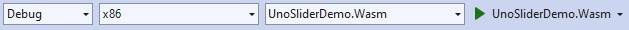
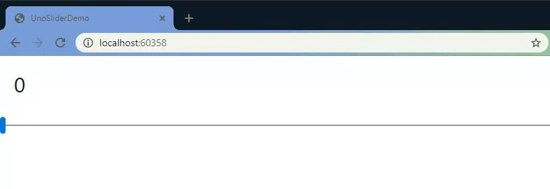

# Create a Single Page App with Uno Platform

[Download the complete sample](https://github.com/unoplatform/Uno.GettingStartedTutorial/tree/master/src/Getting-Started-Tutorial-1)  
-- Estimated time to complete: 10 minutes --

In this tutorial you will learn how to:

- Add the Uno Platform Project Templates to Visual Studio
- Create a new Project with Uno Platform
- Use the ElementName property for element-to-element binding

The tutorial walks you through creating a small multi-platform application with Uno Platform – a small app containing only a simple horizontal slider control.  
Also, you will learn how to run your applications on all platforms supported by Uno Platform.

<div class="NOTE alert alert-info">
<h5>Before you start the tutorial</h5>

[If you haven't prepared your dev environment for Uno Platform app development yet, the Setting up the Environment page will guide you through installing all the prerequisites.](get-started.md)

</div>

## Getting Started

1. Open Visual Studio and click on `Create new project`.  

    

2. Search for the `Uno` templates, select the `Cross-Platform App (Uno Platform)` then click `Next`.  

    

3. Name your app then click `Next`.

4. In your `Shared` project, open up `MainPage.xaml`

5. Add a `StackPanel` around your `TextBlock`
    ```xml
    <Grid Background="{ThemeResource ApplicationPageBackgroundThemeBrush}">
        <StackPanel>
            <TextBlock Text="Hello World" Margin="20" FontSize="30" />
        </StackPanel>
    </Grid>
    ```

6. Add a `Slider`
    ```xml
    <Grid Background="{ThemeResource ApplicationPageBackgroundThemeBrush}">
        <StackPanel>
            <TextBlock Text="Hello World" Margin="20" FontSize="30" />
            <Slider x:Name="slider"/>
        </StackPanel>
    </Grid>
    ```

7. Bind the `Text` value of your `TextBlock` to the value of the `Slider`
    ```xml
    <Grid Background="{ThemeResource ApplicationPageBackgroundThemeBrush}">
        <StackPanel>
            <TextBlock Text="{Binding Value, ElementName=slider}" Margin="20" FontSize="30" />
            <Slider x:Name="slider"/>
        </StackPanel>
    </Grid>
    ```

8. Select `UWP` as the Startup Project, select the `x86` platform, then `Run`  
   Note: To change the startup project from the Solution Explorer, right-click the desired project and choose "Set as StartUp Project" from the context-sensitive menu that is displayed. You can also choose this menu item from the Project menu.

    

    Result!  
    

9. Select `WASM` as the Startup Project and `Run`  

    

    Result!  
    

Congratulations, you’ve just built your first multi-platform application with Uno Platform! Feel free to select some other platform heads as your Startup Project and run them – just make sure you have all prerequisites installed to run on all other platforms.  

<div class="NOTE alert alert-info">
<h5>Next:</h5>

[Got questions? Want to learn more? Looking for production-ready examples? Check out the next tutorial page. We will walk you through a `BugTracker` sample and build out a full Uno Platform app.](getting-started-tutorial-2.md)

</div>
