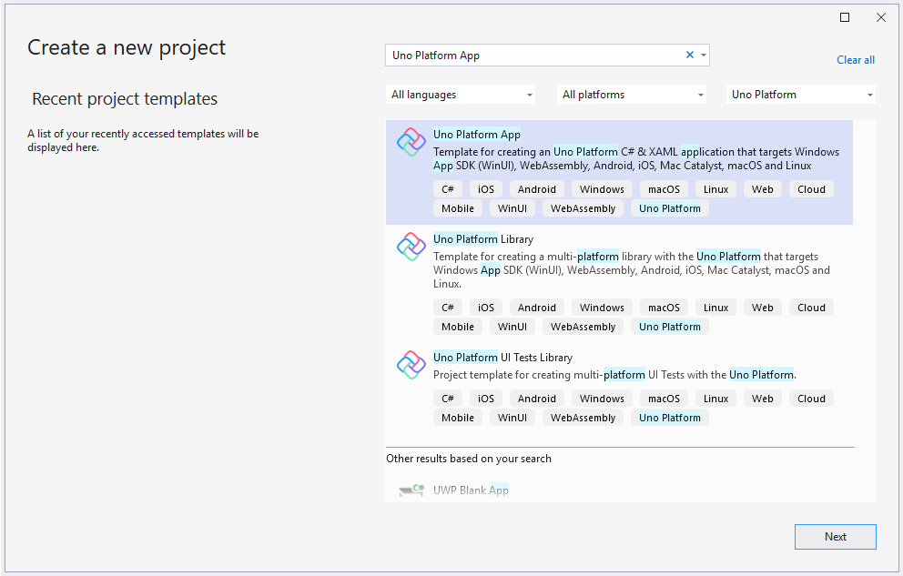

# Create a Single Page App with Uno Platform

[Download the complete sample](https://github.com/unoplatform/Uno.GettingStartedTutorial/tree/master/src/Getting-Started-Tutorial-1)  

> [!NOTE] 
> Estimated time to complete: 10 minutes

In this tutorial you will learn how to:

- Add the Uno Platform Project Templates to Visual Studio
- Create a new Project with Uno Platform
- Use the `ElementName` property for element-to-element binding

The tutorial walks you through creating a small multi-platform application with Uno Platform – a small app containing only a simple horizontal slider control.
Also, you will learn how to run your applications on all platforms supported by Uno Platform.

<div class="NOTE alert alert-info">
<h5>Before you start the tutorial</h5>
If you haven't prepared your dev environment for Uno Platform app development yet, [the Setting up the Environment page](get-started.md) will guide you through installing all the prerequisites.
</div>

## Getting Started

1. Open Visual Studio and click on `Create new project`.  

    

1. Search for the `Uno` templates, select the `Uno Platform App` then click `Next`.  

    

1. Name your app then click `Next`.

1. Choose a list of platforms, including **WebAssembly** and **WinUI**

    

1. After a few seconds, a banner may appear at the top of editor asking to reload projects. Click **Reload projects**.

    

1. In your `MyApp` Class Library project, open up `MainPage.xaml`

1. Add a `StackPanel` around your `TextBlock`
    ```xml
    <Grid>
        <StackPanel>
            <TextBlock Text="Hello World" Margin="20" FontSize="30" />
        </StackPanel>
    </Grid>
    ```

1. Add a `Slider`
    ```xml
    <Grid>
        <StackPanel>
            <TextBlock Text="Hello World" Margin="20" FontSize="30" />
            <Slider x:Name="slider"/>
        </StackPanel>
    </Grid>
    ```

1. Bind the `Text` value of your `TextBlock` to the value of the `Slider`
    ```xml
    <Grid>
        <StackPanel>
            <TextBlock Text="{Binding Value, ElementName=slider}" Margin="20" FontSize="30" />
            <Slider x:Name="slider"/>
        </StackPanel>
    </Grid>
    ```

1. Select `MyApp.Windows` as the Startup Project, select the `x86` platform, then `Run`  
   > [!NOTE] 
   > To change the startup project from the Solution Explorer, right-click the desired project and choose **Set as StartUp Project** from the context-sensitive menu that is displayed. You can also choose this menu item from the Project menu.

    

    Result!  
    

1. Select `MyApp.Wasm` as the Startup Project and `Run`  

    

    Result!  
    

Congratulations, you’ve just built your first multi-platform application with Uno Platform! Feel free to select some other platform heads as your Startup Project and run them – just make sure you have all prerequisites installed to run on all other platforms.  

<div class="NOTE alert alert-info">
<h5>Next:</h5>

Got questions? Want to learn more? Looking for production-ready examples? [Check out the next tutorial page.](getting-started-tutorial-2.md) We will walk you through a `BugTracker` sample and build out a full Uno Platform app.

</div>
