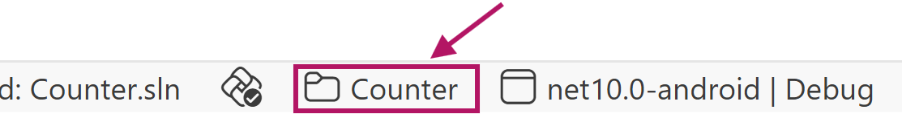
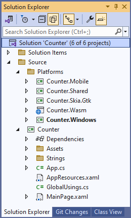

# Counter App using XAML and MVVM

[Download the complete XAML + MVVM sample](https://github.com/unoplatform/Uno.Samples/tree/master/reference/Counter/XAML-MVVM)  

[!INCLUDE [Intro](includes/include-intro.md)]

In this tutorial you will learn how to:

- Create a new Project with Uno Platform using Visual Studio Template Wizard or the **dotnet new** command
- Add elements to the XAML file to define the layout of the application
- Add code to the C# file to implement the application logic using the Model-View-ViewModel (MVVM) pattern
- Use data binding to connect the UI to the application logic

To complete this tutorial you don't need any prior knowledge of the Uno Platform, XAML, or C#.

[!INCLUDE [VS](includes/include-create.md)]

## [Visual Studio](#tab/vs)

> [!NOTE]
> If you don't have the **Uno Platform Extension for Visual Studio** installed, follow [these instructions](xref:Uno.GetStarted.vs2022).

- Launch **Visual Studio** and click on **Create new project** on the Start Window. Alternatively, if you're already in Visual Studio, click **New, Project** from the **File** menu.

- Type `Uno Platform` in the search box

- Click **Uno Platform App**, then **Next**

- Name the project `Counter` and click **Create**

At this point you'll enter the **Uno Platform Template Wizard**, giving you options to customize the generated application. For this tutorial, we're only going to configure the markup language and the presentation framework.

- Select **Blank** in **Presets** selection

- Select the **Presentation** tab and choose **MVVM**

- Select the **Markup** tab and choose **XAML**

Before completing the wizard, take a look through each of the sections and see what other options are available. You can always come back and create a new project with different options later. For more information on all the template options, see [Using the Uno Platform Template](xref:Uno.GettingStarted.UsingWizard).

- Click **Create** to complete the wizard

The template will create a solution with a single cross-platform project, named `Counter`, ready to run.

### [Rider](#tab/rider)

> [!NOTE]
> If you don't have the **Uno Platform Extension for Rider** installed, follow [these instructions](xref:Uno.GetStarted.Rider).

- Launch **Rider** and click on **New Solution** on the Start Window

- From the left menu, under the **Uno Platform** section, select **Uno Platform App**
  At this point, you'll see options for creating a new Uno app, allowing you to customize the generated application. For this tutorial, we will only configure the presentation framework.

- Name the project `Counter`

- Select **Blank** in **Presets** selection

- Select the **Presentation** tab and choose **MVVM**

- Select the Markup tab and choose **XAML Markup**

- Click **Create** to complete the creation
  The template will create a solution with a single cross-platform project, named `Counter`, ready to run.

### [VS Code](#tab/vscode)

> [!NOTE]
> If you don't have the **Uno Platform Extension for VS Code** installed, follow [these instructions](xref:Uno.GetStarted.vscode).

- Launch The Live Wizard by visiting the [Uno Platform Live Wizard](https://new.platform.uno/)

- Name the project `Counter` and click **Start**

- Select **Blank** in **Presets** selection

- Select the **Presentation** tab and choose **MVVM**

- Select the Markup tab and choose **XAML Markup**

- Click **Create** to complete the wizard

- Copy the `dotnet new` command and run it from a terminal where you want your solution to be located.

- This will create a new folder called **Counter** containing the new application.

- Next, open the project using Visual Studio Code. In the terminal type the following:

  ```bash
  code ./Counter
  ```

- Visual Studio Code might ask to restore the NuGet packages. Allow it to restore them if asked.

- Once the solution has been loaded, in the status bar at the bottom left of VS Code, `Counter.sln` is selected by default. Select `Counter.csproj` to load the project instead.
  

## [Command Line](#tab/cli)

> [!NOTE]
> If you don't have the Uno Platform dotnet new templates installed, follow [dotnet new templates for Uno Platform](xref:Uno.GetStarted.dotnet-new).

From the command line, run the following command:

```dotnetcli
dotnet new unoapp -preset blank -presentation mvvm -markup xaml -o Counter
```

This will create a new folder called **Counter** containing the new application.

If you want to discover all the options available in the **unoapp** template, run the following command:

```dotnetcli
dotnet new unoapp -h
```

Also, for more information on all the template options, see [Using the Uno Platform Template](xref:Uno.GettingStarted.UsingWizard).

---

[!INCLUDE [Counter Solution](includes/include-solution.md)]



[!INCLUDE [Main Window](includes/include-mainwindow.md)]

[!INCLUDE [Main Page - XAML](includes/include-mainpage-xaml.md)]

[!INCLUDE [Main Page - Layout](includes/include-mainpage-layout.md)]

[!INCLUDE [Main Page - Image](includes/include-image-xaml.md)]

[!INCLUDE [Main Page - Change Layout](includes/include-mainpage-change-layout.md)]

[!INCLUDE [Main Page - Other Elements](includes/include-elements-xaml.md)]

[!INCLUDE [View Model](includes/include-mvvm.md)]

## Data Binding

Now that we have the **`MainViewModel`** class, we can update the **`MainPage`** to use data binding to connect the UI to the application logic.

- Add a **`DataContext`** element to the **`Page`** element in the **MainPage.xaml** file, between the first `StackPanel` and the `Page` element.

    ```xml
    <Page.DataContext>
        <local:MainViewModel />
    </Page.DataContext>
    ```

- Update the **`TextBlock`** by removing the **`Text`** attribute, replacing it with two **`Run`** elements, and binding the **`Text`** property of the second **`Run`** element to the **`Count`** property of the **`MainViewModel`**.

    ```xml
    <TextBlock Margin="12"
               HorizontalAlignment="Center"
               TextAlignment="Center">
        <Run Text="Counter: " /><Run Text="{Binding Count}" />
    </TextBlock>
    ```

- Update the **`TextBox`** by binding the **`Text`** property to the **`Step`** property of the **MainViewModel**. The **`Mode`** of the binding is set to **`TwoWay`** so that the **`Step`** property is updated when the user changes the value in the **`TextBox`**.

    ```xml
    <TextBox Margin="12"
             HorizontalAlignment="Center"
             PlaceholderText="Step Size"
             Text="{Binding Step, Mode=TwoWay}"
             TextAlignment="Center" />
    ```

- Update the **`Button`** by adding a **`Command`** attribute that is bound to the **`IncrementCommand`** property of the **`MainViewModel`**.

    ```xml
    <Button Margin="12"
            HorizontalAlignment="Center"
            Command="{Binding IncrementCommand}"
            Content="Increment Counter by Step Size" />
    ```

The final code for **MainPage.xaml** should look like this:

```xml
<Page x:Class="Counter.MainPage"
      xmlns="http://schemas.microsoft.com/winfx/2006/xaml/presentation"
      xmlns:x="http://schemas.microsoft.com/winfx/2006/xaml"
      xmlns:local="using:Counter"
      Background="{ThemeResource ApplicationPageBackgroundThemeBrush}">
  <Page.DataContext>
    <local:MainViewModel />
  </Page.DataContext>
  <StackPanel VerticalAlignment="Center">
    <Image Width="150"
           Height="150"
           Margin="12"
           HorizontalAlignment="Center"
           Source="Assets/logo.png" />

    <TextBox Margin="12"
             HorizontalAlignment="Center"
             PlaceholderText="Step Size"
             Text="{Binding Step, Mode=TwoWay}"
             TextAlignment="Center" />

    <TextBlock Margin="12"
               HorizontalAlignment="Center"
               TextAlignment="Center">
        <Run Text="Counter: " /><Run Text="{Binding Count}" />
    </TextBlock>

    <Button Margin="12"
            HorizontalAlignment="Center"
            Command="{Binding IncrementCommand}"
            Content="Increment Counter by Step Size" />
  </StackPanel>
</Page>
```

[!INCLUDE [Wrap Up](includes/include-wrap.md)]

If you want to see the completed application, you can download the source code from [GitHub](https://github.com/unoplatform/Uno.Samples/tree/master/reference/Counter/XAML-MVVM).
