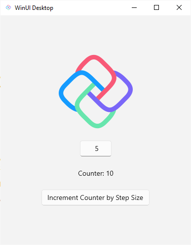

> [!NOTE]
> Estimated time to complete: 5 minutes

## Introduction

This tutorial will walk you through creating a simple counter application with Uno Platform. The application will have a **`Button`** that increments the counter, a **`TextBox`** where the user can enter the step size, and a **`TextBlock`** that displays the current value of the counter.

