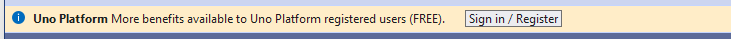

# Sign in with Uno Platform

Sign in with your Uno Platform account directly in your favorite IDE (Visual Studio, VS Code, or Rider), to unlock powerful tools like Hot Reload, helping you speed up development. With a single registration, you also get early access to new features and the opportunity to connect with the Uno Platform community to share feedback and network.

## Create your account

1. Go to our website, [platform.uno](https://platform.uno/), and click on the **Sign in** button in the top right corner, or go directly to [platform.uno/my-account](https://platform.uno/my-account).
1. Enter your email address and click on **Register**.
1. On the registration page, fill in your information. Once done, click on **Sign up**.
1. You will receive a confirmation email from `no-reply@platform.uno`. Follow the instructions in the email to activate your account.
1. You should then see the sign-in page. Enter your email and password and click on **Sign in** to access your account details, where you can update information or add more details.

## Sign in to your IDE of choice

After creating your Uno Platform account, follow the steps below to sign in to your preferred IDE:

**I am developing on...**

### [**Visual Studio 2022**](#tab/vs2022)

If you’ve already set up **Visual Studio 2022** by following the [Get Started on Visual Studio 2022](xref:Uno.GetStarted.vs2022) documentation, sign in as follows:

1. Create a new Uno Platform project by following the [Creating an app with Visual Studio 2022](xref:Uno.GettingStarted.CreateAnApp.VS2022) documentation or open an existing one with Uno.Sdk version 5.5 or higher.

   For existing applications, you should take this opportunity to update to the [latest `Uno.Sdk` version](https://www.nuget.org/packages/Uno.Sdk). See our [migration guide](xref:Uno.Development.MigratingFromPreviousReleases) to upgrade.

1. After your project has finished loading, a notification should appear. Click on the **Sign in / Register** button.

   

   > [!TIP]
   > Ensure that the lower left IDE icon shows a check mark and says "Ready" . This ensures that the projects have been created, and their dependencies have been restored completely.
   >
   > [!NOTE]
   > If the notification doesn’t appear, access the Studio app by clicking on **Extensions** > **Uno Platform** > **Studio...**.
   >
   > 

### [**Visual Studio Code**](#tab/vscode)

If you’ve already set up **Visual Studio Code** by following the [Get Started on VS Code](xref:Uno.GetStarted.vscode) documentation, sign in as follows:

1. Create a new Uno Platform project by following the [Creating an app with VS Code](xref:Uno.GettingStarted.CreateAnApp.VSCode) documentation or open an existing one with Uno.Sdk version 5.5 or higher.

   For existing applications, you should take this opportunity to update to the [latest `Uno.Sdk` version](https://www.nuget.org/packages/Uno.Sdk). See our [migration guide](xref:Uno.Development.MigratingFromPreviousReleases) to upgrade.

1. After your project has finished loading, check the status bar at the bottom left of VS Code. By default, `YourProjectName.sln` is selected. Switch to `YourProjectName.csproj` to load the project instead.

   

1. Once you've switched to the proper project, a notification should appear. Click the **Sign in / Register** button.

   

   > [!NOTE]
   > If the notification doesn’t appear, access the Studio app by selecting **View** > **Command Palette...** and typing `Uno Platform: Open Studio`.
   >
   > 

### [**JetBrains Rider**](#tab/rider)

If you’ve already set up **JetBrains Rider** by following the [Get Started on JetBrains Rider](xref:Uno.GetStarted.Rider) documentation, sign in as follows:

1. Create a new Uno Platform project by following the [Create an app with JetBrains Rider](xref:Uno.GettingStarted.CreateAnApp.Rider) documentation or open an existing one with Uno.Sdk version 5.5 or higher.

   For existing applications, you should take this opportunity to update to the [latest `Uno.Sdk` version](https://www.nuget.org/packages/Uno.Sdk). See our [migration guide](xref:Uno.Development.MigratingFromPreviousReleases) to upgrade.

1. After your project has finished loading, a notification should appear. Click on the **Sign in / Register** button.

   

   > [!NOTE]
   > If the notification doesn’t appear, access the Studio app by selecting **Tools** > **Uno Platform** > **Studio...**.
   >
   > 

---

### Uno Platform Studio window

1. In the Uno Platform Studio window, click on **Sign in**. You’ll be redirected to your browser to enter your Uno Platform account credentials.

   

1. Once signed in, you’ll see a confirmation of your account along with your license details.

   You can then use the **Hot Reload** feature to speed up your workflow and test changes in real-time. For more information, refer to the [Hot Reload documentation](xref:Uno.Features.HotReload).

   

   > [!TIP]
   > You can also access a menu where you can select **My Account** to view your account details, **Refresh** the account changes, and **Sign out**.
   >
   > 

1. If you're using a `Uno Platform Studio Pro` license, your Uno Platform Studio window will display additional tools. You can see the comparison below:

   

1. After you are done, feel free to close the Uno Platform Studio window. You can always access it again from your IDE menu by following the steps above.

## Getting Uno Platform Studio Pro License

Discover the additional features available with `Uno Platform Studio Pro`, including Hot Design® - our next-generation visual designer for cross-platform .NET applications.

> [!IMPORTANT]
> Uno Platform itself remains open-source and free under Apache 2.0. The Pro subscription is specifically for Uno Platform Studio features.

### Compare Plans

Uno Platform Studio offers two subscription tiers, Community and Pro. Check out [Compare Uno Platform Studio Community vs Pro plan](https://platform.uno/select-subscription/) to see what you gain by upgrading.

### Purchase a Pro License

1. Visit [platform.uno/select-subscription](https://platform.uno/select-subscription/) to view subscription options and current pricing.
1. Choose your preferred billing cycle (monthly or yearly).
1. Add how many licenses you want above **Buy Now** Button.
1. Click **Buy Now** on your selected plan.
1. If you don't have a Uno Platform account yet, you'll be prompted to create one during the checkout process.
1. Complete the payment process and receive your license confirmation email.

### Hot Design® 30-Day Trial

The Community version includes a 30-day trial of Hot Design®, no credit card required:

1. Create your free Uno Platform account at [platform.uno](https://platform.uno/).
1. Sign in to your IDE following the [steps above](xref:Uno.GetStarted.Licensing#sign-in-to-your-ide-of-choice).
1. Your 30-day Hot Design® trial will be automatically available.
1. After the trial expires, upgrade to Pro to continue using Hot Design®.

### Special Pricing

- **Students and Open Source Maintainers**: Contact [info@platform.uno](mailto:info@platform.uno) for special pricing
- **Enterprise/Custom Quotes**: Contact [info@platform.uno](mailto:info@platform.uno) for customized licensing

### Subscription Management

- **Cancellation**: You can cancel your subscription anytime from your [account dashboard](https://platform.uno/my-account)
- **Billing**: Invoices are sent to your registered email address

## Assigning a Uno Platform Studio Pro License

Once you have purchased a Uno Platform Studio Pro subscription, you may need to assign or activate your license:

### Activating Your License After Purchase

1. After purchasing your Pro subscription, you should receive a confirmation email with your license details.

1. Sign in to your IDE following the steps in the "Sign in to your IDE of choice" section above.

1. In the Uno Platform Studio window, click **Refresh** to update your license status.

1. Your Pro features, including Hot Design®, should now be available.

### Checking License Status

If you notice a small snowflake icon next to the Hot Design® flame icon when running your Uno app, this indicates that Hot Design® is not active:

### Troubleshooting License Issues

1. **License Not Showing**:
   - Open your IDE settings and access Uno Platform Studio again
   - Click the **Refresh** button to update your account status
   - Ensure you're signed in with the correct Uno Platform account

1. **License Assignment** (for team subscriptions):
   - Log in to your Uno Platform account at [platform.uno/my-account](https://platform.uno/my-account)
   - Navigate to the **Subscriptions** section in the left navigation bar (1)
   - Enter the email address of the person you want to grant access to in the text box (2)
   - Click **Assign** to assign the license (3)
   - The recipient will receive a notification email about the license assignment

   

1. **Verification**:
   - After assignment, return to your IDE settings
   - Click **Refresh** in the Uno Platform Studio window
   - You should see a blue checkmark on Hot Design®, indicating it's ready to use

### Troubleshooting Common Issues

If you encounter issues during the subscription or licensing process:

1. **Payment Problems**:
   - Verify your payment information is correct
   - Check with your bank if the transaction was blocked
   - Try using a different payment method
   - Contact [info@platform.uno](mailto:info@platform.uno) for payment assistance

1. **License Not Activated**:
   - Check your email (including spam folder) for confirmation
   - Wait up to 15 minutes for license activation
   - Use the **Refresh** button in Uno Platform Studio
   - Sign out and sign in again to your IDE

1. **Hot Design® Trial Expired**:
   - The 30-day trial is automatically included with Community accounts
   - After expiration, upgrade to Pro to continue using Hot Design®
   - Visit [platform.uno/select-subscription](https://platform.uno/select-subscription/) to upgrade

1. **Support**:
   - Pro support covers Uno Platform Studio features only
   - For general support, visit [GitHub Discussions](https://github.com/unoplatform/uno/discussions) or [Discord](https://www.platform.uno/discord)
   - [Paid support](https://platform.uno/contact/) available for enterprise needs

## Questions

For general questions about Uno Platform, refer to the [general FAQ](xref:Uno.Development.FAQ) or see the [troubleshooting section](xref:Uno.UI.CommonIssues) for common issues and solutions.

If you encounter any issues or need further assistance, join our [Discord server](https://platform.uno/discord), connect with us via [GitHub](https://github.com/unoplatform/uno/discussions), or reach out on our [contact page](https://platform.uno/contact).
