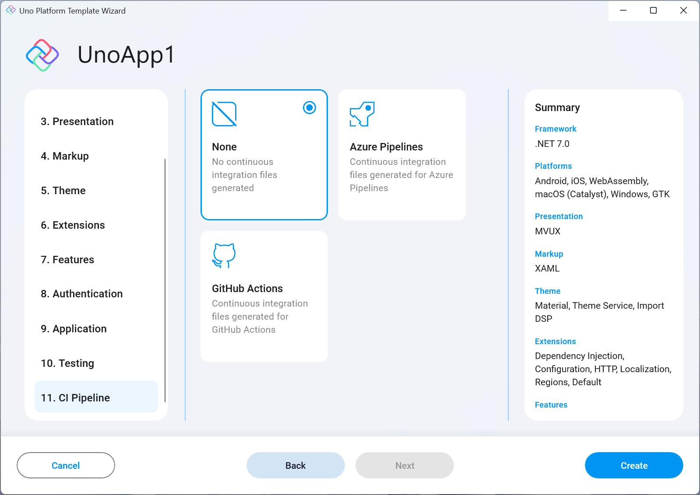

- **None**  
    No CI pipeline will be created.

- **Azure Pipelines**  
    Adds a YAML file that can be used to create a CI pipeline in Azure Pipelines.     

- **GitHub Action**  
    Adds a YAML file that can be used to create a CI pipeline in GitHub Actions.

