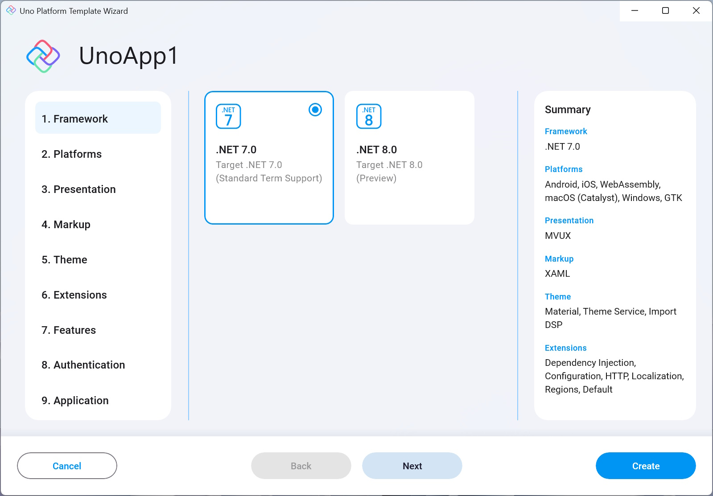

This setting lets you choose the .NET version to target. The default is .NET 8.0, but you can change it to .NET 7.0!

- [**.NET 7**](https://learn.microsoft.com/en-us/dotnet/core/whats-new/dotnet-7) is provided as an STS (Standard Term Support) version, and has introduced a myriad of improvements in performance especially for mobile, as well as other aspects and is the current recommended .NET version.  
- [**.NET 8**](https://learn.microsoft.com/en-us/dotnet/core/whats-new/dotnet-8) is provided as (LTS) long-term support. This is the most recent release and adds further performance improvements as well as other general enhancements.

