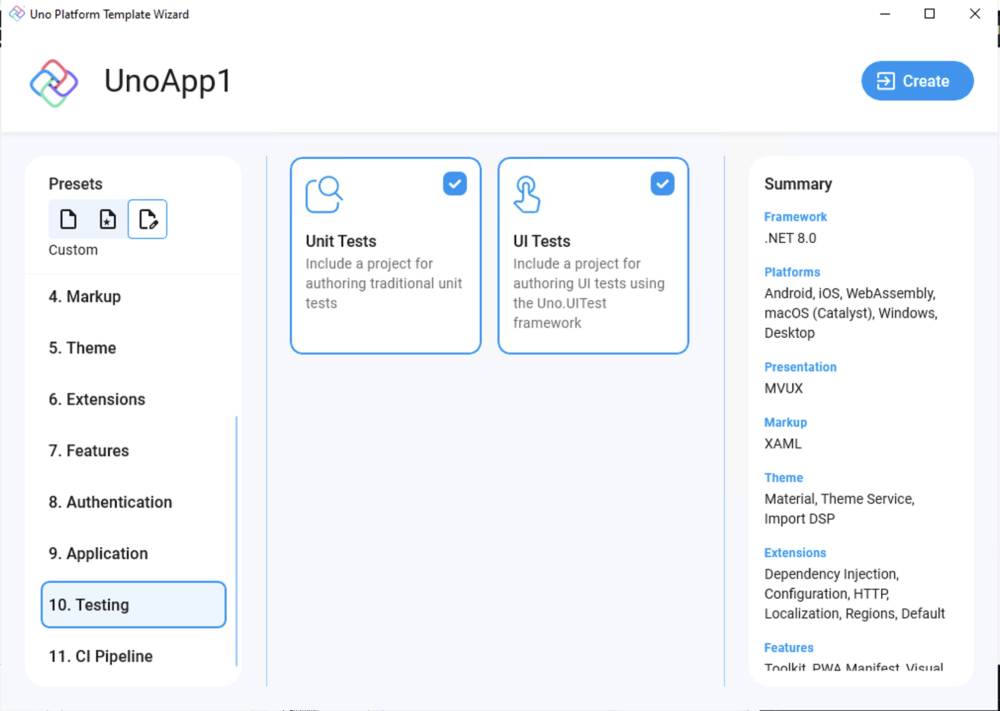

- #### Unit tests

    Adds an [NUnit](https://nunit.org) test project that targets the main (shared) head project.  

    The project also comes with [FluentAssertions](https://fluentassertions.com) pre-installed.

    This is included in the recommended preset, but not in the blank preset.

    ```dotnetcli
    dotnet new unoapp -tests unit
    ```

- #### UI tests  

    Adds an NUnit-powered test app that provides UI testing capabilities using Uno Platform's UI testing tools (Uno.UITest).  

    To learn more about UI Testing in Uno Platform apps, read [this](xref:Uno.UITest.GetStarted).

    This is included in the recommended preset, but not in the blank preset.

    ```dotnetcli
    dotnet new unoapp -tests ui
    ```

You can include both types of tests by including the parameter multiple times:

```dotnetcli
dotnet new unoapp -tests ui -tests unit
```

Alternatively, to include no tests, use the `none` parameter:

```dotnetcli
dotnet new unoapp -tests none
```


